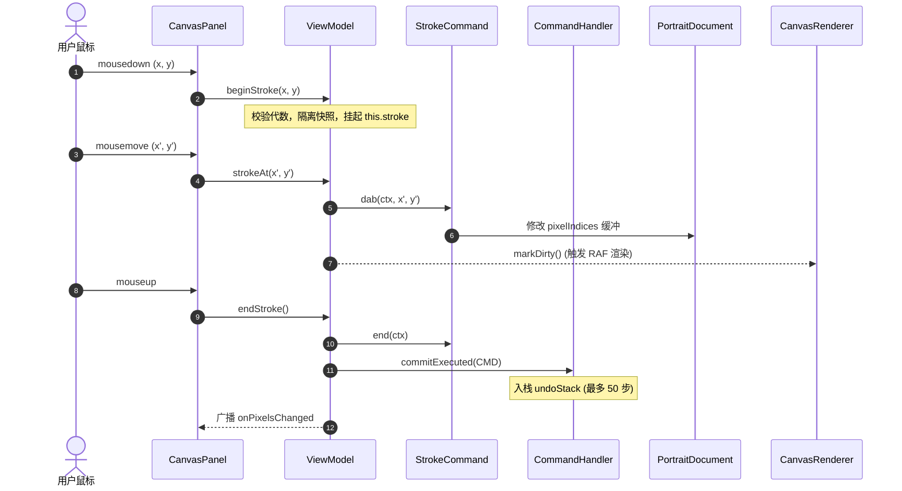
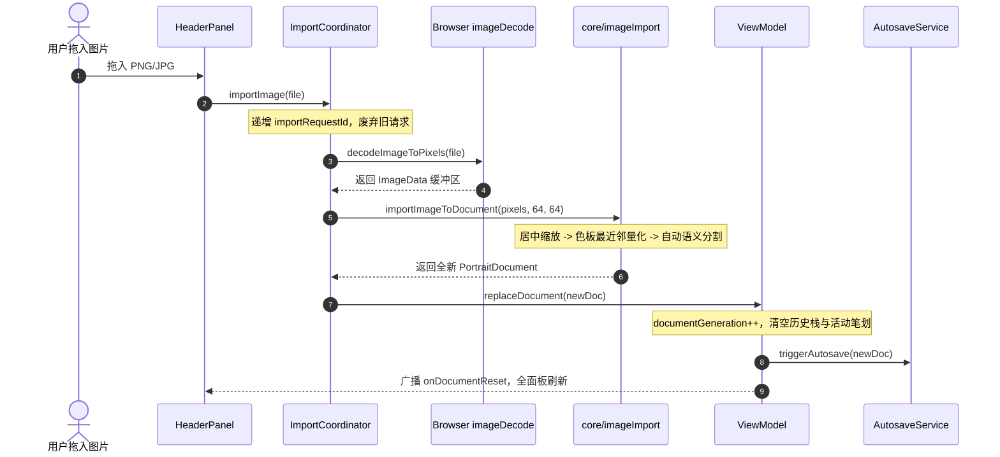
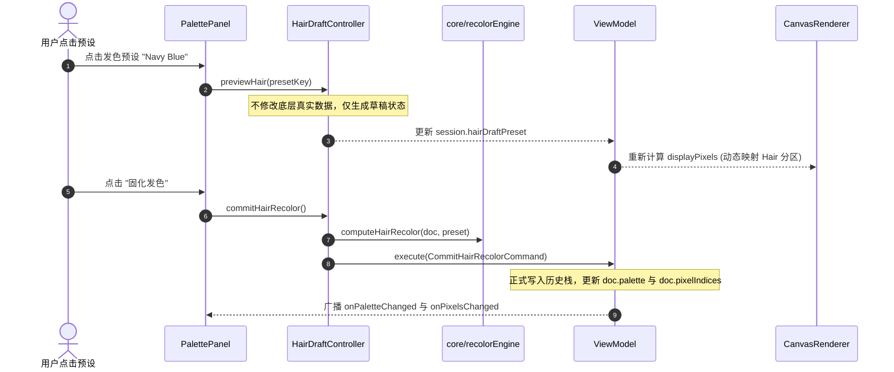

# 64px Portrait Studio 代码阅读与审查指南 (Code Review Guide)

本文档专为代码评审（Code Review）与架构理解编写，全面梳理 **64px-portrait-studio**（64×64 像素头像 36 色复古 GBA 规范工作室）的系统分层、核心模块、数据流向、设计模式与关键技术决策。

---

## 1. 架构总览与核心设计哲学

### 1.1 设计哲学
1. **纯 Vanilla TypeScript + Vite**：不依赖 React/Vue 等重型 UI 框架，所有 DOM 操作显式可追溯，极致减少框架运行时开销与状态黑盒。
2. **纯领域层与浏览器环境严格解耦 (T07)**：
   - `core/`、`model/`、`command/` 模块为纯数据与纯算法，**零 DOM / zero window 依赖**，可在 Node.js、Web Worker 或 Headless 自动化测试中独立无伤运行（仓库中有专门的 AST 依赖静态检查测试 `tests/adapterBoundary.test.ts` 强制守护）。
   - 浏览器相关操作（Canvas 绘制、图片解码、DOM 下载、LocalStorage）全部收拢在 `app/browser/`、`app/adapters/` 与 `app/services/` 中。
3. **命令模式驱动单一数据源**：所有对图像、遮罩、色板的修改都封装为 `Command` 对象，统一通过 `CommandHandler` 执行，天然保证撤销（Undo）与重做（Redo）的一致性。
4. **事务与代数隔离 (Generation Guard)**：
   - 引入 `documentGeneration` 追踪文档身份，防止异步导入、延迟确认弹窗对新载入的图像产生“旧请求污染”（R2）。
   - 引入 `strokeGeneration` 保护活动笔划事务，避免手势未完成时撤销损坏历史栈或新换图时写入旧快照（R1）。
5. **微批次脏标记渲染 (Dirty-Flag Rendering)**：各面板继承自 `Panel` 基类，数据变更触发事件后只打标记，通过 `requestAnimationFrame` 合并同一帧内的多次更新。

### 1.2 系统分层架构

```mermaid
graph TD
  subgraph UI ["界面与交互层 (UI Panels)"]
    App["app/app.ts (装配根)"]
    Header["panels/Header.ts"]
    CanvasPanel["panels/canvas/CanvasPanel.ts"]
    PalettePanel["panels/PalettePanel.ts"]
    MaskPanel["panels/MaskPanel.ts"]
    MaskToolsPanel["panels/MaskToolsPanel.ts"]
    ConfirmModal["panels/modals/ConfirmModal.ts"]
  end

  subgraph Facade ["门面与应用服务层 (Application / Facade)"]
    ViewModel["app/viewModel.ts (中央外观门面)"]
    Ports["app/ports.ts (窄接口协议)"]
    AutosaveService["app/services/AutosaveService.ts"]
    ImportCoordinator["app/controllers/ImportCoordinator.ts"]
    ExportService["app/controllers/ExportService.ts"]
    HairDraftController["app/controllers/HairDraftController.ts"]
    SelectionService["app/controllers/SelectionService.ts"]
  end

  subgraph BrowserAdapters ["浏览器适配层 (Browser Adapters)"]
    BrowserStorage["app/adapters/BrowserStorage.ts"]
    BrowserArchive["app/browser/projectArchive.ts"]
    BrowserCanvas["app/browser/pixelCanvas.ts"]
    BrowserDecode["app/browser/imageDecode.ts"]
  end

  subgraph Domain ["领域模型与纯算法层 (Pure Domain - Zero DOM)"]
    Document["model/document.ts (PortraitDocument)"]
    Session["model/session.ts (EditorSession)"]
    CommandHandler["command/commandHandler.ts"]
    Commands["command/*Commands.ts"]
    ImageImport["core/imageImport.ts"]
    Segmentation["core/segmentation/ (语义分割)"]
    Recolor["core/recolorEngine.ts (发色引擎)"]
    EditOps["core/editOps.ts (泛洪与几何)"]
    ProjectData["core/projectData.ts (Codec)"]
  end

  App --> ViewModel
  App --> UI
  ViewModel --> Ports
  ViewModel --> CommandHandler
  CommandHandler --> Commands
  Commands --> Document
  ViewModel --> ImportCoordinator
  ViewModel --> HairDraftController
  ViewModel --> SelectionService
  ViewModel --> ExportService
  ViewModel --> AutosaveService
  AutosaveService --> BrowserStorage
  ExportService --> BrowserArchive
  ImportCoordinator --> ImageImport
  ImageImport --> Segmentation
  ImageImport --> Recolor
```



---

## 2. 目录结构与模块导航

```
src/
├── types/                   # 全局领域类型定义 (SemanticZone, PixelTool, HairPresetKey 等)
├── data/
│   └── palette.ts           # GBA 36 色色板常量、5 阶发色梯度定义 (RAMPS_INFO)、匹配色预设
├── model/
│   ├── document.ts          # 核心领域实体 PortraitDocument 及不可变拷贝/不变式校验
│   └── session.ts           # 编辑器会话状态 EditorSession (选区、缩放、模式、草稿状态)
├── command/
│   ├── command.ts           # 命令基类 Command 与 CommandContext、快照 Memento
│   ├── commandHandler.ts    # 历史记录管理器 (Undo/Redo 栈上限 50 步)
│   ├── events.ts            # StudioEvents 监听接口定义 (扇出总线)
│   ├── pixelCommands.ts     # 像素笔划 StrokeCommand (点/线/桶/替换)、FillPixelsCommand
│   ├── maskCommands.ts      # 遮罩划入/剔除 MaskBoxSelectCommand、AssignColorToZoneCommand
│   └── paletteCommands.ts   # 色板微调 SetPaletteColorCommand、发色预设与固化命令
├── core/                    # 纯计算核心 (ZERO DOM 依赖)
│   ├── colorUtils.ts        # RGB/Hex 互转与 Delta-E 颜色距离比较
│   ├── editOps.ts           # 4/8 邻域 BFS 泛洪、canAssignZone 遮罩规则、选区几何裁剪
│   ├── imageImport.ts       # 纯图像导入裁切、量化与遮罩自动生成入口
│   ├── projectData.ts       # 工程 JSON 规范编解码器与校验器 (validateProjectData)
│   ├── recolorEngine.ts     # GBA 发色 5 阶梯度非破坏性重着色计算引擎
│   └── segmentation/        # 自动语义分割器 (8 区域特征提取与残差合并为 5 大分区)
├── app/
│   ├── app.ts               # 应用组合根：装配各 Panel、注册全局快捷键、监听窗口事件
│   ├── viewModel.ts         # 中央 ViewModel (外观门面 Facade + 状态总线 + 手势事务)
│   ├── ports.ts             # 抽象窄端口定义 (StudioPrompts, ExportPorts, HairDraftHost 等)
│   ├── toaster.ts           # 全局浮动通知管理器 (Toast Notification)
│   ├── controllers/         # 领域子控制器 (通过窄端口解耦)
│   │   ├── ExportService.ts         # PNG/ZIP 导出服务 (快照抓取与代数校验)
│   │   ├── HairDraftController.ts   # 发色草稿预览与确认切换
│   │   ├── ImportCoordinator.ts     # 异步导入时序隔离与连续请求废弃
│   │   └── SelectionService.ts      # 选区剪贴板、移动、翻转、旋转
│   ├── services/
│   │   └── AutosaveService.ts       # 实例级 300ms 防抖暂存服务
│   ├── adapters/
│   │   └── BrowserStorage.ts        # 安全 LocalStorage 适配器 (防 SecurityError)
│   ├── browser/             # 具体浏览器实现
│   │   ├── imageDecode.ts           # 浏览器 Canvas/Image 二进制解码
│   │   ├── pixelCanvas.ts           # HTMLCanvasElement 物理像素渲染
│   │   └── projectArchive.ts        # ZIP 工程压缩包打包导出与解包导入适配器
│   └── utils/
│       └── download.ts              # 浏览器 Blob 触发文件下载封装
└── panels/                  # UI 面板视图组件 (继承自 Panel 基类)
    ├── Panel.ts             # 视图组件基类 (RAF 微任务防抖渲染)
    ├── Header.ts            # 顶部导航栏 (工程导入/导出、重置、存储状态、预设)
    ├── PalettePanel.ts      # 左侧色板面板 (36 色色板网格、发色梯级、颜色拾取)
    ├── MaskPanel.ts         # 右侧语义遮罩面板 (5 分区显示/隐藏、锁定保护、不透明度)
    ├── MaskToolsPanel.ts    # 右侧遮罩工具箱 (智能划入、框选、容差去杂色)
    ├── RealtimePreview.ts   # 浮动 1:1 (64×64) 原寸实时预览窗
    ├── canvas/              # 画布核心编辑区域
    │   ├── CanvasPanel.ts           # 画布交互主面板 (鼠标/手势、缩放平移、中键漫游)
    │   ├── CanvasRenderer.ts        # 离屏 Canvas 双缓冲渲染管线与高亮网格
    │   ├── SelectionInteraction.ts  # 矩形选区拖动/框选交互机
    │   ├── SelectionStatsPanel.ts   # 选区信息统计小浮窗
    │   ├── HoverInfoBar.ts          # 底部像素坐标与颜色悬浮状态栏
    │   ├── cursors.ts               # SVG 像素级动态光标生成
    │   └── overlays.ts              # 选区跑马灯虚线与遮罩层复合渲染
    └── modals/              # 模态对话框
        ├── ConfirmModal.ts          # 多按钮确认对话框 (代数安全 + 焦点圈入陷阱)
        └── ReplaceColorModal.ts     # 颜色替换对话框
```

---

## 3. 核心数据模型与关键不变式

### 3.1 `PortraitDocument` ([src/model/document.ts](file:///home/pt/Desktop/64px-portrait-studio/src/model/document.ts))
整个应用的核心数据载体，代表一副完整的头像工程：
```ts
export interface PortraitDocument {
  palette: string[];                    // 36 个大写十六进制颜色字符串 (例: "#1A1A1A")
  pixelIndices: Uint8Array;             // 4096 字节 (64×64)，取值 0~35 为色板索引，255 为透明
  semanticMask: Uint8Array;             // 4096 字节 (64×64)，取值 0~4 对应 SemanticZone 枚举
  currentHairPreset: HairPresetKey | null; // 当前固化的发色预设 key (如 "ash_blonde")
}
```

#### 关键不变式 (Invariants)：
- **尺寸固定**：`pixelIndices.length === 4096`，`semanticMask.length === 4096`。
- **透明归一化 (B1 修复)**：如果像素位置 `i` 为透明色 (`pixelIndices[i] === 255`)，其对应的遮罩分区 **必须且只能** 为背景 (`semanticMask[i] === SemanticZone.Background`)。无论是橡皮擦除、透明油漆桶还是全图清空，此规则绝对优先。
- **目标锁保护 (B2 修复)**：如果某个分区被锁定 (`lockedMaskZones.includes(zone)`)，任何试图向其写入像素、修改其遮罩或将其作为目标覆盖的操作均被拒绝。

### 3.2 `EditorSession` ([src/model/session.ts](file:///home/pt/Desktop/64px-portrait-studio/src/model/session.ts))
仅存放在内存中的瞬态交互状态，不随工程存档持久化：
```ts
export interface EditorSession {
  activeMode: 'pixel' | 'mask';         // 当前主模式：像素修图 Q vs 语义遮罩 W
  activeTool: PixelTool;                // pen | eraser | bucket | picker | select
  activePaletteIndex: number;           // 前景色色板索引 (0~35 或 255)
  bgPaletteIndex: number;               // 背景色色板索引 (右键使用)
  zoomLevel: number;                    // 缩放倍率 (4×, 6×, 8×, 12×, 16×, 24×, 32×)
  showGrid: boolean;                    // 是否显示 1px 像素网格
  bucketConnectivity: 4 | 8;            // 油漆桶邻域连通度 (4 邻域 vs 8 邻域)
  activeZone: SemanticZone;             // 当前选中的遮罩分区 (0:背景, 1:头发, 2:皮肤, 3:五官, 4:服装)
  visibleMaskZones: SemanticZone[];     // 开启显示的遮罩图层
  lockedMaskZones: SemanticZone[];      // 被锁定的遮罩图层
  selection: RectSelection | null;      // 活动矩形选区
  hairDraftPreset: HairPresetKey | null;// 试色草稿中的预设 (非 null 表示正在试色预览)
  // ...
}
```

---

## 4. 事务与状态管理核心机制

### 4.1 活动笔划手势事务 (`StrokeCommand` 与 T04/R1)
在画布上按下鼠标、拖动、松开的过程被称为一次“笔划手势”：
1. **启动 (`beginStroke`)**：
   - 检查 `isLoaded` 与 `_isDisposed`；
   - 若上一个笔划未正常闭合，**先调用 `endStroke()` 自动提交**，决不丢弃或覆盖旧笔划；
   - 记录 `this.strokeGeneration = this.documentGeneration`；
   - 对 `lockedZones` 和 `selection` 执行深拷贝隔离，防止笔划过程中外部修改会话导致命令参数漂移；
   - 初始化命令快照并暂存为 `this.stroke`。
2. **打点 (`strokeAt`)**：
   - 校验代数：`if (this.strokeGeneration !== this.documentGeneration) return;`；
   - 执行局部点绘制 `stroke.dab(ctx, x, y)`。
3. **闭合 (`endStroke`)**：
   - 核对代数，若代数不匹配直接丢弃；
   - 调用 `s.end(ctx)`，若产生实际改动则送入 `CommandHandler.commitExecuted(s)` 入栈。
4. **中断隔离与撤销互斥**：
   - 在调用 `undo()`、`redo()` 或执行其它任意命令时，若检测到 `this.stroke` 存在，**必须强制先 `endStroke()`**，杜绝未闭合的手势破坏历史栈。
   - 在加载新工程 (`replaceDocument`) 时，显式 `this.stroke = null` 彻底作废活动笔划。

### 4.2 文档代数与过期弹窗隔离 (R2)
在单页应用中，异步操作极易引发“迟到执行”竞态：
```ts
// 典型场景：用户对图 A 弹出“清空画布”确认框 -> 此时异步加载完成图 B -> 用户点击了之前的确认框
```
- **代数自增**：每次调用 `replaceDocument`，`this.documentGeneration++`。
- **弹窗守卫 (`confirmWithGeneration`)**：
  ```ts
  private confirmWithGeneration(options: PromptOptions): void {
    if (this._isDisposed) return;
    const gen = this.documentGeneration;
    const guardedButtons = options.buttons.map(b => ({
      ...b,
      onClick: () => {
        if (this._isDisposed || this.documentGeneration !== gen) return; // 过期直接静默废弃
        b.onClick();
      }
    }));
    // ...
  }
  ```
- 相同机制应用于清空画布、色板重置、发色试色切换以及 `ExportService` 导出。

### 4.3 实例级自动保存与页面退出持久化 (R5)
- **多实例隔离**：[AutosaveService.ts](file:///home/pt/Desktop/64px-portrait-studio/src/app/services/AutosaveService.ts) 为普通类而非单例，每个 `ViewModel` 构造时持有自己独立的 `AutosaveService`，其持有独立的 300ms 防抖计时器 `debounceTimer` 与 `pendingDoc`。
- **销毁与 Flush 顺序**：在 `vm.dispose()` 时，先执行 `autosave.dispose()` 同步刷出挂起的数据并触发保存回调，之后再置 `_isDisposed = true` 并清空监听器。
- **页面退出兜底**：在 [app.ts](file:///home/pt/Desktop/64px-portrait-studio/src/app/app.ts) 中注册浏览器 `pagehide` 与 `document.visibilityState === 'hidden'` 事件，页面关闭或切后台时强制调用 `vm.flushAutosave()`，避免 300ms 防抖尚未到期数据丢失。

---

## 5. 核心算法解析

### 5.1 GBA 5 阶渐变发色重着色引擎 ([src/core/recolorEngine.ts](file:///home/pt/Desktop/64px-portrait-studio/src/core/recolorEngine.ts))
像素头像的发色由 5 个梯度色（亮高光、基础浅、基准中、深暗部、极深阴影）构成：
1. **色阶排序提取**：分析当前色板中属于发色色带的 5 个索引，按明度（Luminance: `0.299R + 0.587G + 0.114B`）从浅到深排序为 $R_0, R_1, R_2, R_3, R_4$。
2. **目标色带映射**：从目标预设（如 `navy_blue`）获取其标准的 5 个目标十六进制色。
3. **遮罩限定计算**：遍历 4096 像素，**仅当像素的语义遮罩为 `SemanticZone.Hair` 且处于发色原梯级中时**，将其映射替换为目标梯级色。其他非头发区域（如衣服、眼睛即使用了相同颜色）受到遮罩保护，绝对不被误改。
4. **草稿机制**：在试色期间，不修改 `doc.pixelIndices`，仅通过 `hairDraft.displayPixels()` 动态计算并返回给画布渲染；只有点击“固化发色”时才发射 `CommitHairRecolorCommand` 写入历史栈。

### 5.2 遮罩油漆桶与泛洪策略 ([src/core/editOps.ts](file:///home/pt/Desktop/64px-portrait-studio/src/core/editOps.ts))
油漆桶在遮罩模式下有特殊的语义：将连续同色像素划归某个分区。
- **遍历条件 vs 改写条件 (R4 修复)**：
  - 起点 `(x, y)` 哪怕**已经属于目标分区**（例如起点已经是头发遮罩），只要同色的相邻像素不是头发遮罩，BFS 依然被允许启动并向外泛洪。
  - BFS 遍历条件：颜色与起点相同、未锁定、在选区范围内。
  - 逐点赋值判定：调用 `canAssignZone(color, currentZone, targetZone, lockedZones)`，仅对实际需要且允许被改写的像素写入 `layers.mask[offset] = toZone`。

### 5.3 纯图像导入与自动量化管道 ([src/core/imageImport.ts](file:///home/pt/Desktop/64px-portrait-studio/src/core/imageImport.ts))
当用户拖入任意 PNG/JPG/WebP 图片时：
1. **居中裁切/缩放**：根据原图宽高比，在保持像素比例的前提下自适应裁切或居中缩放至 64×64 缓冲区。
2. **Lab 空间近邻量化**：对于每一个非透明像素，在 36 色标准 GBA 调色板中寻找色差最小（Delta-E / 欧氏加权距离最小）的颜色索引。
3. **语义分割初提取**：调用 `computeSemanticMask`，提取肤色（面部/颈部）、发色、五官与背景轮廓，并自动绑定预设色组。

---

## 6. 视图渲染与组件系统

### 6.1 `Panel` 基类与微任务渲染 ([src/panels/Panel.ts](file:///home/pt/Desktop/64px-portrait-studio/src/panels/Panel.ts))
为防止频繁事件（如连续 `onPixelsChanged`）导致 DOM 剧烈重排卡死页面：
```ts
export abstract class Panel implements StudioEvents {
  private isDirty = false;

  markDirty(): void {
    if (this._isDisposed) return;
    this.isDirty = true;
    requestRender(this); // 全局唯一的 requestAnimationFrame 调度队列
  }

  flush(): void {
    if (!this.isDirty || this._isDisposed) return;
    this.isDirty = false;
    this.render();
  }
}
```

### 6.2 画布渲染管线 ([src/panels/canvas/CanvasRenderer.ts](file:///home/pt/Desktop/64px-portrait-studio/src/panels/canvas/CanvasRenderer.ts))
Canvas 采用双缓冲与分层渲染策略：
1. **离屏缓冲 (Offscreen)**：维护一个 64×64 的离屏 ImageData，根据 `doc.pixelIndices` 与色板生成底层像素缓冲。
2. **视口缩放呈现 (Viewport Canvas)**：使用 `image-rendering: pixelated` 将 64×64 离屏缓冲以当前倍率（如 12× 放大至 768×768）绘制至前台 Canvas。
3. **遮罩层半透明复合**：遍历可见遮罩分区，使用专属分区高饱和度颜色（带 0.45 不透明度）进行半透明叠加。
4. **覆盖物 (Overlays)**：
   - 1px 细线像素网格（在放至 8× 以上时开启）；
   - Shift 悬停同色高亮线框；
   - 矩形选区蚂蚁线（Marching Ants 动态跑马灯）。

### 6.3 模态弹窗与无障碍焦点圈入 ([src/panels/modals/ConfirmModal.ts](file:///home/pt/Desktop/64px-portrait-studio/src/panels/modals/ConfirmModal.ts))
- **弹窗替换原子性 (R7)**：若当前已有弹窗打开，新弹窗被调起时，先触发旧弹窗的 `onDismiss` 恰好一次，避免挂起 Promise。
- **键盘焦点圈入 (Focus Trap)**：
  - 弹窗显示时，自动缓存前置激活元素 `previousActiveElement = document.activeElement`，并默认聚焦首选按钮；
  - 拦截 `Tab` 与 `Shift+Tab`，将焦点限制在对话框各按钮间循环；
  - 按下 `Escape` 或关闭弹窗时，自动将焦点归还给 `previousActiveElement`。

---

## 7. 典型业务调用链路时序 (Key Runtime Traces)

为了更直观地跟踪代码执行流程，以下梳理了 3 条最关键的业务运行时链路：

### 7.1 链路 A：用户在画布上绘制一笔 (Pen Stroke Trace)



### 7.2 链路 B：导入外部图片 (Image Import Trace)



### 7.3 链路 C：发色试色与固化 (Hair Recolor Draft & Commit Trace)



---

## 8. 代码审查（Code Review）重点检查清单

在阅读或审查新代码提交时，请重点对照以下检查项：

| 检查维度 | 审查标准与陷阱防范 |
| :--- | :--- |
| **纯度与 DOM 隔离** | `src/core/`、`src/model/`、`src/command/` 下绝对不能出现 `window`、`document`、`localStorage`、`HTMLCanvasElement` 或 `Image`。新增代码运行 `npm test tests/adapterBoundary.test.ts` 验证。 |
| **手势事务闭环** | 新增任何外部可触发的 `Command` 或快捷键操作，必须先确认是否调用了 `vm.execute()`；直接调用 `handler.execute()` 会绕过 `endStroke()` 导致手势事务断裂。 |
| **代数有效性** | 新增异步流程（如网络、延迟弹窗、耗时解析）时，必须在触发前记录 `generation = vm.getDocumentGeneration()`，在回调响应时核对 `generation` 是否变更，过期需立即丢弃。 |
| **透明归一化** | 任何修改像素的方法，当颜色为 `TRANSPARENT_INDEX (255)` 时，必须强制设置遮罩为 `SemanticZone.Background (0)`。 |
| **分区锁定受保护** | 凡涉及批量赋值、油漆桶、框选、替换的操作，必须过滤 `lockedZones`，被锁定的图层既不能被改写，也不能被用作目标覆盖。 |
| **生命周期释放** | 新建的 DOM 事件、`AbortController`、定时器或浮动层，必须在 `dispose()` 方法中妥善移除；组件销毁后禁止再次执行任何变更。 |

---

## 9. 验证套件与自测指南

仓库内置了 23 个测试套件（共 164 项测试），在本地环境运行以下命令即可完成端到端静态检查与自动化验证：

```bash
# 1. 业务类型检查 (确保 TypeScript 严格类型无错误)
npm run typecheck

# 2. 测试套件类型检查
npm run typecheck:tests

# 3. 运行完整 Vitest 单元与集成测试套件 (包含 R1-R7 与边界测试)
npm test

# 4. 生产构建打包验证
npm run build

# 5. 代码格式与空格规范检查
git diff --check
```
