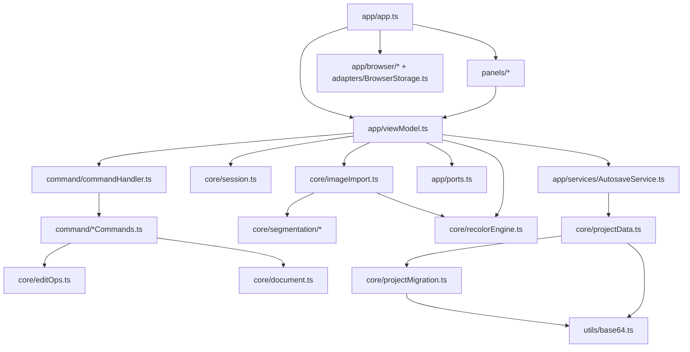
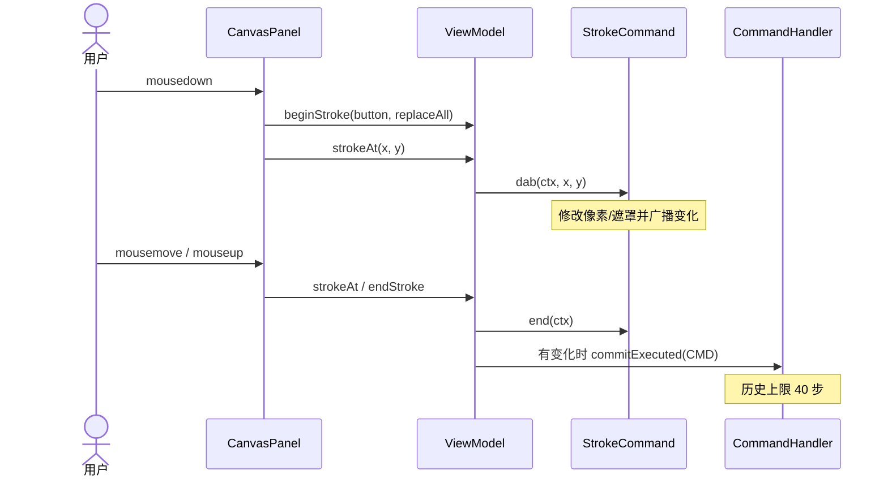

# 64px Portrait Studio 代码阅读与审查指南 (Code Review Guide)

本文档描述当前源码的模块、数据流与审查契约。架构提案和历史实施文档中的目录、控制器与草稿流程可能已变更，应以源码和可重复测试为准。内核重构的历史分析见 [CORE_REFACTOR_REPORT.md](CORE_REFACTOR_REPORT.md)。

## 1. 架构总览

项目采用 Vanilla TypeScript + Vite。界面调用 `ViewModel`，文档修改通过命令执行，会话状态直接修改后广播事件。面板将事件合并到下一次 `requestAnimationFrame` 渲染。

- `core/`、`command/` 和纯工具不依赖界面 DOM。`editOps` 原地修改显式传入的数组，不能将其理解为没有副作用的数学纯函数。
- 文档和会话模型位于 `core/document.ts`、`core/session.ts`。当前没有 `model/`、`data/`、`types/` 目录。
- `app/viewModel.ts` 作为父中枢协调器，统筹独立的 `PixelViewModel`（绘图）与 `MaskViewModel`（遮罩）两个子 ViewModel。模式切换（包括工具/分区卡片点击、全局快捷键、以及隐藏全部遮罩等触发场景）严格遵循统一的 `canExit -> cleanup -> enter` 生命周期协议，提供完整的状态隔离与试色确认；拒绝退出时绝不提前污染可见图层与覆盖层状态；`app/app.ts` 装配面板和浏览器能力。
- `app/ports.ts` 定义 `StudioPrompts` 与 `ExportBackend`。默认 `ViewModel` 可无浏览器构造，未注入存储或导出能力时返回失败。
- 浏览器解码、Canvas、ZIP 与下载位于 `app/browser/`；localStorage 通过 `app/adapters/BrowserStorage.ts` 注入 `AutosaveService`。



## 2. 目录结构与模块导航

```text
src/
├── main.ts                         # 入口；?debug 时暴露 window.__studio
├── style.css / styles/             # 样式
├── core/
│   ├── types.ts                    # 分区、工具、矩形、工程与解码类型
│   ├── constants.ts                # 36 色色板、9 种四阶发色、分区与匹配色组
│   ├── document.ts                 # PortraitDocument、克隆与图层视图
│   ├── session.ts                  # EditorSession、缩放档位、选区裁剪
│   ├── pixelGrid.ts                # 唯一网格规格、邻域与连通域算法
│   ├── editOps.ts                  # 像素/遮罩编辑、几何变换、扣白底
│   ├── imageImport.ts              # 已解码图像量化、分区与透明归一化
│   ├── recolorEngine.ts            # 发色投票、源色阶识别与目标颜色映射
│   ├── projectData.ts              # 工程校验、编解码与透明遮罩归一化
│   ├── projectMigration.ts         # v1 → v2 工程迁移
│   └── segmentation/              # 背景、轮廓、面部特征与最终分区决议
├── command/
│   ├── command.ts                 # Command、SnapshotCommand、差异事件
│   ├── commandHandler.ts          # 40 步历史、合并、撤销与重做
│   ├── events.ts                  # StudioEvents、通知与保存状态
│   ├── pixelCommands.ts           # 笔划、移动、粘贴、清除与换色
│   ├── maskCommands.ts            # 框选、按色划分与整张遮罩设置
│   ├── paletteCommands.ts         # 色板微调、重置与发色提交
│   └── transformCommands.ts       # 翻转与旋转
├── app/
│   ├── app.ts                     # 装配、快捷键、文件导入与生命周期
│   ├── viewModel.ts               # 父中枢与模式协调器，生命周期调度与门面
│   ├── subViewModel.ts            # SubViewModel 接口与 StudioContext
│   ├── pixelViewModel.ts          # 色板、像素工具、选区与几何变换
│   ├── maskViewModel.ts           # 遮罩工具、分区显隐、匹配色与发色试色
│   ├── ports.ts                   # 确认与导出端口
│   ├── editorContext.ts           # 高亮与实时预览等界面状态
│   ├── services/AutosaveService.ts # 实例级 300ms 防抖保存
│   ├── adapters/BrowserStorage.ts # localStorage 接入
│   └── browser/
│       ├── imageDecode.ts         # 图片解码、等比缩放与居中
│       ├── pixelCanvas.ts         # 索引像素绘制
│       ├── projectImportExport.ts # 图片/ZIP 导入、工程打包与导出
│       └── domUtils.ts            # 下载、ObjectURL、Canvas Blob、图片加载
├── panels/
│   ├── Panel.ts                   # 脏队列、RAF 合并渲染与销毁
│   ├── Header.ts                  # 导入/导出、模式与保存状态
│   ├── PalettePanel.ts            # 像素工具、36 色色板与四阶发色卡
│   ├── MaskToolsPanel.ts          # 遮罩工具与匹配色组
│   ├── MaskPanel.ts               # 四个有效分区、锁定、显隐与发色应用
│   ├── RealtimePreview.ts         # 原寸预览
│   ├── canvas/                    # 输入、渲染、选区、高亮与信息浮层
│   └── modals/                    # ConfirmModal、ReplaceColorModal、HelpModal
└── utils/
    ├── colorUtils.ts              # RGB/OKLab、色差与最近邻量化
    ├── minimalPng.ts              # 索引 PNG、CRC 与压缩降级
    ├── base64.ts                  # 字节数组与 Base64
    └── mathUtils.ts               # 数值和统计工具
```

## 3. 数据模型与不变式

### 3.1 PortraitDocument

参见 [core/document.ts](../src/core/document.ts)。

```ts
interface PortraitDocument {
  palette: string[];                       // 36 个 #RRGGBB 颜色
  pixelIndices: Uint8Array;                // 4096 字节；0–35 或 255
  semanticMask: Uint8Array;                // 4096 字节；0–4
  currentHairPreset: HairPresetKey | null; // 如 '02_brown_棕'
}
```

- 网格为 64×64，规格以 `core/pixelGrid.ts` 为唯一来源；`core/constants.ts` 重导出规格。
- 分区值为 `None=0`、`Hair=1`、`Skin=2`、`Eyes=3`、`Clothes=4`。`Background=0` 仅保留为废弃兼容别名。界面只列出四个有效分区，快捷键为 1–4。
- 透明像素必须满足 `semanticMask[i] === SemanticZone.None`。不透明像素也可没有遮罩，None 不代表透明。
- `cloneDocument()` 复制色板与两张数组；`layersOf()` 返回原数组的编辑视图，并复制锁集合。
- `currentHairPreset` 参与后续改色的源预设识别。导入、选择发色卡系列和应用发色都可能修改它，不能仅将其视为“已应用发色”的证明。

### 3.2 EditorSession

参见 [core/session.ts](../src/core/session.ts)。会话包含模式、工具、前景/背景色、选区、分区显隐与锁定、匹配色组、遮罩不透明度、缩放与网格开关。默认活动分区为 Hair。

会话不进入工程存档；选区随命令快照参与撤销，其余会话字段不参与。缩放档位为 4、6、8、12、16、24、32，默认 12。当前没有活动发色草稿字段。

### 3.3 锁定的实际范围

锁定保护手工遮罩分配，不是全局像素锁：

| 操作 | 当前规则 |
| --- | --- |
| 遮罩笔刷、遮罩擦除、遮罩桶、按色划分、智能框选 | 当前分区或非 None 目标分区被锁定时拒绝改写；遮罩泛洪不能穿过锁定分区 |
| 像素绘制、像素桶、全局换色、选区几何变换 | 不受遮罩锁限制 |
| 像素擦除、透明绘制、剪切与清空 | 像素清为 255，遮罩无条件清为 None |
| 重新识别语义遮罩 | 整体替换；当前不按锁过滤 |
| 一键应用发色 | 处理 Hair 分区；当前不按锁过滤 |
| 扣外围白底 | 保护锁定分区与 Eyes；透明位置可作为泛洪通路 |

扩大锁保护范围属于行为变更，应另外约定并验证，不能在结构重构时悄悄改变。

## 4. 命令、笔划与状态管理

### 4.1 普通命令与输入校验

`SnapshotCommand.init()` 捕获文档及选区，`execute()` 修改数据并比较 before/after。无变化命令不入栈。Undo/redo 恢复快照并按差异广播事件，不重新计算算法。

`CommandHandler` 先尝试合并栈顶命令，再调用新命令的 `init()`。因此 **init 校验不会自动覆盖 mergeWith 路径**：

- `SetPaletteColorCommand` 在初始化和合并时共用输入校验，索引必须是 0–35 的整数，颜色必须是 `#RRGGBB`。
- 相同非零 gesture 且索引相同的连续颜色修改可合为一步撤销。非法后续颜色不能污染已保存的合并快照。
- `ResetPaletteCommand` 接受 null（全部重置）或合法整数索引。
- `SetMaskCommand` 拒绝错误长度及 0–4 以外的值，应用后归一化透明位置。
- `CommitHairRecolorCommand` 拒绝错误长度、非法预设及 0–35/255 以外的像素索引，应用后归一化透明位置。
- 拒绝的命令不得修改文档、广播变化事件、增加历史或截断已有重做分支。

以上不是对所有命令输入的通用外部校验承诺；选区块等内部参数仍依赖调用方契约。工程外部数据必须先走 `validateProjectData()`。

### 4.2 跨鼠标事件的笔划

1. `beginStroke()` 检查加载和销毁状态，先提交已有笔划，捕获工具、锁集合和选区，并记录 `strokeGeneration`。
2. `strokeAt()` 校验文档代次后调用 `StrokeCommand.dab()`，局部修改并广播像素/遮罩事件。
3. `endStroke()` 调用 `end()`，仅有实际变化时用 `commitExecuted()` 入栈。
4. `ViewModel.execute()`、undo/redo、影响笔划的会话切换和导出先结束笔划；替换文档直接作废活动笔划并清空历史。

历史上限由 `UNDO_LIMIT=40` 定义。撤销后提交新命令会截断重做分支；非法命令不能截断它。

### 4.3 文档代次与异步边界

`replaceDocument()` 自增 `documentGeneration`，取消挂起的 ViewModel 确认及自动保存，复制新文档，并清空笔划与历史。

`confirmWithGeneration()` 保护清空、新建、色板重置等 ViewModel 弹窗回调，并确保 dismiss 释放等待者。自动保存回调也核对代次。

目前 App 的 `handleIncomingFile()` 直接等待 `importAnyFile()`，没有导入请求序号或 await 后的文档代次检查，不能据此宣称并发导入已隔离。导出通过独立快照保护输出内容，完成通知没有文档代次校验。新增异步写入仍应审查文档身份、连续请求及销毁后回调。

### 4.4 自动保存与生命周期

每个 ViewModel 持有独立 `AutosaveService`，默认防抖 300ms。保存失败广播 error 状态与通知，清缓存失败也不误报成功。

`vm.dispose()` 先结束笔划、取消确认并 flush 自动保存，再设置销毁标记、清空监听者。App 在 `pagehide` 与页面隐藏时调用 `flushAutosave()`；销毁通过 AbortController 释放事件并销毁面板。面板销毁会注销监听者、移出脏队列，并释放自身定时器与节点。

## 5. 核心算法与输入输出

### 5.1 四阶发色映射

参见 [core/recolorEngine.ts](../src/core/recolorEngine.ts)。九个预设各有四个阶位，使用常量中的顺序，不重新按亮度排序。

1. `resolveEffectiveSourceKey()` 优先采用合法显式源预设，否则在 Hair 像素中投票识别；最高票数大于零即返回预设，纯白不参与投票。
2. `resolveTierForPixel()` 优先精确匹配源色阶；源外颜色按亮度 `0.2126R + 0.7152G + 0.0722B` 就近匹配目标阶位。
3. `resolvePaletteIndex()` 优先精确匹配目标色号，缺色时使用 OKLab 最近邻映射到当前色板。
4. `recolorHair()` 返回新数组，只处理非透明 Hair 像素，其他分区保持不变。

试色草稿机制与已提交文档完全解耦：

- 待确认换色保存在 `MaskViewModel.pending`（区域 → 目标预设）及其撤销/重做快照栈中；`applyHairPreset()` 经 `setZoneTrial()` 更新，并通过 `onPreviewChanged` 通知画布、实时预览、发色卡和遮罩工具栏。不修改正式文档、不生成文档命令、不触发自动保存。
- `displayPixels()` 把待确认集合依次合成到已提交文档上（`composeRecolors()`）；没有待确认项时直接返回文档数组。当前没有预览缓存（64×64，且文档数组原地修改，缓存需额外失效机制）。
- 退出蒙版模式时统一确认或放弃换色，也可继续试色；导出（PNG/ZIP）前可确认换色、放弃换色或取消导出。确认通过 `CommitHairRecolorCommand` 提交，取消只清除试色状态，不回写旧像素，保留已完成的几何变换与遮罩编辑。文档替换和销毁调用 `invalidateTrial()`。
- `hasPendingRecolors()` 逐区域按试色目标及实际像素差异判定（同名预设的杂色映射也可产生 pending）。`ZONE_RECOLORS` 注册表定义各区域的名称、源预设与换色函数，目前只注册了头发；新增眼睛等区域只需补一项，确认、取消、弹窗文案（`describePendingRecolors()`，退出与导出共用）和显示合成均已按“区域集合”工作。确认时目前仍只同步头发预设标记，其他区域的文档标记需随各自算法接入。
- 遮罩框选、按色划分和颜色统计读取已提交文档。`current_hair` 匹配组（界面标为“已确认发色预设”）在试色、试色撤销/重做和取消时保持源色组；正式提交、文档历史恢复或色板调整后刷新。自定义匹配组不自动覆盖。
- 自动保存服务严格仅持久化已提交文档（`doc`），未确认试色绝不写入本地存储。

标准四阶映射可保持阶位；自定义色和缺色兜底不保证无损回环。

### 5.2 遮罩泛洪与框选

`floodFillMask()` 区分遍历与赋值条件。起点已经属于目标分区时，仍可遍历相邻同色区域并改写其他允许位置。遍历受连通度、选区和锁定分区限制；赋值统一调用 `canAssignZone()`。

`boxSelectMask()` 实现 add/remove/subtract/clear，`assignColorToMask()` 实现按色划分。对应命令只组织参数、结果数量与快照。

透明像素不能划入有效分区。像素操作写入透明时清除遮罩，并通过事件同步视图。

### 5.3 图像导入与自动分区

浏览器 `decodeImageFile()` 将大图等比缩到 64×64 范围内；小图保持尺寸，居中放入透明画布，得到 `DecodedImage`。核心 `processDecodedImage()` 不负责 DOM 解码或缩放：

1. alpha 小于 128 视为透明，RGB 临时使用白色占位。
2. 使用 OKLab 最近邻量化到当前 36 色色板，不抖动。
3. `computeSemanticMask()` 依次估算背景、提取轮廓、分析面部、认领特征、决议四个有效分区及 None。
4. 无有效面部时，使用 `FALLBACK_CHIN_Y=38` 分配上下部轮廓，其余前景归 Clothes。异常捕获则采用角落背景色与 Clothes 的简化兜底。
5. 恢复透明索引并归一化遮罩，投票识别源发色预设，返回新文档与提示。

固定样本位于 `tests/fixtures/segmentationFixtures.ts`；阶段与结果断言位于 `tests/segmentation.test.ts`。

### 5.4 工程校验、迁移与导出

`validateProjectData()` 返回判别联合；先判断 valid，成功后才能访问 data。它负责版本迁移及色板、数组长度、像素/遮罩值域、预设、时间戳校验。`projectDataToDocument()` 接收已校验数据，解码并修复透明位置的遮罩；不要把它当作未知输入校验器。

当前 Schema 为 v2；v1 迁移处理旧五阶发色。迁移和编解码分别直接依赖 `utils/base64.ts`，避免相互循环引用。`documentToProjectData()` 编码文档，不代替入口校验。

ViewModel 导出先结束笔划、flush 自动保存、`cloneDocument()`，再调用注入的 ExportBackend。浏览器适配器生成 PNG/ZIP；PNG 使用索引编码，ZIP 包含可恢复工程与辅助资源。下载通过 `domUtils.downloadBlob()` 的 try/finally 回收 ObjectURL。

## 6. 渲染与模态窗口

`Panel` 使用模块级 `Set<Panel>` 去重脏面板；同一帧只执行一次 render。没有 RAF 的测试环境采用 setTimeout 降级，不存在面板实例的 `isDirty/flush()` 接口。

`CanvasRenderer` 将 64×64 索引像素画到离屏 canvas，再关闭平滑、按缩放倍率绘制到展示 canvas。随后叠加可见遮罩、颜色高亮、网格和选区。遮罩不透明度来自 session（默认 0.5），网格在 zoom ≥ 8 时绘制。

`ConfirmModal` 处理替换时的 dismiss、Tab 焦点循环及关闭后的焦点恢复。它的 UI 生命周期与 ViewModel 的文档代次守卫是两层职责，调用方仍需处理异步结果有效性。

## 7. 典型调用链



图片导入：`App.handleIncomingFile()` → `importAnyFile()` → `decodeImageFile()` → `vm.importImage()` → `processDecodedImage()` → `replaceDocument()`。工程 ZIP 则先校验/迁移，再调用 `vm.loadProject()`。

发色试色：`MaskPanel` 点击预设 → `vm.applyHairPreset()` → 更新试色历史 → `onPreviewChanged` → `displayPixels()` 合成显示。退出模式或导出前确认 → `commitAllRecolors()` → `vm.execute(CommitHairRecolorCommand)` → 文档差异事件 → 自动保存与面板渲染。

## 8. 审查检查清单

| 检查维度 | 审查标准 |
| --- | --- |
| DOM 隔离 | core/command 及 ViewModel 的依赖图不引入浏览器实现；运行 adapterBoundary 测试，而不是按变量名 document 判断 |
| 命令输入 | init 和 mergeWith 都须覆盖所承诺的校验；非法输入不改文档、事件、历史或重做分支 |
| 手势闭环 | 应用层命令经 vm.execute()；直接使用 handler 会绕过笔划结束 |
| 异步有效性 | 回调核对文档代次、请求顺序与销毁状态；独立导出快照和异步写入需分别审查 |
| 透明归一化 | 写入索引 255 必须同时清遮罩为 None；透明位置不能划入有效分区 |
| 锁定范围 | 手工遮罩操作保护当前与目标分区；按第 3.3 节分别审查像素、重识别、发色与扣白底 |
| 快照与历史 | 避免数组共享；覆盖合并撤销、重做截断、无变化命令及选区恢复 |
| 工程边界 | 未知 JSON 先校验；合法输入与迁移行为用仓库内固定夹具验证 |
| 生命周期 | 事件、定时器、确认等待者和浮层在 dispose 中释放，销毁后回调不再写入 |
| 文档同步 | 目录、常量、字段含义和调用图与源码一致，不把历史方案当作已实现功能 |

## 9. 验证与证据范围

执行以下检查，以实际输出记录套件和测试数量，避免在指南中维护容易过期的固定计数：

```bash
npm run typecheck
npm run typecheck:tests
npm test
npm run build
npm run test:e2e
git diff --check
```

`test:e2e` 使用系统 Chrome，Playwright 会按配置启动或复用开发服务器。`test:all` 只串联 Vitest 与 Playwright，不包含类型检查和 diff 检查。

重点回归测试包括 commandHandler/gestureHistory（输入与合并历史）、maskCommands/editOps/pixelCommands（锁与透明）、adapterBoundary（依赖）、projectData/projectMigration（工程）、recolorEngine（发色）、segmentation（固定样本）、storage/lifecycle/reviewFollowup（保存与销毁）。

单元测试通过不等于所有异步竞态已覆盖。例如，Downloads 中私人备份文件不存在时，相应迁移测试会直接返回；仓库内合成 ZIP 测试可重复，但不能据此宣称验证过该私人文件。并发导入的代次隔离也需要独立实现与回归验收。
