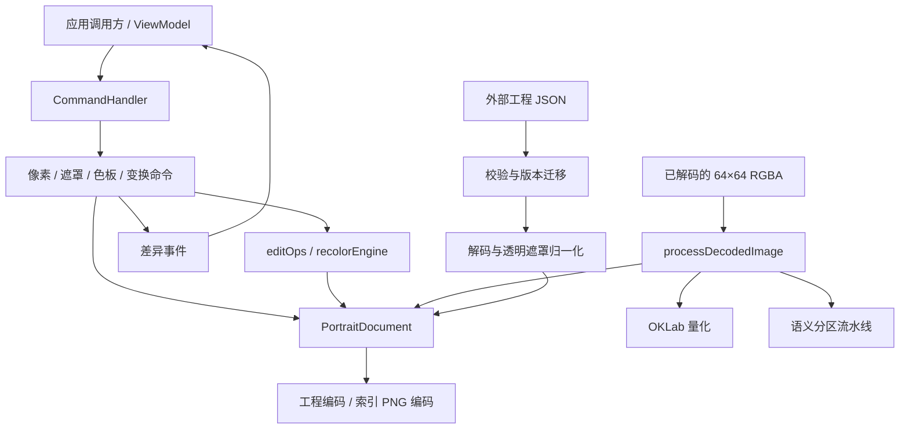
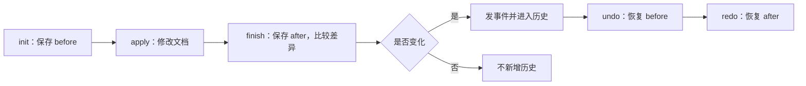
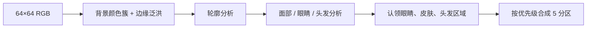

# 64px Portrait Studio：内核代码理解与重构报告

报告日期：2026-10-06（America/Los_Angeles）  
源码基线：Git HEAD `42153fd`  
报告性质：源码分析与重构建议；本次只新增报告，未修改实现、测试或配置。

## 1. 范围与主要判断

本报告关注 `src/core/`、`src/command/` 和与内核直接相关的 `src/utils/`。`ViewModel` 仅作为内核调用方介绍；浏览器适配器仅用于说明输入输出边界。面板、DOM 组件、CSS、快捷键和画布输入组织不属于本次重构范围。

目前内核的整体路线适合这个项目：固定 64×64 网格、索引色像素、互斥语义遮罩、同步编辑命令、快照式撤销。重构的主要收益来自明确数据含义和规则归属，以及清理少数依赖问题。

建议优先处理：

1. 统一画布规格常量，解除工程数据与迁移模块的循环依赖。
2. 明确透明像素、遮罩锁定和几何变换的现有规则，收拢重复的写入逻辑。
3. 把遮罩命令中的算法移到核心操作函数，让命令专注历史与事件。
4. 澄清发色标记的含义，以及改色算法中精确映射和兜底映射的区别。
5. 明确工程校验、迁移、解码的边界，改善结果类型。
6. 在调整识别算法前，补足可重复的样本与回归测试。

报告中使用三种标记：**已确认**表示源码或已执行检查直接支持；**风险推断**表示调用链存在潜在问题，但本次未复现故障；**待定规则**表示需要先明确业务含义，再决定是否改变行为。

## 2. 当前内核地图

### 2.1 模块与职责

| 模块 | 当前职责 | 阅读时关注的问题 |
| --- | --- | --- |
| `core/types.ts` | 分区、工具、矩形、图片解码结果、工程数据等类型 | 哪些类型属于保存数据，哪些属于操作上下文 |
| `core/constants.ts` | 36 色色板、9 种发色、分区配置、匹配色组 | 数据表与规格常量的归属 |
| `core/document.ts` | 文档创建、克隆、编辑图层视图 | 数组所有权及文档不变量 |
| `core/session.ts` | 编辑会话状态、选区裁剪和命中判断 | 哪些会话状态参与撤销 |
| `core/pixelGrid.ts` | 坐标、邻域、边缘、连通域、泛洪 | 固定网格上的通用图算法 |
| `core/editOps.ts` | 清除、换色、填充、选区块、变换、遮罩分配、扣白底 | 每项操作怎样同时修改像素和遮罩 |
| `core/imageImport.ts` | 已解码图片的量化、分区、透明归一化、发色识别 | 导入怎样产生合法文档 |
| `core/recolorEngine.ts` | 发色投票、色阶识别、发色置换 | 源预设参与映射的方式 |
| `core/segmentation/` | 背景、轮廓、眼睛、面部、头发等启发式识别 | 各阶段的中间结果与最终优先级 |
| `core/projectData.ts` | 保存格式编解码、校验、透明遮罩修复 | 外部数据进入内存文档的边界 |
| `core/projectMigration.ts` | 历史版本升级，目前为 v1 → v2 | 旧 5 阶发色如何迁移到 4 阶 |
| `command/command.ts` | 命令接口、快照、恢复、差异事件 | 修改结果和历史如何保持一致 |
| `command/commandHandler.ts` | 历史栈、游标、合并、撤销、重做 | 无变化命令与重做分支 |
| `command/*Commands.ts` | 像素、遮罩、色板和变换命令 | 算法与命令机制是否分离 |
| `utils/colorUtils.ts` | RGB/OKLab、色差、色板最近邻 | 感知距离和亮度距离的不同用途 |
| `utils/base64.ts` | 字节数组与 Base64 | 保存格式的底层编码 |
| `utils/minimalPng.ts` | 索引 PNG 编码、CRC、压缩降级 | 内部透明索引与 PNG 透明槽位 |
| `utils/mathUtils.ts` | 基础统计与数值操作 | 与分区统计工具的关系 |

当前实际没有 `src/model/`；文档和会话模型位于 `src/core/`。旧文档中的目录描述应以当前源码为准。

### 2.2 调用关系



其中几条路径需要区分：

- 普通编辑通过命令修改现有文档，并进入历史。
- 导入或恢复由调用方整体替换文档，并清空历史。
- 自动分区、量化、改色先计算结果；把结果提交到现有文档时，再由命令记录历史。
- 存储和下载位于调用方或适配层，内核命令不负责这些 I/O。

“无 DOM 依赖”与“数学意义上的纯函数”也要区分。`recolorHair()` 返回新数组；`editOps` 中许多函数会原地修改传入数组。后者仍然属于内核，只是具有显式的数据修改副作用。

## 3. 数据模型：两张数组与一个色板

### 3.1 PortraitDocument

核心文档只有四个字段：

```ts
interface PortraitDocument {
  palette: string[];
  pixelIndices: Uint8Array;
  semanticMask: Uint8Array;
  currentHairPreset: HairPresetKey | null;
}
```

| 字段 | 当前含义 | 约束 |
| --- | --- | --- |
| `palette` | 当前色板，允许微调 | 36 个 `#RRGGBB` 颜色 |
| `pixelIndices` | 每个像素指向色板的索引 | 长度 4096；0–35 为颜色，255 为透明 |
| `semanticMask` | 每个像素所属分区 | 长度 4096；0–4 分别为背景、头发、皮肤、眼睛、衣服 |
| `currentHairPreset` | 当前发色预设标记，参与后续改色 | null 或 9 个合法预设之一；它的业务含义尚有混用，见第 7 节 |

像素坐标采用行优先布局：`offset = y × 64 + x`。例如 `(10, 20)` 对应数组下标 1290，像素和遮罩使用同一下标。

这是一张互斥标签图：每个像素只有一个语义分区。界面中多个分区的显示，不意味着文档保存了五张独立的可重叠图层。

背景分区也不等于透明。一个不透明的白色背景像素可以属于 Background；透明像素则必须属于 Background。这是单向约束。

### 3.2 不变量

文档应始终满足：

1. 色板长度、像素长度和遮罩长度固定且合法。
2. 像素索引与遮罩值处于合法范围。
3. `pixelIndices[i] === 255` 时，`semanticMask[i] === Background`。
4. 发色标记为 null 或有效预设。

已有测试助手 `tests/helpers/documentFixture.ts` 的 `assertDocumentInvariant()` 明确检查了这些规则，可以继续复用。

**已确认：**TypeScript 的 `Uint8Array` 类型不能表达“长度必须为 4096”，也不能保证数组中的业务取值合法。合法文档依赖创建函数、外部数据校验、编辑规则和调用约定共同维持。

### 3.3 会话状态与撤销状态

`EditorSession` 保存当前工具、颜色、分区锁定、匹配色组、缩放和选区等状态。绝大部分会话字段不保存到工程，也不进入撤销。

选区是例外：快照命令会保存选区，使移动、粘贴和旋转后的撤销能恢复相应选区。当前快照保存的是“文档 + 选区”，并未保存完整会话。

会话中仍有 `hairDraftPreset` 字段，但当前正常发色流程直接提交像素修改，没有活动草稿。这是可清理的模型遗留；清理时需要同步调用方和测试。

### 3.4 数组所有权

`cloneDocument()` 会复制色板和两张字节数组。`layersOf()` 则返回原数组的编辑视图，只为锁定分区创建新的 Set。

因此，克隆适用于需要独立结果的快照或输出边界；图层视图适用于有意修改当前文档的操作。两者用途不同，重构中应保持清楚。

## 4. 命令、笔划与撤销如何工作

### 4.1 普通快照命令

`SnapshotCommand` 的流程如下：



快照包含像素、遮罩、色板、发色标记和选区。恢复时对两张现有数组调用 `.set()`，恢复色板和其他字段，再比较差异并发事件。

快照命令的重做会恢复保存的结果，不重新运行识别或改色算法。这样算法以后调整，也不会改变已经进入历史的重做结果。

### 4.2 CommandHandler

历史由一个命令数组和游标表示，上限为 40 条。执行新命令时：

1. 尝试与栈顶合并。
2. 执行初始化和命令。
3. 有变化才截断重做分支并入栈。
4. 超过上限时丢弃最旧命令。

撤销、重做或清空历史后，会关闭下一次合并尝试。`SetPaletteColorCommand` 使用 gesture ID 合并同一次连续调色；默认 gesture 为 0 的独立修改不会合并。

这套机制已足够支撑当前规模。每份快照的两张数组合计 8 KiB；每条命令保存前后两份，40 条约 640 KiB 的数组数据，另加色板、对象和选区开销。这个规模支持继续采用整份快照。

### 4.3 笔划命令是特殊事务

`StrokeCommand` 跨多个输入采样执行：

1. 调用方创建命令并 `init()`，保存笔划前状态。
2. 每次 `dab()` 修改一个像素或一片笔刷区域。
3. 每次采样按真实修改发像素或遮罩事件。
4. 结束时 `end()` 保存最终状态，判断整笔是否变化。
5. 调用方使用 `commitExecuted()` 把已执行的整笔提交到历史。

`StrokeParams` 在笔划开始时捕获参数。这样一笔的工具、颜色、分区、邻接方式和选区作用域具有一致含义。调用方也会在相关会话参数变化时结束当前笔划。

**重构验收重点：**一笔仍对应一次撤销；无变化笔划不新增历史；桶工具每笔只执行一次；文档替换后旧笔划不能继续写入。

### 4.4 事件仍可保持现状

`emitDiff()` 分别检查像素、遮罩、色板、发色和选区变化。多个字段变化时，会发多个事件。当前调用方依靠这些通知安排保存与刷新。

若以后希望合并事件，应单独评估调用方兼容性。本次建议保持事件机制，优先改善命令中的业务规则归属。

## 5. 像素、遮罩与锁定：现有规则必须先讲清

### 5.1 主要操作

| 操作 | 对像素的影响 | 对遮罩的影响 |
| --- | --- | --- |
| 普通绘制或非透明换色 | 修改色板索引 | 通常保持原分区 |
| 擦为透明、透明填充、清空选区 | 置为 255 | 同时归 Background |
| 遮罩画笔、桶、按色分配 | 不改像素颜色 | 修改分区 |
| 剪贴板复制 | 复制像素块 | 同时复制分区块 |
| 粘贴 | 非透明块像素覆盖目标；透明像素跳过 | 覆盖位置带入块遮罩 |
| 翻转 | 交换像素位置 | 同步交换遮罩位置 |
| 旋转 | 清除旧范围，再写旋转结果 | 同步处理遮罩；选区宽高互换 |
| 扣外围白底 | 清除符合条件的白色像素 | 清除位置归 Background |

透明粘贴与清空不同：透明块像素不会覆盖下方内容。剪切移动则先清空原范围，再粘贴非透明部分。

### 5.2 锁定规则不是通用像素锁

**已确认：**当前像素绘制、换色、移动、翻转等正常调用多使用空锁集合；遮罩编辑使用会话中的锁集合。核心函数 `stampPatch()`、`flipRect()` 等也没有通用锁过滤。

`canAssignZone()` 的规则是：

1. 透明像素不能归入非背景分区。
2. 当前分区被锁定时，不能改写分区。
3. 目标为被锁定的非背景分区时，不能向其划入。
4. 已属于目标分区时，无变化。

遮罩泛洪还会把锁定区域作为不可穿越的边界。它依据相邻像素的颜色扩展，不是只依据已有遮罩标签扩展。

另外两种操作要单独理解：

- 像素擦除为透明时，遮罩无条件归背景，以满足文档不变量。
- 扣外围白底会保护 Eyes 分区和锁定分区；透明像素允许泛洪通过，以找到与外围相通的白底。

重新识别使用 `SetMaskCommand` 整体替换遮罩，没有逐像素锁检查。它与手工遮罩分配的含义不同。

### 5.3 当前注释冲突

`editOps.ts` 文件头、部分换色/泛洪注释，以及 `ClearRectCommand` 注释仍描述“清空时保留锁定遮罩”或“遵守分区锁”。实际 `erase()` 和 `clearRect()` 会无条件把透明位置归背景。

这是已确认的说明与实现不一致。重构应先将现有规则写准确，随后再决定是否改变锁定的业务含义。把锁定扩展为“保护所有颜色和变换”会改变现有行为，应作为独立功能决策处理。

### 5.4 可以怎样收拢规则

现在透明处理出现在 `editOps.erase()`、`StrokeCommand`、`ClearPixelsCommand`、导入和工程解码等路径。

建议分为两类：

- **运行时编辑操作：**统一像素写入和擦除的基础函数，确保颜色改为透明时同时处理遮罩。
- **外部数据进入：**统一透明遮罩归一化函数，返回修复数量或警告信息。

外部修复和正常编辑不要混为同一个操作。正常编辑应直接保持不变量；历史工程兼容修复需要保留警告信息。

## 6. 图片导入、量化与自动分区

### 6.1 内核收到的输入

内核接收 `DecodedImage`，其中 RGBA 已经是 64×64 的画布数据，并带原始尺寸和实际放置尺寸。图片解码、缩放、居中属于外部适配器。

`processDecodedImage()` 执行：

1. 读取 RGBA；alpha 小于 128 的位置视为透明。
2. 为透明位置放置白色 RGB 占位，同时记录透明标记。
3. 使用当前色板进行 OKLab 最近邻量化，不使用抖动。
4. 根据 RGB 输入自动识别语义分区。
5. 将透明位置的索引改为 255，遮罩改为 Background。
6. 根据头发分区投票识别发色标记。
7. 返回文档、尺寸提示和警告。

**已确认：**识别使用量化前 RGB，最终文档保存量化后的色板索引。以后“根据当前画布重新识别”使用的则是色板索引还原的 RGB。因此两次输入可能不同，不能假定导入分区与重新识别逐字节相同。

### 6.2 颜色量化

`quantizeToPalette()` 先把色板转换为 OKLab，再为每个 RGB 像素寻找感知距离最近的颜色。相同 RGB 值的结果会通过 Map 缓存。

它保留图像几何位置，只缩减颜色。此处的感知距离与发色兜底使用的加权 RGB 亮度距离不同，不能在重构时简单互换。

### 6.3 自动分区流水线

自动分区使用颜色、连通性和几何规则，没有机器学习推理调用。



- `background.ts`：从边缘像素中找主要 OKLab 颜色簇，估计阈值，从四边泛洪得到背景。
- `contour.ts`：分析前景轮廓及轮廓颜色。
- `faceAnalysis.ts`：通过肤色连通域、行宽、眼睛锚点和脸部几何建立面部分析结果，并结合头发分析。
- `resolver.ts`：认领区域，最后合成互斥标签。

最终判断顺序是：背景 → 眼睛 → 头发 → 皮肤 → 轮廓分配 → 剩余衣服。内部嘴部与表情区域参与识别，但最终仍归入五个输出分区之一。

面部识别返回 null 时，流水线仍能输出：轮廓按下巴阈值分到头发或衣服，其余前景归衣服。只有流水线抛异常时，`imageImport.ts` 才进入另一条角点颜色兜底并附加警告。

### 6.4 当前测试保护的限度

`tests/segmentation.test.ts` 当前有两个测试：均匀背景、居中肤色块。第二个只断言一个中心位置属于 Skin 或 Hair，无法保证眼睛边缘、头发轮廓、表情和身体皮肤的精确结果。

这足以检查基本可运行性，但对复杂启发式重构的保护有限。建议先准备小型、固定的 RGB 样本及关键区域断言，再调整模块和阈值。

可以覆盖：完整头像、无面部前景、非白背景、不同头发形状、脸部部分遮挡、眼白与头发高光、透明边缘。已有正确结果可使用逐字节基线；对已知误识别样本，要标记当前输出与期望目标，避免把误识别永久冻结。

## 7. 发色内核：算法与标记含义

### 7.1 当前为 4 阶、直接写入像素

9 种预设各有 4 个颜色：轮廓、阴影、主色、高光。正常应用发色时，调用方先执行 `recolorHair()`，再用 `CommitHairRecolorCommand` 写入新像素和预设标记。

当前文档没有独立保留原始头像像素，也没有渲染时执行“原图 + 遮罩 + 发色配置”的动态合成。保存和输出读取的是已改色的像素；撤销依靠命令快照恢复。

旧草稿方法和命令名称可清理，但不能把名称清理误写成已采用动态合成架构。

### 7.2 recolorHair 的分支

1. 复制输入像素，保持输入数组不变。
2. 校验目标预设。
3. 源预设有效时使用它；没有有效源预设时投票识别。
4. 只处理 Hair 分区的非透明像素。
5. 像素颜色精确匹配源色阶时，按同一阶位映射到目标色阶。
6. 没有匹配源色阶时，按当前实现的加权 RGB 亮度寻找目标阶位。
7. 目标色在当前色板中不存在时，使用 OKLab 最近邻找到可用索引。

精确色阶映射可保留暗部、主色和高光的角色。兜底映射处理自定义颜色或源预设未知的像素，但可能产生信息损失。

现有多次改色回环测试使用精确的预设色板像素。它证明该场景的阶位映射稳定，不能推广为“所有自定义颜色循环改色都无损”。

### 7.3 currentHairPreset 的混用

**已确认：**`SetHairPresetCommand` 只改变标记；`CommitHairRecolorCommand` 同时改变像素和标记。调用方既有实际换色入口，也有只选择发色色系的入口，后者同样写入 `currentHairPreset`。

所以这个字段同时承担了至少两种角色：选中的发色色系，以及后续改色算法参考的源预设。它并不能保证所有 Hair 像素都属于该预设。

**风险推断：**仅选择一个色系后，后续改色会使用这个源标记；若实际颜色属于另一个预设，精确阶位映射可能变成亮度兜底映射。本次未执行交互复现，报告不把它定为已证实故障。

**待定规则：**字段究竟代表“最后应用的预设”“源色阶参考”还是“当前选中色系”？建议在重构前明确这一点。较清晰的方向是把选择状态与算法参考分开，但这会影响调用方以及可能的保存语义，需要独立验收。

### 7.4 色阶查找逻辑可以复用，但策略应明确

当前核心匹配预设 `current_hair` 用 `palette.indexOf(hex)` 找精确颜色；改色算法则支持大小写归一化和缺色时最近邻查找。不同入口可能得到不同的可用色阶集合。

建议提供明确的纯函数处理色阶到色板索引的解析，并明确调用方选择“精确匹配”还是“允许最近邻”。是否让匹配色组也采用最近邻，是业务行为选择；结构重构阶段应保留各入口现有策略。

`detectHairPreset()` 的注释写“命中不足 50 无法识别”，实际代码只要求最佳票数大于 0。先修正说明；若要增加阈值，应作为识别行为变更，新增对应样本测试。

## 8. 工程数据、版本迁移与 PNG

### 8.1 保存格式

当前 `CURRENT_PROJECT_VERSION` 是 2。`ProjectData` 包含版本、色板、像素 Base64、遮罩 Base64、发色标记和时间戳；工具、缩放、锁集合及完整撤销历史不在保存格式中。

`documentToProjectData()` 复制色板并编码两张数组。时间戳参数可注入，默认取当前时间。这是无 DOM 编码逻辑；默认时间会影响输出，不能直接用完整 JSON 相等判断文档内容相等。

`ProjectData.v` 的注释仍写版本 1，应与当前版本同步。

### 8.2 三个步骤的实际含义

| 步骤 | 当前入口 | 做什么 |
| --- | --- | --- |
| 迁移 | `upgradeProjectData()` | 将历史保存结构及旧发色像素升级到目标版本 |
| 校验 | `validateProjectData()` | 检查色板、数组长度和值域、预设、时间戳；内部还会触发迁移 |
| 解码/归一化 | `projectDataToDocument()` | Base64 转数组，修复透明位置的非背景遮罩，生成文档与警告 |

透明位置的分区关系没有在校验阶段直接拒绝，而是在解码阶段修复。这是当前的兼容策略。

成功校验会解码数组以检查长度和值域，随后生成文档时又解码一次。对 4096 字节数组而言成本很小；如果以后整理接口，可以让内部解码入口复用已验证字节，但不必为性能先引入缓存系统。

### 8.3 v1 → v2 会改变部分像素

迁移保存了旧版 5 阶发色定义，并使用映射 `[0, 1, 1, 2, 3]` 收敛到 4 阶。它按源预设或旧预设投票确定色阶，只处理 Hair 区域，并把符合旧色阶的像素映射到当前色板索引。

因此迁移不只是更改 JSON 版本号；它包含图像内容转换。重构时应使用旧工程输入与迁移结果对照。

### 8.4 已确认的循环依赖

当前关系：

```text
projectData.ts → projectMigration.ts
projectMigration.ts → projectData.ts（读取重新导出的 Base64 工具）
```

Base64 实现已经在 `utils/base64.ts`。迁移模块直接从那里导入即可解除这个循环，同时可保留 `projectData.ts` 的兼容重导出，减少调用方改动。

这是高收益、低风险的结构调整，无需新增服务或注册机制。

### 8.5 校验结果类型

当前校验结果使用 `valid: boolean` 加可选 `data` 和 `error`，类型上不能表达“valid 为 true 时 data 一定存在”。

建议改成判别联合：

```ts
type ValidationResult =
  | { valid: true; data: ProjectData; upgraded: boolean; fromVersion: number }
  | { valid: false; error: string };
```

这样调用方只检查 `valid` 即可安全访问成功数据。升级元数据应在成功分支中明确定义。

版本输入目前采用兼容推断：缺失或不满足整数类型的 `v` 会按 v1 处理。未来版本和非正整数版本会拒绝。若要对非法类型更严格，应先列出历史兼容要求；收紧规则会改变哪些工程可以被接受。

### 8.6 内部透明索引与 PNG 透明索引不同

`minimalPng.ts` 输出 8-bit 索引 PNG，包含 IHDR、PLTE、tRNS、IDAT、IEND 和 CRC。

文档内部透明值为 255；PNG 色板增加一个透明槽位，默认在索引 36，扫描线编码时将 255 映射到该槽位。直接把内部 255 写进只有 37 项的 PNG 色板会失去正确索引含义。

压缩优先使用平台 `CompressionStream`；缺失时构造未压缩 zlib 数据。最终文件大小依赖图像内容和压缩路径，文档中的“约 400 字节”是估计。

这里使用 Blob、Response、压缩流和 Base64 平台 API，虽然不依赖 DOM，也仍有运行环境要求。内核可独立测试，不意味着所有工具在任意 JavaScript 运行时都无需适配。

## 9. 具体重构建议与验收

### R1：统一网格规格常量

**证据：**`constants.ts` 和 `pixelGrid.ts` 各定义了 WIDTH、HEIGHT、PIXEL_COUNT、MAX_CANVAS_COORD；PNG 编码器还直接写了宽高 64。

**建议：**先选 `pixelGrid.ts` 中的现有定义作为唯一来源，由 `constants.ts` 重导出。PNG 编码器也读取统一规格。项目继续固定为 64×64，无需在这一步推广为可变尺寸引擎。

**收益：**导入、编辑、识别和编码依靠同一规格，读代码时有明确来源。

**风险：低。验收：**原导入路径仍可使用；网格边缘、数组长度和 PNG IHDR 结果不变；领域依赖边界检查通过。

### R2：解除迁移循环，明确校验结果

**建议：**迁移直接依赖 `utils/base64.ts`；保留兼容导出；把校验结果改为判别联合。校验、迁移和解码的职责先通过函数名称及说明明确，避免一次性改动保存格式。

**收益：**依赖方向更清晰，调用方不再反复判断成功数据是否存在。

**风险：低到中。验收：**v1 → v2 像素结果、v2 编解码、损坏 Base64、无效值域及透明遮罩修复保持现有规则。

### R3：收拢透明写入和归一化规则

**建议：**复用核心擦除函数；普通像素写入在目标为透明时同步处理遮罩。把外部数据透明归一化抽成独立函数，用于导入和工程解码。

对于同时改变像素与遮罩的填充，可以返回简单的变化描述，例如 `{ pixelsChanged, maskChanged }`，让笔划准确发事件，减少为判断遮罩变化而额外复制和比较整张遮罩的逻辑。只在需要两个变化标记的路径引入，其他操作可继续返回 boolean 或数量。

**收益：**同一不变量有明确实现位置，命令不再重复业务规则。

**风险：中。验收：**擦除、透明桶、透明换色、清空、扣白底之后的不变量；有颜色但背景标签的合法性；相关 undo/redo 逐字段一致。

### R4：把遮罩算法从命令移到 editOps

**证据：**`MaskBoxSelectCommand` 自己遍历矩形和处理四种动作；`AssignColorToZoneCommand` 自己遍历整图。`editOps.assignColorToMask()` 已有相近的按色分配能力。

**建议：**让按色命令复用核心按色分配函数；将框选 add/remove/subtract/clear 提取为核心操作。命令继续负责快照、结果数量和历史，核心函数负责像素筛选及分区写入。

**收益：**遮罩规则可以直接测试，框选与桶工具更容易保持一致。

**风险：中。验收：**四种动作、部分越界矩形、透明像素、当前与目标分区锁、无变化操作，以及泛洪不跨锁区域的现有行为。

`editOps.ts` 当前约 337 行，可以先继续承载这些函数。只有出现明确的维护负担时，再按矩形几何或遮罩操作分文件。

### R5：明确命令输入契约

**证据：**`SetMaskCommand` 和改色提交命令直接 `.set()` 输入数组；色板命令直接写入索引。调用方通常已提供合法数据，但这些公开内核接口自身没有完整长度和值域保证。

例如，短数组 `.set()` 只覆盖前缀；过长数组会抛错。类型系统无法替调用方约束这些情况。

**建议：**明确哪些入口接收可信内部结果，哪些接收外部数据。外部数据在一次入口校验；可信路径保留轻量执行。若命令可被独立复用，使用 `init()` 拒绝明显非法输入，并保证拒绝时文档和历史不变。

数组和集合参数也应说明所有权：立即使用、由命令持有，还是需要复制。只在可能延迟使用或共享修改的边界复制。

**收益：**独立调用内核的行为可预测，避免反复添加分散防御。

**风险：中。验收：**合法输入行为不变；约定拒绝的输入不修改文档；历史快照不被调用方后续修改污染。

### R6：整理发色算法步骤，先确定标记语义

**建议：**将源色阶识别、阶位映射、目标色板解析三个步骤写清或提取为小函数；修正投票阈值注释；将“固化草稿”命名改为“应用发色”；删除无实际用途的草稿模型字段。

`currentHairPreset` 的角色分离单独处理。先确定它是否是算法源参考，再决定选择状态放在哪里以及是否影响工程字段。结构阶段保持现有 4 阶定义和兜底算法。

**收益：**能准确理解什么时候保持阶位、什么时候发生近似映射。

**风险：步骤整理为中；语义调整为较高。验收：**所有预设对的精确阶位映射、透明与非头发不变、null 源预设、源外颜色、修改过的色板、缺失目标色、撤销恢复像素和标记。

### R7：以固定样本保护分区流水线

**建议：**先建立样本及阶段断言，再整理阶段输入输出、阈值常量和实际使用的统计工具。已有流水线分文件较明确，保持这种结构即可。

**收益：**修改眼睛或面部分析时，可以区分结构变化与识别结果变化，并定位是哪一阶段产生差异。

**风险：测试基线建设低，算法行为调整较高。验收：**相同样本输出稳定；背景、眼睛和头发关键区域符合各样本约定；面部失败及异常兜底分别验证。

### R8：保留命令机制，补足契约说明

**建议：**说明普通命令和跨采样笔划的不同生命周期；约定命令实例的复用方式；校正 40 条历史上限、草稿及锁定注释。复用现有快照恢复和 gesture 合并机制。

**收益：**以后添加内核操作时，可以按照已有模式实现，而不必重新理解笔划事务。

**风险：说明整理低。验收：**无变化不入栈、合并的撤销粒度、撤销后新命令截断重做、选区恢复、40 条上限、笔划整笔撤销。

## 10. 测试基线与证据范围

以下结果来自本次会话前段已执行的检查，不是报告写作时重新跑出的结果：

| 检查 | 结果 | 含义 |
| --- | --- | --- |
| `npm run typecheck` | 通过 | 当前源码通过严格类型检查 |
| `npm test` | 26 个文件、179 个测试通过 | 全仓已有 Vitest 测试通过；包含应用层测试，不全是内核测试 |
| `npm run typecheck:tests` | 9 处错误 | 测试代码的静态类型基线仍需修复 |
| 生产构建 | 本次未执行 | 不据此声称构建已通过 |
| 浏览器端到端测试 | 本次未执行 | 不据此声称全部浏览器流程已验证 |

测试类型错误分布：

| 文件 | 问题 |
| --- | --- |
| `tests/importCoordinator.test.ts` | 2 个未使用导入；访问联合结果 `data` 前未做 TypeScript 可识别的分支收窄 |
| `tests/modeSwitching.test.ts` | 2 个未使用导入 |
| `tests/outerWhite.test.ts` | 1 个未使用导入 |
| `tests/pngExport.test.ts` | 1 个未使用导入 |
| `tests/projectMigration.test.ts` | 1 个未使用导入；`fs` 类型声明不可用 |

`expect(result.kind).toBe('project')` 可以验证运行时值，但不会自动为下一行的 TypeScript 访问收窄类型。这解释了“测试运行通过、测试类型检查失败”的一种情况。

迁移测试还有一个本机 Downloads 中的备份路径，文件不存在时直接返回。通过测试总数不能证明这一真实备份验收已执行。建议改为仓库内可重复的最小迁移夹具；私人备份检查可作为独立的可选本地验收。

测试名 `importCoordinator.test.ts` 也保留着已删除控制器的历史名称。重命名时应按现在验证的行为组织。

## 11. 推荐实施批次

| 批次 | 工作 | 应交付的结果 | 风险 |
| --- | --- | --- | --- |
| A：基线与依赖 | 修复测试类型问题；统一网格规格；解除迁移循环；修正内核注释 | 清楚的规格来源、无迁移循环、可信检查基线 | 低 |
| B：编辑规则 | 写清锁定与透明规则；收拢擦除；提取遮罩框选和按色分配 | 算法可直接测试，命令职责缩小 | 中 |
| C：数据边界 | 校验结果判别联合；明确校验、迁移、解码和归一化 | 旧工程兼容行为有固定夹具保护 | 中 |
| D：发色内核 | 步骤与命名整理；草稿模型清理；源参考语义单独决策 | 改色规则可解释，保存含义清晰 | 中到较高 |
| E：分区算法 | 固定样本、阶段断言、阈值说明和必要的局部整理 | 可定位识别回归的测试基线 | 建基线低，改算法较高 |

每批都检查源码类型与相关内核测试；触及调用方或事件接口时，再运行全仓 Vitest 与测试类型检查。PNG 相关改动验证尺寸、色板、透明和解码像素；不要求压缩数据在不同平台逐字节相同。

几何操作可使用有价值的性质测试，例如水平翻转两次恢复原图、完整画布旋转四次恢复原图。非方形选区靠边旋转可能发生位置调整，需要按现有契约验收，不能直接套用同一位置恢复断言。

时间估算暂不填写。批次 D 的字段含义及批次 E 的样本可用性会明显影响工作量；先完成批次 A 可以降低后续评估的不确定性。

## 12. 需要单独决定的业务规则

| 问题 | 当前实现 | 建议处理 |
| --- | --- | --- |
| 锁定是否保护像素颜色与几何变换 | 主要保护手工遮罩分配；扣白底另有锁保护 | 结构重构保留现状；扩大锁范围另立行为变更 |
| 重新识别是否保留锁定遮罩 | 整体替换，不按锁过滤 | 若需要保留，新增明确规则与测试 |
| 发色标记代表选择还是应用/源参考 | 当前两种入口共同修改字段 | 先确定语义，再决定字段与保存迁移 |
| 匹配色组是否允许最近邻 | 当前发色匹配组主要精确匹配，改色支持兜底 | 先复用解析代码并保留策略，再决定行为统一 |
| 自定义颜色循环改色是否需无损 | 当前亮度及最近邻映射可能损失信息 | 若要求无损，需要原始颜色或阶位等额外数据设计 |
| 旧工程非法版本字段如何处理 | 部分情况按 v1 推断 | 保留兼容基线后，单独考虑收紧校验 |

这些问题不妨碍先做常量、依赖、注释与测试基线清理。涉及像素结果或保存含义时，应与纯结构变动分别验收。

## 13. 按阅读目的导航

以下源码路径从 `src/` 起算，`tests/` 路径从仓库根目录起算。可按顺序在编辑器中打开。

### 路线一：先理解数据如何编辑和撤销

1. `core/types.ts`：看分区编号、矩形和保存格式。
2. `core/document.ts`：看文档创建、克隆和图层视图。
3. `core/session.ts`：看选区与操作上下文。
4. `core/editOps.ts`：先读 `erase`、`clearRect`、`replaceColor` 和 `canAssignZone`。
5. `command/command.ts`：看 before/after 快照与恢复。
6. `command/commandHandler.ts`：看游标、合并与重做分支。
7. `command/pixelCommands.ts`：把基础操作放进笔划事务理解。

建议带着一个例子阅读：把头发分区中的像素擦为透明，然后撤销。它同时涉及像素、遮罩、不变量、快照和两个变化事件。

### 路线二：理解发色为什么能保留明暗

1. `core/constants.ts` 的 `RAMPS_INFO` 和 `TIER_NAMES`。
2. `core/recolorEngine.ts` 的 `detectHairPreset` 与 `recolorHair`。
3. `command/paletteCommands.ts` 的两个发色命令。
4. `tests/recolorEngine.test.ts` 的精确四阶映射和回环样本。

建议带着两个例子阅读：标准棕色色阶换成红色；一个蓝色自定义头发像素换成红色。它们分别走精确阶位与亮度兜底分支。

### 路线三：理解图片导入和语义分区

1. `core/imageImport.ts`。
2. `utils/colorUtils.ts` 的量化函数。
3. `core/segmentation/index.ts`。
4. `background.ts`、`contour.ts`、`faceAnalysis.ts`。
5. `resolver.ts` 的最终优先级。

先理解阶段之间的数据，再按需要深入眼睛和头发检测细节。这样能分清颜色量化与语义识别是两项不同计算。

### 路线四：理解工程怎样保存并兼容旧版本

1. `core/projectData.ts` 的编码、校验、解码。
2. `utils/base64.ts`。
3. `core/projectMigration.ts` 的旧色阶表与映射。
4. `tests/projectData.test.ts`、`tests/projectMigration.test.ts`。
5. `utils/minimalPng.ts` 的透明槽位和扫描线编码。

工程保存用于恢复编辑数据，PNG 保存用于显示最终图像。二者使用不同格式，也保存不同范围的信息。

## 14. 建议保留的设计

固定 64×64 数据模型、索引色、单张互斥遮罩、同步纯数据操作、显式命令和整份快照撤销都与当前功能规模匹配。它们使结果容易检查，历史容易恢复，也让测试无需浏览器界面即可覆盖大部分核心行为。

重构目标可以明确为：规格来源唯一、规则位置明确、命令轻薄、发色含义清楚、外部数据边界可信、算法结果可回归。完成这些目标后，再依据具体维护需求决定是否增加文件或抽象层。
