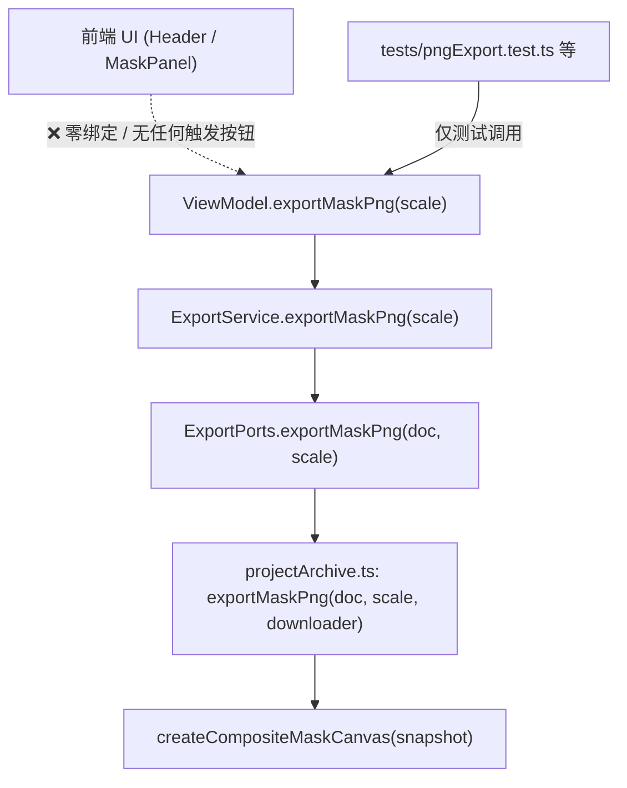
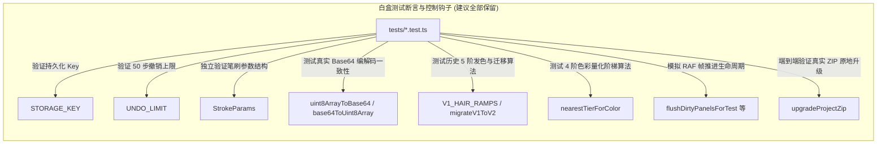

# 64px Portrait Studio 全工程 Dead Code（冗余代码）全景审计报告

本文档全面梳理 **64px-portrait-studio** 全工程代码库中存在的未引用导出（Unused Exports）、零触发业务链路（Orphaned Business Flows）、算法遗留辅助函数、重复实现及游离样式，为后续代码重构与轻量化提供详尽依据。

> **扫描时间**：2026-10-04（最新代码库全量扫描）  
> **代码版本基准**：Commit `06e2d6b`（已并入 4 阶发色重构、工程迁移引擎 v1 $\to$ v2、实用色彩升级）  
> **扫描范围**：54 个 TypeScript 源码文件 + 11 个 CSS 样式表 + 24 个测试套件（172 项单测，通过率 100%）  
> **执行约束**：**严格仅生成文档报告，未改动任何生产源码与测试文件**。

---

## 1. 概览汇总（Executive Summary）

经过对当前代码库的全局 AST 解析、符号交叉引用追踪、UI 事件绑定链比对及样式表类名扫描，全工程代码整体模块化良好，领域层零 DOM 约束严格遵守，但存在以下几处明显的冗余与未引用代码：

| 类别 | 发现数量 | 影响程度 | 核心处理建议 |
| :--- | :---: | :---: | :--- |
| **1. UI 零绑定的幽灵业务链路** | **1 条完整业务链** (`exportMaskPng`) | 🟡 中度认知干扰 | **首选删除**：从协议层、服务层、ViewModel 及测试中彻底移除 |
| **2. 全工程零外部引用的导出符号** | **12 项接口/类型 + 1 项函数** | 🟢 轻度体积冗余 | 去除多余 `export` 关键字或直接清理 |
| **3. 图像分割原型导出的内部辅助项** | **19 项常量/函数** (`src/core/segmentation/`) | 🟢 轻度污染命名空间 | 去除 `export`，收敛为文件内部私有符号 |
| **4. ViewModel 闲置门面方法** | **2 个方法** (`getHairPresetKey`, `commitHairRecolor`) | 🟢 冗余中转 | 外部零调用，可安全精简 |
| **5. 跨模块重复实现的工具函数** | **2 处** (`decodeBase64`, `encodeBase64`) | 🟢 重复造轮子 | `projectMigration.ts` 直接复用 `projectData.ts` 既有导出 |
| **6. 样式表中未生效的 CSS 类** | **2 个类** (`.segment-kbd`, `.header-status-pill`) | 🟢 样式冗余 | 清理或在 Header 组件中补齐对应 DOM |
| **7. 白盒测试专用导出钩子（正常）** | **17 项**（常量、数据编解码、单阶迁移算法等） | ⚪ 正常工程设计 | 属于健康的白盒测试夹具，予以保留 |

---

## 2. 重点关注：UI 零绑定的“幽灵业务链路”

### 2.1 `exportMaskPng` 单张遮罩导出链路

#### 调用链路分布


#### 涉及文件
- **底层生成**：[`src/app/browser/projectArchive.ts`](file:///d:/godot_exe/64px-portrait-studio/src/app/browser/projectArchive.ts#L240): `export async function exportMaskPng(...)`
- **控制器服务**：[`src/app/controllers/ExportService.ts`](file:///d:/godot_exe/64px-portrait-studio/src/app/controllers/ExportService.ts#L59): `async exportMaskPng(scale = 1)`
- **端口抽象**：[`src/app/ports.ts`](file:///d:/godot_exe/64px-portrait-studio/src/app/ports.ts#L27): `ExportPorts.exportMaskPng(...)`
- **视图模型**：[`src/app/viewModel.ts`](file:///d:/godot_exe/64px-portrait-studio/src/app/viewModel.ts#L988): `ViewModel.exportMaskPng(...)`
- **组装入口**：[`src/app/app.ts`](file:///d:/godot_exe/64px-portrait-studio/src/app/app.ts#L52): `exports: { ..., exportMaskPng }`
- **单测用例**：`tests/pngExport.test.ts`, `tests/reviewFollowup.test.ts`, `tests/adapterBoundary.test.ts`

#### 现状分析
1. **UI 零触发**：查遍 [`Header.ts`](file:///d:/godot_exe/64px-portrait-studio/src/panels/Header.ts)、[`MaskPanel.ts`](file:///d:/godot_exe/64px-portrait-studio/src/panels/MaskPanel.ts)、[`MaskToolsPanel.ts`](file:///d:/godot_exe/64px-portrait-studio/src/panels/MaskToolsPanel.ts)，界面上没有任何按钮、菜单或快捷键绑定此方法。
2. **参数未生效**：`exportMaskPng(doc, scale = 1)` 接收了 `scale` 参数，但底层 `createCompositeMaskCanvas` 始终只输出 64×64，仅仅把 scale 拼接到了文件名中 (`mask_composite_${scale}x_...`)。
3. **功能被完整替代**：“导出工程 ZIP”功能已在 `masks/` 目录下默认打包了 64×64 综合遮罩 (`mask_composite.png`) 以及 5 个分区的独立二值图 (`mask_zone_*.png`)，用户已无需单张遮罩导出。

#### 处置建议
**彻底移除**：从 `projectArchive.ts` $\to$ `ExportService.ts` $\to$ `ports.ts` $\to$ `viewModel.ts` $\to$ `app.ts` 中整链删除对应方法，并同步精简单测。

---

## 3. 全工程零外部引用的导出符号（Unused Exports）

以下符号在定义处显式加上了 `export`，但在整个 `src/` 与 `tests/` 中**从未被任何外部文件 import**：

### 3.1 架构接口与自用函数（13 项）
| 文件路径 | 符号名称 | 类型 | 引用现状与分析 | 建议处置 |
| :--- | :--- | :--- | :--- | :--- |
| [`src/app/browser/projectArchive.ts`](file:///d:/godot_exe/64px-portrait-studio/src/app/browser/projectArchive.ts#L220) | `generateProjectPngBlob` | `function` | 仅在当前文件内被 `exportProjectPng` 调用，外部无 import | 去掉 `export` 改为文件内部私有函数 |
| [`src/app/controllers/HairDraftController.ts`](file:///d:/godot_exe/64px-portrait-studio/src/app/controllers/HairDraftController.ts#L11) | `HairDraftHost` | `interface` | 控制器内部鸭子类型约束，外部未显式导入 | 保留或移入 `ports.ts` 集中管理 |
| [`src/app/controllers/SelectionService.ts`](file:///d:/godot_exe/64px-portrait-studio/src/app/controllers/SelectionService.ts#L18) | `SelectionHost` | `interface` | 同上，未被外部显式导入 | 保留或移入 `ports.ts` 集中管理 |
| [`src/app/ports.ts`](file:///d:/godot_exe/64px-portrait-studio/src/app/ports.ts#L3) | `PromptButton` | `interface` | 仅在 `ports.ts` 内部使用，外部未显式导入 | 去掉 `export` |
| [`src/command/command.ts`](file:///d:/godot_exe/64px-portrait-studio/src/command/command.ts#L43) | `DocumentMemento` | `interface` | 备忘录接口，仅在当前文件被具体命令实现 | 去掉 `export` |
| [`src/core/imageImport.ts`](file:///d:/godot_exe/64px-portrait-studio/src/core/imageImport.ts#L9) | `ImageImportResult` | `interface` | 返回类型由 TypeScript 自动推导，无显式导入 | 去掉 `export` |
| [`src/core/projectData.ts`](file:///d:/godot_exe/64px-portrait-studio/src/core/projectData.ts#L31) | `ProjectDecodeResult` | `interface` | `projectDataToDocument` 的返回值类型，外部解构接收 | 可保留作为 API 返回类型，或去掉 `export` |
| [`src/core/projectMigration.ts`](file:///d:/godot_exe/64px-portrait-studio/src/core/projectMigration.ts#L167) | `UpgradeResult` | `interface` | `upgradeProjectData` 返回值类型，调用方自动推导 | 可保留作为公共 API 返回类型 |
| [`src/panels/canvas/CanvasPanel.ts`](file:///d:/godot_exe/64px-portrait-studio/src/panels/canvas/CanvasPanel.ts#L25) | `CanvasHooks` | `interface` | 内部钩子定义，外部未引用 | 去掉 `export` |
| [`src/panels/canvas/CanvasRenderer.ts`](file:///d:/godot_exe/64px-portrait-studio/src/panels/canvas/CanvasRenderer.ts#L21) | `CanvasOverlay` | `type` | 渲染叠加层类型，外部未引用 | 去掉 `export` |
| [`src/panels/canvas/cursors.ts`](file:///d:/godot_exe/64px-portrait-studio/src/panels/canvas/cursors.ts#L10) | `ToolCursorMap` | `type` | 内部映射字典，外部未引用 | 去掉 `export` |
| [`src/panels/canvas/SelectionInteraction.ts`](file:///d:/godot_exe/64px-portrait-studio/src/panels/canvas/SelectionInteraction.ts#L10) | `BoxSelectState` | `interface` | 内部交互状态类型，外部未引用 | 去掉 `export` |
| [`src/panels/canvas/SelectionInteraction.ts`](file:///d:/godot_exe/64px-portrait-studio/src/panels/canvas/SelectionInteraction.ts#L16) | `MovingSelectionState` | `interface` | 内部交互状态类型，外部未引用 | 去掉 `export` |

---

### 3.2 语义分割原型算法遗留导出（19 项）
位于 [`src/core/segmentation/`](file:///d:/godot_exe/64px-portrait-studio/src/core/segmentation) 目录。在早期语义分割算法原型探索阶段定义了大量中间数学/几何模型与像素过滤器。最终算法在 `resolver.ts` 形成确定性启发式规则后，以下导出的符号在外部（包含上层 `computeSemanticMask` 与 `tests/`）均未被导入，仅在各自文件内部自用：

| 文件路径 | 符号名称 | 类型 | 说明 |
| :--- | :--- | :--- | :--- |
| `contour.ts` | `OUTLINE_MIN_COMPONENT_PIXELS`, `OUTLINE_MAX_OKLAB_DISTANCE` | `const` | 早期轮廓分离距离与连通阈值常量 |
| `eyeDetector.ts` | `chroma`, `isSclera`, `isEyeInk`, `isEyeHighlight`, `nearbyInk` | `function` | 细粒度眼白/眼墨判定器 |
| `faceAnalysis.ts` | `FACE_OUTLINE_MODEL`, `deadZoneShift` | `const / fn` | 面部边缘死区偏移模型 |
| `faceModel.ts` | `cubicPoints`, `faceOutlinePoints`, `rasterPolygon`, `FACE_EGG_MODEL` | `const / fn` | 贝塞尔面部椭圆曲线与多边形光栅化函数 |
| `hairDetector.ts` | `HAIR_PALETTE_MODEL` | `const` | 早期硬编码发色探测模型 |
| `mouthDetector.ts` | `MOUTH_DETECTION_MODEL`, `isMouthColor`, `skinNeighbourCount` | `const / fn` | 嘴部网格与唇色判定器 |
| `resolver.ts` | `looksLikeExpressionColor` | `function` | 表情色彩容差判定 |
| `stats.ts` | `isBackgroundWhite` | `function` | 白底辅助判定函数 |

> **建议**：这 19 个符号均带有 `export`，但外部从未被 import。建议去掉 `export` 修饰符，收敛为模块内私有符号。

---

## 4. ViewModel 闲置门面方法

对 [`ViewModel.ts`](file:///d:/godot_exe/64px-portrait-studio/src/app/viewModel.ts) 的 85 个公开方法进行交叉扫描：

1. **`exportMaskPng(scale = 1)`**：上文详述的无 UI 触发方法。
2. **`getHairPresetKey(): HairPresetKey`**：
   - 转发给 `this.hairDraft.getHairPresetKey()`。
   - 全工程 UI 面板与单测均未调用该方法（面板直接监听状态变更或使用预设键）。
3. **`commitHairRecolor(): void`**：
   - 转发给 `this.hairDraft.commitHairRecolor()`。
   - 实际用户交互在换发色弹窗确认时，由 `HairDraftController` 内部闭包 `this.commitHairRecolor()` 触发，外部 UI 不需要直接调 `vm.commitHairRecolor()`。

---

## 5. 重复造轮子：Base64 编解码器

- [`src/core/projectData.ts:14-29`](file:///d:/godot_exe/64px-portrait-studio/src/core/projectData.ts#L14-L29) 已导出标准函数：
  ```ts
  export function uint8ArrayToBase64(bytes: Uint8Array): string;
  export function base64ToUint8Array(base64: string): Uint8Array;
  ```
- 新增的 [`src/core/projectMigration.ts:37-52`](file:///d:/godot_exe/64px-portrait-studio/src/core/projectMigration.ts#L37-L52) 内部重新实现了私有的 `encodeBase64` 与 `decodeBase64`：
  ```ts
  function decodeBase64(base64: string): Uint8Array { ... }
  function encodeBase64(bytes: Uint8Array): string { ... }
  ```
> **建议**：直接让 `projectMigration.ts` 导入 `uint8ArrayToBase64` 与 `base64ToUint8Array`，消除 16 行完全重复的代码。

---

## 6. 样式表（CSS）中的未激活类名

扫描全量 11 个样式表中的 328 个 CSS 类名，发现 2 个类在 TypeScript 与 HTML 中没有被任何 DOM 元素使用：

| CSS 文件 | 游离类名 | 原始设计意图 | 建议 |
| :--- | :--- | :--- | :--- |
| `src/styles/header.css` | `.segment-kbd` | 顶栏模式切换按钮（🎨 像素修图 / 🎭 语义遮罩）内部的快捷键角标样式 | 若无需显示快捷键角标，可删除该 CSS 规则 |
| `src/styles/header.css` | `.header-status-pill` | 早期设计的另一种圆角状态胶囊栏 | 当前已统一使用 `.auto-save-indicator`，可安全删除 |

---

## 7. 健康的白盒测试专用导出项（建议保留）

以下 17 项虽然在业务运行期没有跨文件调用，但属于为保障系统健壮性而专门暴露给 `tests/` 的白盒测试断言锚点：



| 符号名称 | 所在文件 | 主要测试用例 | 说明 |
| :--- | :--- | :--- | :--- |
| `STORAGE_KEY` | `app/services/AutosaveService.ts` | `storage.test.ts` | 验证本地持久化 Key 是否正确 |
| `UNDO_LIMIT` | `command/commandHandler.ts` | `commandHandler.test.ts` | 验证 Undo 栈上限 50 步防内存溢出 |
| `uint8ArrayToBase64`, `base64ToUint8Array` | `core/projectData.ts` | `compatibility.test.ts`, `zipExporter.test.ts` | 测试 Base64 编解码器在各环境的一致性 |
| `migrateV1ToV2`, `V1_HAIR_RAMPS` | `core/projectMigration.ts` | `projectMigration.test.ts` | 逐步版本迁移的单元测试 |
| `nearestTierForColor` | `core/recolorEngine.ts` | `recolorEngine.test.ts` | 色彩感知梯级量化单测 |
| `flushDirtyPanelsForTest` 等 | `panels/Panel.ts` | `lifecycle.test.ts` | 模拟时间推进驱动 RAF 渲染更新 |
| `upgradeProjectZip` | `app/browser/projectArchive.ts` | `projectMigration.test.ts` | 真实工程 ZIP 原地无感升级流水线单测 |

> **评估**：这些属于**优秀且高可测性的工程设计**，能精准阻断底层算法与生命周期的隐蔽退化，应继续保留。

---

## 8. 实施路线图（分步重构建议）

后续若开展清理，推荐按照以下批次安全推进：

### 阶段一：清理死业务链路 `exportMaskPng`（预计减少 ~70 行）
1. 移除 [`src/app/browser/projectArchive.ts`](file:///d:/godot_exe/64px-portrait-studio/src/app/browser/projectArchive.ts) 中的 `exportMaskPng`。
2. 移除 [`src/app/controllers/ExportService.ts`](file:///d:/godot_exe/64px-portrait-studio/src/app/controllers/ExportService.ts) 中的 `exportMaskPng`。
3. 移除 [`src/app/ports.ts`](file:///d:/godot_exe/64px-portrait-studio/src/app/ports.ts) 中的 `exportMaskPng` 声明与默认实现。
4. 移除 [`src/app/viewModel.ts`](file:///d:/godot_exe/64px-portrait-studio/src/app/viewModel.ts) 与 [`src/app/app.ts`](file:///d:/godot_exe/64px-portrait-studio/src/app/app.ts) 中的相关委托。
5. 同步微调 `tests/pngExport.test.ts`、`tests/reviewFollowup.test.ts`、`tests/adapterBoundary.test.ts` 中的 mock 与断言。
6. 验证：`npm run typecheck` + `npx vitest run` 确保 100% 通过。

### 阶段二：精简多余导出与重复代码（预计优化 ~50 行）
1. 将 `generateProjectPngBlob` 去掉 `export`。
2. 将 `src/core/segmentation/` 下 19 个未外部引用的辅助函数与常量去掉 `export`。
3. 将 `src/core/projectMigration.ts` 中的 `decodeBase64` / `encodeBase64` 替换为复用 `projectData.ts` 中的既有导出函数。
4. 清理 `src/styles/header.css` 中未使用的 `.segment-kbd` 和 `.header-status-pill`。
5. 验证：确保类型检查与所有单测完美通过。
