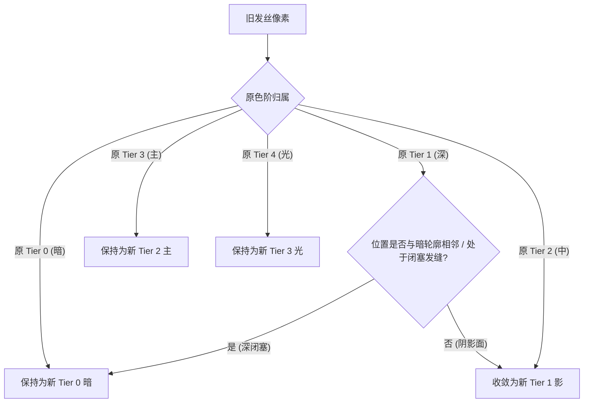

# GBA 36 色体系头像发色 4 色阶重构规范与论证指南
## —— 从 5 阶过度细分到经典 4 阶光影体系的演进、理论论证与定盘映射

**文档版本**：v1.0  
**适用范围**：`64px-portrait-studio` 像素工作台、`imagegem` 9 大发色体系共 180+ 张 64×64 像素头像  
**基准色板**：`src/data/palette.ts`（严格保持固定 36 色色板不变，无新增与篡改色槽副作用）

---

### 一、 核心背景与矛盾破局

#### 1. 棕色发色的结构性死结
在既有的 5 色阶架构中，棕色发色卡（`02_brown_棕`）长期陷入两难困境：
* **原 5 色配置**：`[暗: 2 #080821]` $\rightarrow$ `[深: 14 #3A2016]` $\rightarrow$ `[中: 15 #7B4239]` $\rightarrow$ `[主: 16 #DE6B42]` $\rightarrow$ `[光: 1 #FFFFFF]`
* **困境 A（16 当主色）**：16 号为焦糖红铜（Lum 136.7，饱和度 70%），当主色时偏向橙红发而非正统棕发；且从 16 跌落到 15 号（Lum 82.0，饱和度 37%）跨度高达 54.7 点明度，饱和度腰斩，产生巨大断层，在 36 色色板中找不到任何中间过渡色槽。
* **困境 B（15 当主色）**：15 号明度仅 35%（Lum 82.0），作为占比 60%+ 的大面积主色时，整颗头在屏幕上极其发暗、发乌、发泥，缺乏通透感；若 14 号（Lum 38.6）下移当中色，在 14 到 2 号（Lum 10.8）之间全色板再无其他深棕，导致“深色无处可寻”。
* **全量数据佐证**：对 `avatars_36` 全量 270 张头像进行像素级统计发现，**14 号 `#3A2016` 在整套头像中实际使用量为 0 像素**！它是一个单纯为了填满“深色”色槽而存在的冗余死槽。

#### 2. 用户破局思路：“中深合并，精简为 4 色”
彻底打破 5 色阶教条，**将发色色板统一从 5 阶精简为 4 阶**：
* 将原“深”与“中”两色合并为统一的【发丝阴影】；
* 极深处的发缝、闭塞转折由【绝墨轮廓/暗色】吸收；
* 彻底剔除 14 号死槽，让 15 号稳居阴影，16 号坐稳发丝本体，1 号（或暖光）负责点睛高光。

---

### 二、 经典地位与理论论证（四大权威依据）

将发色体系确立为 4 阶光影结构，不仅完全可行，而且是像素画史与视觉科学中公认的黄金法则：

#### 论证 1：GBA 硬件史与工业考古（16 色调色板分配律）
在任天堂 GBA 硬件架构中，单个精灵图（Obj/Sprite）在硬件层面被限制在 16 色（含 1 个透明色）。在 16 色肖像画的工业巅峰之作——Intelligent Systems 开发的《火焰纹章》（FE6/FE7/FE8 封印之剑/烈火之剑/圣魔之光石）中，官方美术建立了严格的 16 色配额公式：
$$\text{16 色配额} = 1\text{ 透明} + 1\text{ 通用外轮廓} + 3\text{ 肤色} + \mathbf{4\text{ 发色}} + 4\text{ 战袍/铠甲} + 3\text{ 眼睛/饰品/纯白}$$
全行业（包括卡普空《洛克人 Zero》、SNK《拳皇》Neo Geo 立绘、《黄金太阳》）在 32~64px 精灵头像中，**发色的标准配置就是严格的 4 阶（1 轮廓闭塞暗色 + 3 受光/明暗发阶）**。

#### 论证 2：空间几何与像素团簇理论（解决 Banding 与 Pillowing）
在 Michael Azzi 的经典著作《Pixel Logic》中，发丝刻画受制于空间频率：
* **发束物理尺度**：64×64 头像中，单根发束（Hair Clump）的横向宽度通常只有 **4 ~ 7 个像素**。
* **5 阶的必然缺陷（Banding 条带化）**：
  $$\text{1px(暗)} \rightarrow \text{1px(深)} \rightarrow \text{1px(中)} \rightarrow \text{1~2px(主)} \rightarrow \text{1px(光)}$$
  每个色阶在物理上只能分得单列 1 像素，像素画会蜕化为机械的单线渐变（Banding），失去发丝体积感与厚度，且容易导致头发膨胀松散（Pillowing）。
* **4 阶的团簇优势（Pixel Clusters）**：
  * **暗**：1px 勾勒关键发缝与轮廓；
  * **影**：2~3px 形成凝聚连续的背光阴影面；
  * **主**：3~4px 形成充裕的主体固有色受光面；
  * **光**：1~2px 形成聚光反光点。
  各色阶能形成健康的几何像素块（Cluster），画面立刻呈现出干脆利落的二次元立体感。

#### 论证 3：视知觉感知与韦伯-费希纳定律（明度阶距最优解）
根据人眼视知觉心理学（Weber-Fechner Law），二次元高辨识度像素画要求相邻色阶的明度差（$\Delta L$）保持在 **35 ~ 65** 之间，才能确保在小屏上瞬间识别明暗转折：
* **4 阶明度分布（自然对数递进，阶差均匀）**：
  * **暗**：$\approx 10 \sim 25$
  * **影**：$\approx 65 \sim 85$（$\Delta L \approx 55 \sim 60$）
  * **主**：$\approx 125 \sim 150$（$\Delta L \approx 60 \sim 65$）
  * **光**：$\approx 220 \sim 255$（$\Delta L \approx 70 \sim 95$）
* **5 阶的弊病**：在“暗”与“主”之间硬塞两层阴影，导致深与中之间的明度差经常被压缩至 15 左右，人眼在 64px 尺度下极难辨析，仅增加泥泞感与画师心智负担。

#### 论证 4：商业动漫赛璐璐（Cel Shading）标准四层工序对应
二次元商业动画与插画的标准上色工序与 4 色阶完美对齐：
1. **Lineart（线稿层）** $\rightarrow$ **第 1 阶：暗（绝墨轮廓/发缝闭塞）**
2. **Shadow 1（一影层）** $\rightarrow$ **第 2 阶：影（发丝立体阴影，深中合并）**
3. **Base Color（固有色层）** $\rightarrow$ **第 3 阶：主（发丝受光本体，占 55%+ 面积）**
4. **Highlight（高光层）** $\rightarrow$ **第 4 阶：光（极光高光/天使光环）**

在 Q 版与小幅面肖像中，极少使用 2 影（深重投影）。“线稿 + 一影 + 底色 + 高光”是二次元视觉最爽朗清透的基石结构。

---

### 三、 4 色阶光影结构标准定义

| 阶位 | 阶位简称 | 语义角色 | 画面职能 | 像素面积参考 |
| :---: | :---: | :--- | :--- | :---: |
| **Tier 0** | **暗** | **绝墨轮廓** | 外边缘轮廓线、最深发缝闭塞、颈脖发根遮挡 | 10% ~ 15% |
| **Tier 1** | **影** | **发丝阴影** | **原“深”与“中”合并**，背光面、体积转折投影 | 25% ~ 35% |
| **Tier 2** | **主** | **发丝主色** | 发丝固有受光面，决定人物第一发色辨识度 | 50% ~ 60% |
| **Tier 3** | **光** | **极光高光** | 发顶光环、发梢受光反光、金属/丝绸质感亮点 | 5% ~ 15% |

---

### 四、 全套 9 大发色 4 色阶定盘映射总表

基于“中深合并，极深处归暗色，其余归合并后阴影”原则，确立全套 9 大发色预设的 4 色方案：

| 发色分类 | 图标 | 原 5 色阶梯 | **重构 4 色阶梯 [暗 $\rightarrow$ 影 $\rightarrow$ 主 $\rightarrow$ 光]** | 选色与合并理由 |
| :--- | :---: | :--- | :--- | :--- |
| **02 棕色** | 🤎 | `#080821` / `#3A2016` / `#7B4239` / `#DE6B42` / `#FFFFFF` | **`#080821` $\rightarrow$ `#7B4239` $\rightarrow$ `#DE6B42` $\rightarrow$ `#FFFFFF`** | 剔除 0 像素冗余死色 `#3A2016`；中深合并为纯正暖栗棕 `#7B4239`；主色焦糖 `#DE6B42`，纯净高光 `#FFFFFF`。 |
| **03 金色** | 💛 | `#6B0818` / `#7B4239` / `#C68C31` / `#FFDE6B` / `#FFFFFF` | **`#6B0818` $\rightarrow$ `#C68C31` $\rightarrow$ `#FFDE6B` $\rightarrow$ `#FFFFFF`** | 深中合并为暖蜜金影 `#C68C31`；淘汰容易发脏发泥的栗褐 `#7B4239`；保留经典暗血红轮廓 `#6B0818`。 |
| **04 粉色** | 💗 | `#6B106B` / `#B5106B` / `#C6218C` / `#FFA5B5` / `#FFFFFF` | **`#6B106B` $\rightarrow$ `#C6218C` $\rightarrow$ `#FFA5B5` $\rightarrow$ `#FFFFFF`** | 深中合并为艳玫粉 `#C6218C`；极深宝石红 `#B5106B` 归入暗廓 `#6B106B`；粉发干净纯正，无红棕杂色。 |
| **05 蓝色** | 💙 | `#180852` / `#08219C` / `#0063CE` / `#0884D6` / `#DEEFEF` | **`#180852` $\rightarrow$ `#08219C` $\rightarrow$ `#0884D6` $\rightarrow$ `#DEEFEF`** | 影色选用纯正海蓝 `#08219C`（23号）；午夜暗紫 `#180852` 勾边；主色纯净蔚蓝 `#0884D6`，高光冰蓝 `#DEEFEF`。 |
| **06 银白** | 🤍 | `#080821` / `#212142` / `#8473A5` / `#DEEFEF` / `#FFFFFF` | **`#080821` $\rightarrow$ `#8473A5` $\rightarrow$ `#DEEFEF` $\rightarrow$ `#FFFFFF`** | 剔除浑浊冷灰 `#212142`；深中合并为银灰 `#8473A5`；最外缘保持 4-邻域纯黑轮廓 `#080821`，冰银主色通透。 |
| **07 绿色** | 💚 | `#081039` / `#21636B` / `#3FA836` / `#18CEA5` / `#DEEFEF` | **`#081039` $\rightarrow$ `#21636B` $\rightarrow$ `#18CEA5` $\rightarrow$ `#DEEFEF`** | 剔除偏黄草绿 `#3FA836`；深中合并为深青墨绿 `#21636B`；主色明艳翡翠亮绿 `#18CEA5`，高光清润。 |
| **08 紫色** | 💜 | `#180852` / `#421084` / `#6329BD` / `#8473A5` / `#FFFFFF` | **`#180852` $\rightarrow$ `#421084` $\rightarrow$ `#6329BD` $\rightarrow$ `#DEEFEF`** | 午夜深紫 `#180852` 轮廓；皇家深紫 `#421084` 阴影；核心主力亮紫 `#6329BD`；水青反光 `#DEEFEF` 对齐标杆。 |
| **09 红色** | ❤️ | `#080821` / `#6B0818` / `#8C1031` / `#A51831` / `#DE6B42` | **`#080821` $\rightarrow$ `#8C1031` $\rightarrow$ `#A51831` $\rightarrow$ `#DE6B42`** | 绝墨轮廓 `#080821`；深赤红 `#8C1031` 阴影；正红 `#A51831` 主色；暖铜红 `#DE6B42` 高光（红发专属暖光）。 |
| **01 黑色** | 🖤 | `#000000` / `#080821` / `#081039` / `#212142` / `#8473A5` | **`#080821` $\rightarrow$ `#081039` $\rightarrow$ `#212142` $\rightarrow$ `#8473A5`** | 绝墨轮廓 `#080821`；藏青黑 `#081039` 阴影；冷炭黑 `#212142` 主发色；紫银灰 `#8473A5` 发丝微光。 |

---

### 五、 像素收敛迁移算法（从旧 5 阶到新 4 阶）

在将现有 5 色头像或草稿迁移至 4 阶时，执行如下确定性收敛规则：



1. **原 Tier 0（暗）与原 Tier 4（光）**：保持 1:1 映射至新 Tier 0（暗）与新 Tier 3（光）。
2. **原 Tier 2（中）**：全部映射至新 Tier 1（影）。
3. **原 Tier 1（深）的智能分流**：
   * **闭塞吸附（Occlusion Pull）**：如果该深色像素 4-邻域中直接接触【暗】色或位于最深发根裂缝处，收敛为【暗】（强化立体勾线与闭塞感）；
   * **阴影平铺（Shadow Merge）**：其余位于发束阴影面的深色像素，全部平滑并入【影】。

---

### 六、 工程落地与架构改造清单

在 `64px-portrait-studio` 工作台中落地该规范需修改的模块清单：

1. **`src/data/palette.ts`**：
   * `TIER_NAMES` 由 5 项精简为 4 项：
     ```ts
     export const TIER_NAMES: string[] = ["绝墨轮廓", "发丝阴影", "发丝主色", "极光高光"];
     ```
   * 更新 `RAMPS_INFO` 中 9 大发色的 `hexes` 数组，全部精简为 4 色元素（参见第四节总表）。
2. **`src/panels/PalettePanel.ts`**：
   * 更新 `tierShortNames = ['暗', '影', '主', '光']`；
   * UI 提示文本由 `发色色卡 (5色阶)` 更新为 `发色色卡 (4色阶)`；
   * 发色卡 DOM 芯片数量由循环 5 改为循环 4（`rampInfo.hexes.length`）。
3. **`src/core/recolorEngine.ts`**：
   * 引擎现行逻辑原本已适配数组动态长度，色板统一变 4 色后，1:1 对称映射将更加干净，彻底根除跨阶漂移。
4. **单元测试与回归校验**：
   * 运行 `npm test` 与 `npm run typecheck`，确保发色草稿控制器、遮罩面板及置换逻辑零编译报错。

---

### 七、 总结

将 5 色阶精简为 4 色阶，是以经典 GBA 工业范式和视知觉物理规律为依托的技术回归：
1. **死结解脱**：棕色色卡摆脱了 14 号死槽与 15/16 号断层的撕扯，阴影沉得住、本体亮得起；
2. **纯粹利落**：告别发束单像素条带化（Banding），形成健康的像素团簇与鲜明的动漫光影；
3. **体系稳健**：全 36 色基础色板零改动、零破坏，纯前端架构平滑演进。
