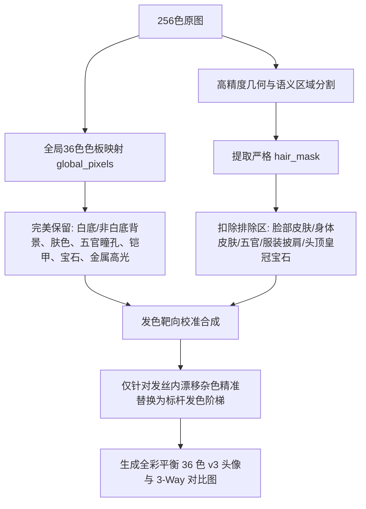

# GBA 36 色体系头像发色统一化标准作业程序 (SOP)
## —— 基于旧版 female_01 黄金标杆的靶向色相漂移校准指南

**文档版本**：v1.0  
**适用范围**：`/home/pt/Desktop/imagegem` 9 大发色分类共 180 张头像的色阶规范化与发色统一工程  
**基准色板**：`src/data/palette.ts`（`PALETTE_36`，严格固定 36 色，不可新增或改动色板）

---

### 一、 核心原则与目标

1. **同系纯正统一（Category-Level Consistency）**：
   - 同一发色分类（如棕色、金色、粉色等）下的 20 张头像（男女各 10 张），其主发色必须保持高度一致的视觉家族感。
   - 彻底消灭原图由于色相细微偏差在量化时造成的严重杂色漂移（例如金发阴影漂移为鲜紫、深棕发漂移为紫黑死色等）。
2. **像素画质感守恒（Texture & Dither Preservation）**：
   - **绝对禁止分位数硬切（Quantile Hard Cut）**：不得简单粗暴地按亮度截断重新填色，否则会抹杀像素画所有的高光反光、阴影褶皱与微观抖动（Dithering），导致头发沦为扁平单调的“一坨”色块。
   - 保留原图每一个像素的相对明暗级差与发丝走势。
3. **黄金标杆法（Benchmark Alignment）**：
   - 每一个颜色分类均以**旧版 v1 36 色中的 `female_01`** 作为该分类的绝对视觉权威与调色基准。
   - 继承标杆头像被用户高度认可的发色主色、过渡色、阴影色与轮廓深度。

---

### 二、 核心技术架构：全局映射底板 + 语义靶向漂移收敛

整个流水线采用两阶段处理架构：

#### 为什么该架构最优？
1. **全局映射（Global Palette Mapping）的绝对优势**：全图 36 色全局映射对于衣服、铠甲、金属饰品、宝石、肤色、瞳孔的色彩还原已达到 95% 以上的完美精度，且白底背景具备天然的 100% 纯净度。
2. **靶向修正的精准度**：问题仅仅出在发丝内部 5%~15% 的像素因原图色相微偏而落入错误的色板条目中。只需对这部分发生“色相漂移（Hue Drift）”的像素进行定向映射收敛，即可在零副作用的前提下达成 100% 发色统一。

---

### 三、 五大避坑红线与保护规则

在棕色与金色的迭代过程中，总结出的五大核心经验与防御规则：

#### 规则 1：头顶饰品与皇冠保护（防“金冠变发色”）
- **教训**：在早期 female_棕_04 中，头顶 $y < 12$ 区域的华丽金色王冠与红宝石被误判为头发，染成了棕色发丝。
- **红线**：
  - 无论是否落在头发外接框内，凡是高明度金属金（`#FFDE6B`、`#C68C31`）、高光明亮白（`#FFFFFF`、`#FFFFEF`）以及宝石色（`#A51831`、`#CE4242`、`#0884D6`、`#18CEA5`），一律严禁纳入发色替换！
  - 确保皇冠金碧辉煌、宝石晶莹剔透。

#### 规则 2：严禁将冲突色塞入发丝高光（防“棕发变粉红”）
- **教训**：在早期 female_棕_03 中，误将面部唇部浅粉色 `#DE8C94` 放入棕发色阶的高光候选，导致整片柔顺长发大面积染成刺眼的粉色。
- **红线**：
  - 发色阶梯必须纯净。棕发的高光与反光必须由棕色本体或象牙白/柔和过渡色构成，严禁混入任何与发色色相冲突的肤色系或外族色阶。

#### 规则 3：长发下垂连贯性（消除“下巴水平截断线”）
- **教训**：在早期 female_棕_05 中，原代码在下巴水平线以下（$y > y_{chin}$）粗暴将有彩度像素判为服装，导致下巴上方变棕、下方保留原版紫发，形成难看的水平断层。
- **红线**：
  - 披肩长发、马尾发辫允许自然流淌至下巴及胸前。
  - 判断服装时必须结合左右横向空间坐标（$x$ 范围）、语义 Clothing Mask 以及色阶特征，不得用单一水平切割线截断长发。

#### 规则 4：非白背景与特殊徽标防护（防“ male_09 蓝圆盘变黄光环”）
- **教训**：部分头像（如 male_金_07 为暗灰蓝底 `#212142`、male_金_09 头后为深蓝勋章圆盘 `#08219C`）背景并非白色。若粗暴认为“非白色即前景即头发”，会将巨大的背景圆盘整体染成发色。
- **红线**：
  - 必须严格依赖 `sem.hair_mask` 并核验几何边缘；
  - 非白背景的颜色在 `global_pixels` 中已完全映射正确，在头发校准阶段严禁对非头发像素进行重写。

#### 规则 5：单分类增量执行机制（杜绝全量 180 张重复跑）
- **操作原则**：
  - 每次调优或确认一个发色，必须通过命令行参数精准增量处理（如 `npx tsx src/cli.ts remap <input_png> 金` 或 `npx tsx src/cli.ts batch-remap <input_dir> [output_dir] --compare`）。
  - 纯 TypeScript 核心管线每张仅需约 75ms，单分类 20 张图像生成仅需约 1.5 秒，大幅降低调试周期，保持其他已确认分类的成果绝对稳定。

#### 规则 6：外轮廓描边黑强化法则（防“白底边缘发虚泛灰”）
- **背景与现象**：在银白等浅色系发色中，最外层直接与纯白背景连接的像素若因相对亮度拉伸变成银灰色（如 `#8473A5`），会导致人物轮廓在白底上显得模糊发虚，失去 GBA 经典像素画特有的“一像素硬黑轮廓”精细质感。
- **红线与实现**：
  - **最外层轮廓收敛**：所有位于头发区域且与外部白色背景连通的边缘像素，必须收敛为调色板中最深的描边黑（`#080821`，RGB `8, 8, 33`）。
  - **4-邻域检测原则**：必须采用 4-邻域连通检测（正上下左右），严禁使用 8-邻域（8-邻域会导致对角线拐角处出现 2 像素宽度的过厚黑斑）。
  - **严格边界与饰品防护**：严格排除面部/身体皮肤、眼眸唇齿、下身服装，并保护金色发带饰品（`#FFDE6B`, `#C68C31`, `#FFFFEF`），确保仅强化头发自身的外廓描边。

#### 规则 7：发丝内部暗部描边色立体强化法则（增“发丝内部层次感与发绺结构”）
- **背景与现象**：若仅对外轮廓加黑，而发丝内部在原版中作为发缝、刘海分层线、发卷阴影的深暗像素（与描边色亮度类似，$oL < 0.36$）若被映射为浅灰 `#8473A5` 或深蓝紫，会导致头发内部缺乏明暗梯级，发丝变成扁平一块。
- **红线与实现**：
  - **发丝内部描边色阶梯映射**：
    - **极深暗影 / 最深描边**（$oL < 0.27$）：统一使用纯黑描边 `#080821`（RGB `8, 8, 33`）；
    - **次深暗影 / 藏青黑描边**（$0.27 \le oL < 0.36$）：统一使用日系深藏青黑描边 `#081039`（RGB `8, 16, 57`），形成内暗部的柔和过渡与清晰发绺立体感。
  - **安全防护**：严格排除五官眼眸瞳孔、面部与身体皮肤、金色饰品与肩甲服装，确保仅作用于发丝内部缝隙与转折阴影。

---

### 四、 已确认发色标杆与漂移收敛表

#### 1. 棕发分类（02_brown_棕）—— 已通过验收
- **黄金标杆**：旧版 `female_棕_01` (v1 36 色)
- **色阶梯队**：
  - 主发色：`#7B4239`（纯正温暖巧克力栗棕）
  - 深阴影：`#310839`、`#6B0818`
  - 轮廓线：`#080821`、`#081039`
- **漂移收敛规则**：
  - `{#6B106B (紫), #421084 (蓝紫), #6B0818 (暗红), #212142 (死黑)}` $\rightarrow$ `#7B4239`

#### 2. 金发分类（03_blonde_金）—— 当前执行
- **黄金标杆**：旧版 `female_金_01` (v1 36 色)
- **色阶梯队**：
  - 主发色：`#FFDE6B`（灿烂明亮动漫金发，532 像素主力）
  - 高光亮点：`#FFFFEF`、`#FFFFFF`
  - 暖过渡/浅阴影：`#C68C31`（暖蜜赭黄，61 像素）
  - 暖中深阴影：`#DE6B42`（暖红铜，101 像素）
  - 深部暗影/轮廓：`#6B0818`（深绯红，147 像素）、`#8C1031`（深宝石红）、`#080821`（黑边）
- **漂移收敛规则**：
  - 紫色漂移：`#6B106B`, `#421084`, `#6329BD` $\rightarrow$ `#6B0818`（深绯红阴影，回归日系经典金发暖影）
  - 冷暗紫漂移：`#310839` $\rightarrow$ `#6B0818`
  - 灰紫漂移：`#8473A5` $\rightarrow$ `#DE6B42`（暖红铜中影）
  - 巧克力棕混入：`#7B4239` $\rightarrow$ `#DE6B42` / `#C68C31`

#### 3. 粉发分类（04_pink_粉）—— 已通过验收
- **黄金标杆**：旧版 `female_粉_01` (v1 36 色)
- **色阶梯队**：
  - 主发色：`#FFA5B5`（明亮梦幻樱花粉，571 像素主力）
  - 高光反光点：`#FFFFFF`
  - 玫红过渡中深阴影：`#C6218C`（206 像素）
  - 深红宝石暗影：`#B5106B`（130 像素）
  - 暗紫莓红极深部：`#6B106B`（118 像素）
  - 轮廓描边：`#080821`、`#310839`
- **漂移收敛规则**：
  - 灰肉粉漂移：`#DE8C94` $\rightarrow$ `#FFA5B5`（彻底消灭 male 01、04、05 灰暗肉粉发，回归正统樱花粉）
  - 铜橙红漂移：`#DE6B42` $\rightarrow$ `#FFA5B5`（彻底消灭 male 07、10 左右半边橘铜色割裂，统一为粉发）
  - 蓝紫漂移：`#421084` $\rightarrow$ `#6B106B`
  - 深暗蓝漂移：`#180852` $\rightarrow$ `#310839`
  - 杂紫漂移：`#6329BD` $\rightarrow$ `#6B106B`
  - 棕色混入：`#7B4239` $\rightarrow$ `#B5106B`
  - 灰紫混入：`#8473A5` $\rightarrow$ `#C6218C`

#### 4. 蓝发分类（05_blue_蓝）—— 已通过验收
- **黄金标杆**：旧版 `female_蓝_05` (v1 36 色)（用户评定颜色最干净纯正的蔚蓝蓝发）
- **发带剔除与饰品防护特别规则**：
  - `female_蓝_05` 头顶配有白金色发带（由 `#FFFFEF` 象牙白、`#FFDE6B` 亮金、`#C68C31` 蜜赭构成）。
  - **红线**：严禁将白金发带颜色当作发色纳入色阶；同时将 `#FFDE6B`、`#C68C31`、`#FFFFEF` 列为核心保护色，保证 `female_05` 自身发带、`female_04` 金冠、`female_06` 金发带、`male_09` 金束发环完璧保留，不被染成蓝发。
- **色阶梯队**：
  - 高光亮点：`#DEEFEF`（冰蓝反光）、`#FFFFFF`（纯白亮点）
  - 主发色：`#0884D6`（纯净天青蔚蓝，680 像素主力）
  - 中深宝蓝过渡：`#0063CE`（192 像素）
  - 海军深蓝暗影：`#08219C`（214 像素）
  - 深邃午夜蓝底影：`#180852`（451 像素）
  - 轮廓与深边缘：`#081039`、`#080821`
- **漂移收敛规则**：
  - 青绿/青色漂移：`#219CAD` $\rightarrow$ `#0884D6`（彻底解决 `female_04` 偏绿变色问题）
  - 粉红高光杂斑：`#FFA5B5` $\rightarrow$ `#DEEFEF`（彻底消除 `female_07` 双马尾上的粉红色高光点）
  - 铜橙杂斑：`#DE6B42` $\rightarrow$ `#0884D6`（彻底消除 `male_09` 马尾等混入的红铜杂色）
  - 红色/暗红杂影：`#6B0818`、`#8C1031`、`#7B4239` $\rightarrow$ `#180852`（统一为深邃午夜蓝阴影）
  - 灰紫杂影：`#8473A5` $\rightarrow$ `#0063CE`
  - 杂紫漂移：`#6329BD`、`#421084` $\rightarrow$ `#08219C`

#### 5. 银白发分类（06_silver_银白）—— 已通过验收
- **黄金标杆**：新版 `male_银白_01` (v3 36 色)（用户评定整体最满意的标杆模版）
- **标杆优化与黑描边强化核心诉求**：
  - 用户反馈原版 `male_01` 唯一瑕疵为：“描边黑太少，很多变成渐变棕了。但原版杂色太多了。”
  - 针对 `male_01`：精准将刘海缝隙与发尾边缘由于抗锯齿混入的渐变棕（`#DE6B42`、`#DE8C94`）转换为银灰阴影 `#8473A5`（避免深黑眼罩感），眉毛与外轮廓强化为纯黑描边 `#081039` / `#080821`。
- **色阶梯队**：
  - 纯白高光：`#FFFFFF`
  - 冰银主发色：`#DEEFEF`
  - 银灰立体阴影：`#8473A5`
  - 深邃暗部阴影：`#180852`
  - 纯正黑轮廓与眉毛：`#081039`、`#080821`
- **漂移收敛与配件防护规则**：
  - **饰品与特征保护**：金色发饰/王冠/束发环（`#FFDE6B`、`#C68C31`、`#FFFFEF`）、白色高光/蕾丝（`#FFFFFF`）、眼睛瞳孔（蓝瞳、绿瞳、异色瞳等）、唇色肤色、喉部皮领（`#DE6B42`、`#7B4239`）严格保护。
  - **蓝紫青冷杂色清除**：宝蓝 `#0063CE`、海蓝 `#08219C`、蔚蓝 `#0884D6`、杂紫 `#6329BD` / `#421084`、青绿 `#219CAD` 等原版杂色，按原始明度连续映射为 `#DEEFEF` / `#8473A5` / `#180852`，彻底杜绝电青/艳蓝污染。
  - **眼部与刘海阴影解耦**：严格解耦真眼眉毛与刘海，刘海阴影统一收敛至银灰 `#8473A5`，杜绝深黑眼罩遮眼缺陷。
  - **白底边缘外轮廓描边强化**：所有直接与纯白背景连通的头发最外层边缘像素（经 4-邻域检测），统一收敛为最深描边黑 `#080821`（RGB `8, 8, 33`）。彻底消除发外圈因映射为 `#8473A5` 导致的边缘发虚泛灰现象，使全 20 张银白头像轮廓如剪纸般利落分明。
  - **双滑杆交互调优定盘参数**：
    - **最深描边 / 发缝暗部阈值 ($T_1$)**：设定为 **`0.31`**（亮度 $<0.31$ 归入最深描边阶梯 `#080821` / `#081039`），精准定义发丝深褶缝与内描边；
    - **银灰过渡立体阴影阈值 ($T_2$)**：设定为 **`0.70`**（$0.31 \le \text{亮度} < 0.70$ 归入银灰过渡阴影 `#8473A5`，$\ge 0.70$ 归入冰银主发色 `#DEEFEF` / `#FFFFFF`），大幅拓展阴影覆盖区间，彻底根除银发扁平过曝，立体感与层次感达到完美平衡。

#### 6. 绿发分类（07_green_绿）—— 已通过验收
- **黄金标杆**：旧版 `male_绿_06` (v1 36 色)（用户评定最纯正明艳的二次元翡翠薄荷绿标杆）
- **标杆色阶梯队**：
  - 高光亮点：`#FFFFEF`、`#FFFFFF`
  - 核心主色：`#18CEA5`（明艳二次元翡翠薄荷绿，RGB `24, 206, 165`）
  - 柔和过渡阴影：`#529484`（柔和鼠尾草灰绿，RGB `82, 148, 132`）
  - 深邃暗部阴影：`#21636B`（深墨绿森林阴影，RGB `33, 99, 107`）
  - 最深描边与轮廓：`#080821`、`#081039`、`#000010`
- **AI 蓝点杂色清除与防误染红线**：
  - **规则 8（AI 错误小蓝点杂色彻底清洗）**：原版 256 色及旧版 v1 映射中，由于扩散模型瑕疵在发顶与发卷散落大量孤立蓝斑（`#0884D6`, `#0063CE`, `#08219C`, `#219CAD`, `#DEEFEF`, `#180852`），在发丝区域依据相对明度平滑映射为绿发色阶梯队，全 20 张头像共清除 **2,541 个蓝点像素**。
  - **规则 9（蓝瞳与下颌深绿战袍双重防染）**：
    - **蓝瞳绝对保护**：20 张绿发角色均为二次元蓝瞳/深瞳，必须严格保护眼部掩码与面部眼眶边界，严禁将眼瞳误洗为绿眼。
    - **服装防溢保护**：针对 `male_01`、`female_01` 等身着深墨绿战袍的角色，加入短发 $y \le chin+2$ 及双马尾 $y \le 48$ 的纵向防溢出边界，严禁将胸前深绿战袍误提升为亮绿发色。
    - **金饰与宝石保护**：金色王冠发带（`#FFDE6B`, `#C68C31`）、红宝石（`#CE4242`, `#A51831`）、纯白底背景 100% 保持纯净。

#### 7. 紫发分类（08_purple_紫）—— 已通过验收
- **黄金标杆**：旧版 `female_紫_05` (v1 36 色)（用户评定标杆，经典皇家二次元亮紫发色）
- **标杆色阶梯队**：
  - 高光亮点：`#DEEFEF`（冰晶水青反光亮点，与 female_05 黄金反光对齐）、可选 `#FFFFFF` 或 `#8473A5`
  - 核心主力主色：`#6329BD`（明艳皇家二次元亮紫，RGB `99, 41, 189`，占比约 26%）
  - 皇家过渡深紫：`#421084`（皇家深紫转折，RGB `66, 16, 132`）
  - 午夜深邃暗影：`#180852`（午夜暗紫底影，RGB `24, 8, 82`，占比约 32%）
  - 最深硬黑描边：`#080821`（RGB `8, 8, 33`）、`#081039`（RGB `8, 16, 57`）
- **多滑杆微调定盘参数**：
  - $T_1 = 0.20$（极深描边/发缝）、$T_2 = 0.30$（午夜暗紫阴影）、$T_3 = 0.38$（皇家深紫过渡）、$T_4 = 0.60$（高光切分）
  - 高光色：`#DEEFEF`，暗部模式：阶梯式（Tiered），外轮廓强黑描边：启用（Force Border On）
- **专属微调工具**：`purple_tuner.html`（局域网实时微调，零延迟 Canvas 重绘与一键落盘）

#### 8. 红发分类（09_red_红）—— 已通过验收
- **黄金标杆**：旧版 `male_红_07` (v1 36 色)（用户评定标杆，热血动漫正红经典质感）
- **标杆色阶梯队**：
  - 高光反光亮点：`#CE4242`（亮绯红高光，RGB `206, 66, 66`）、可选 `#DE6B42`（暖铜红高光）、`#FFFFFF`
  - 经典动漫正红主色：`#A51831`（热血动漫正红核心，RGB `165, 24, 49`，占比约 26%）
  - 宝石深赤红过渡：`#8C1031`（宝石深赤红转折，RGB `140, 16, 49`）
  - 深暗绯红阴影：`#6B0818`（深暗绯红底影，RGB `107, 8, 24`）
  - 最深硬黑描边与暗廓：`#080821`（最深描边黑）、`#081039`、`#310839`（极深红紫描边）
- **多滑杆微调定盘参数**：
  - $T_1 = 0.20$（极深描边/发缝）、$T_2 = 0.35$（深暗绯红底影）、$T_3 = 0.45$（宝石深赤红过渡）、$T_4 = 0.58$（正红与高光切分）
  - 高光色：`#CE4242`，暗部模式：阶梯式（Tiered），外轮廓强黑描边：启用（Force Border On）
- **专属微调工具**：`red_tuner.html`（局域网实时微调，零延迟 Canvas 重绘与一键落盘）

#### 规则 10：双耳、面部边缘与颈部皮肤全域防护法则（彻底杜绝“光耳”与“面颊杂斑”）
- **背景与现象**：在绿发、紫发、红发等高彩度发色处理中，由于语义分割残留分配器可能将耳垂、耳廓边缘及下颌颈部阴影误划入发丝掩码（Hair Mask），在亮度较高时会被误染为发丝高光（例如耳廓变成冰蓝或亮绿），严重破坏人物面相。
- **红线与双重防御机制**：
  1. **空间几何边界识别**：计算双耳包围盒 `in_ears`（$y \in [eye\_y - 8, chin + 4]$，两侧外框扩展 10 像素）、颈部包围盒 `in_neck`（$y \in [chin - 2, chin + 12]$）以及面核包围盒 `in_face_core`。
  2. **人体基础肤色守恒**：凡落在上述空间边界内，且在 36 色映射中属于基础肤色集合（`#FFEFD6`, `#FFE7CE`, `#FFDECE`, `#FFA5B5`, `#DE8C94`, `#FFEFDE`, `#FFC6BD`）或暖肉色（`is_warm_skin`），一律严禁纳入发色替换！
  3. **成效**：彻底根除了 `male_绿_01`、`male_紫_01`、`male_红_01` 等角色耳垂和颈部变色问题，面部五官轮廓纯净自然。

---

### 五、 在线交互式多滑杆微调工具集群

为了给用户提供完全可控、所见即所得的调色体验，系统现已全面配备 4 大独立多滑杆微调控制台：

| 发色分类 | 黄金标杆 | 专属微调页面 | 微调参数与高光自选 |
| :--- | :--- | :--- | :--- |
| **银白** | `male_银白_01` | `silver_tuner.html` | $T_1$ 最深描边, $T_2$ 银灰过渡, 外轮廓硬黑切换 |
| **绿色** | `male_绿_06` | `green_tuner.html` | $T_1 \sim T_4$ 四阶解耦滑杆, 高光色自选 (`#FFFFEF` / `#DEEFEF` / `#FFFFFF`), 描边与暗部模式 |
| **紫色** | `female_紫_05` | `purple_tuner.html` | $T_1 \sim T_4$ 四阶解耦滑杆, 高光色自选 (`#DEEFEF` / `#8473A5` / `#FFFFFF`), 描边与暗部模式 |
| **红色** | `male_红_07` | `red_tuner.html` | $T_1 \sim T_4$ 四阶解耦滑杆, 高光色自选 (`#CE4242` / `#DE6B42` / `#FFFFFF`), 描边与暗部模式 |

- **全量对比总览台**：`all_colors_compare.html`（或 `/index.html`），内置 9 大发色筛选器与 4 大微调工具直达导航。

