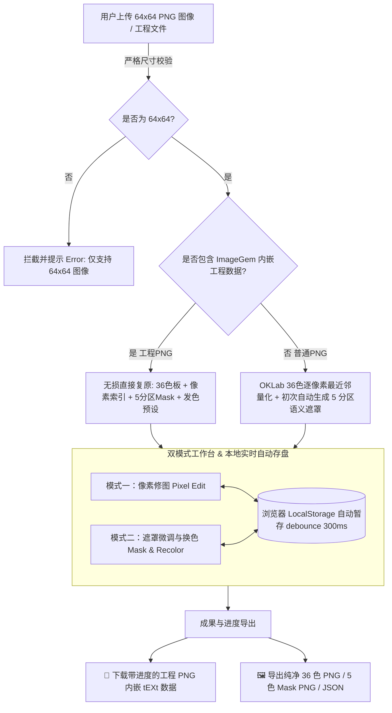
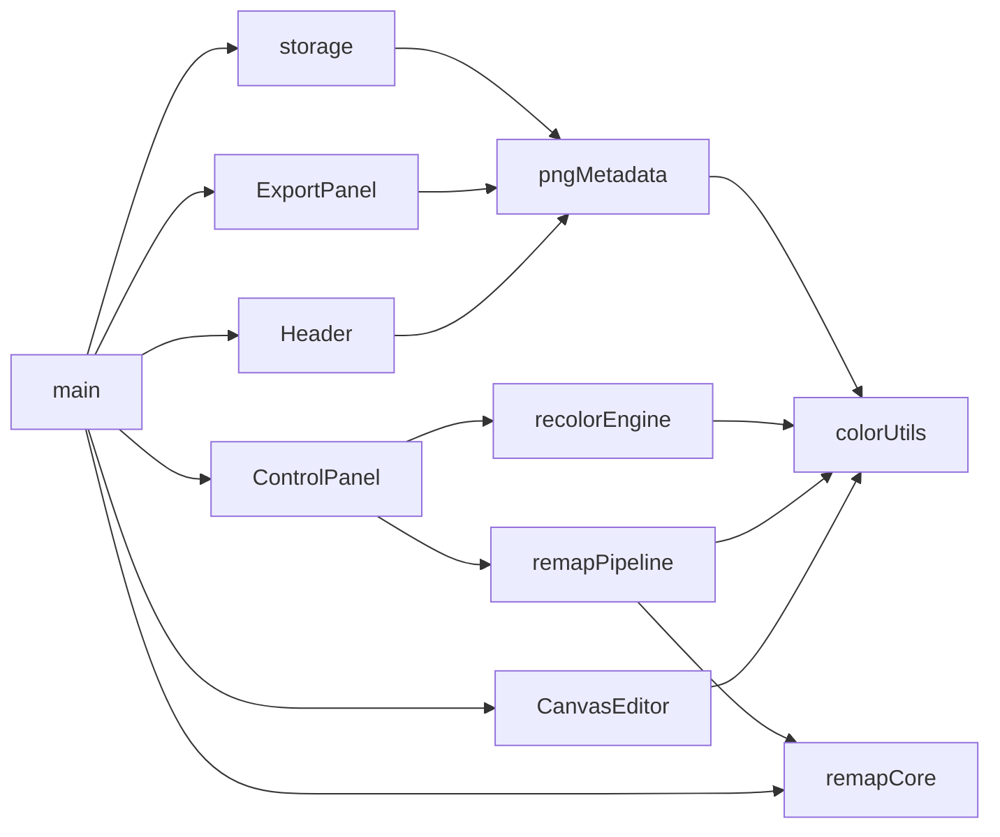

# ImageGem 36 色像素头像工作台设计方案

**文档版本**：v2.0  
**归档路径**：`doc/IMAGEGEM_STUDIO_DESIGN_PLAN.md`  
**核心目标**：构建专注、纯粹、体验流畅的 **64×64 像素头像 36 色映射、编辑、5 分区语义遮罩生成、发色置换与进度全状态持久化系统**。

> **开发策略**：**保留核心算法，重写 UI 与流程**。具体边界如下：
>
> | 处置 | 文件 | 原因 |
> |------|------|------|
> | ✅ 保留 | `src/core/remapCore.ts` (88KB) | **核心引擎**：几何门禁、面部贝塞尔椭圆拟合、双眼/嘴部特征检测、8 区域语义分割（`analyzeSemanticRegions`）、OKLab 色板映射、连通域分析 |
> | ✅ 保留 | `src/core/remapPipeline.ts` (34KB) | **发色重映射流水线**：9 大色系专属管线（漂移收敛/明度阶梯/相对色调协调）、`HAIR_RAMPS_SPEC` 完整色阶定义、对比卡片渲染 |
> | ✅ 保留 | `src/core/colorUtils.ts` | OKLab 转换、色差计算、最近邻匹配 |
> | ✅ 保留 | `src/core/recolorEngine.ts` | 发色阶位映射、BFS 泛洪填充 |
> | ✅ 保留 | `src/core/issueDetector.ts` | 瑕疵检测、皮肤/饰品保护色集合、轮廓边缘检测 |
> | ✅ 保留 | `src/data/palette.ts` | 36 色板定义 + 9 大发色色阶规范 |
> | 🔴 删除 | `src/data/avatars.ts` (500KB) | 测试数据，不再需要 |
> | 🔴 删除 | `src/components/*` (全部 6 个) | UI 布局全部重写 |
> | 🔴 删除 | `src/main.ts` | 主流程编排全部重写 |
> | 🔴 删除 | `src/style.css` | 样式全部重写 |
> | 🔴 删除 | `src/cli.ts` | CLI 工具，与新流程无关 |
> | 🔄 重构 | `src/types/index.ts` | 适配新的 5 分区语义遮罩模型 |
>
> **关键发现**：`remapCore.ts` 中已包含完整的 `analyzeSemanticRegions()` + `assignResidualRegions()` 语义分割实现（8 区域：轮廓/眼睛/嘴部/面部肤色/身体肤色/头发/衣服/饰品），因此设计方案中原计划的 `semanticSegmenter.ts` **无需新建**，直接复用 `remapCore` 即可。新增模块仅需 `pngMetadata.ts`（PNG 工程数据编解码）和 `storage.ts`（LocalStorage 暂存）。

---

## 一、 系统架构与业务流



---

## 二、 核心功能规格与详细设计

### 1. 严格 64×64 图像校验与智能载入
- **尺寸校验与拦截（Reject 非 64×64）**：
  - 读取上传文件的原生尺寸。
  - **若非 64×64，坚决拦截并提示**：`"仅支持 64×64 像素的图片，当前上传图片尺寸为: {width}×{height}px"`。
- **纯粹极简初始态**：
  - 无任何内置预设头像，界面启动时展示简洁的上传/恢复指引占位框，一切从用户上传图片开始。
  - 若 LocalStorage 中存在上次未完成的工程进度，弹出恢复确认提示。
- **智能双解析通道**：
  - 若为**带进度的工程 PNG**（检测到 `ImageGemProject` tEXt chunk）：直接载入全套工程数据，跳过量化与自动遮罩，保护已有编辑成果；
  - 若为**普通 64×64 图片**：
    1. 调用 `mapImageToPalette()`（`remapCore.ts`）执行 OKLab 36 色逐像素最近邻量化（**不使用 dithering**，保留像素画手绘质感），记录每像素的色板索引（0~35）；
    2. 调用 `StrictGeometryGate` → `MouthDetector` → `analyzeSemanticRegions()` + `assignResidualRegions()`（均来自 `remapCore.ts`）自动生成语义分割遮罩，输出 8 区域 boolean 蒙版后归并为 5 分区互斥 Mask（背景/头发/皮肤/眼睛/衣服）。

---

### 2. 关网页防丢失：双重持久化机制（自动缓存 + PNG 内嵌工程）

针对"用户编辑到一半关闭网页后继续"、"下载与上传进度文件"以及"进度能否直接写进 PNG"的需求，采用标准的 **双重持久化方案**：

#### 方案 A：浏览器 `LocalStorage` 自动暂存（防手误关网页）
- 用户的每一次像素绘制、遮罩修改、发色切换，均通过 **debounce（300ms 延迟合并）** 自动静默保存在浏览器的本地缓存（`localStorage`）。
- **用户意外关闭浏览器、崩溃或刷新网页后，重新进入页面时，系统会自动无缝恢复至上次最后编辑的状态**，无需手动保存即可找回进度。
- 界面提供"新建/清空画布"选项，供需要重新开启新任务时使用。清空时同步清除 LocalStorage 缓存。
- **存储数据格式**：与工程 PNG 内嵌的 JSON 结构完全一致（见下方方案 B），确保两套持久化的数据模型统一。

#### 方案 B：进度直接写入标准 PNG 图像（"工程 PNG"技术）

##### 实现原理
采用 **国际标准 PNG 规范（ISO/IEC 15948）中的 `tEXt` 元数据块（Chunk）**，在 PNG 文件中嵌入完整的工程状态数据。

##### 内嵌 JSON 数据结构规范

```jsonc
{
  "v": 1,                          // Schema 版本号（未来兼容升级用）
  "palette": [                     // 36 色色板，36 个 Hex 字符串
    "#000000", "#FFFFFF", "#FFFFEF", "#080821", "#081039", "#8473A5",
    "#421084", "#DEEFEF", "#7B4239", "#B5106B", "#DE6B42", "#FFDE6B",
    "#FFEFD6", "#CE4242", "#8C1031", "#DE8C94", "#FFA5B5", "#C6218C",
    "#180852", "#6B106B", "#08219C", "#0063CE", "#0884D6", "#18CEA5",
    "#21636B", "#219CAD", "#FFE7CE", "#000010", "#FFDECE", "#6B0818",
    "#212142", "#310839", "#A51831", "#529484", "#6329BD", "#C68C31"
  ],
  "pixels": "ABECAwQF...",         // 4096 个色板索引(0~35)，Uint8Array → Base64 (~5.5KB)
  "mask": "AAECAwQA...",           // 4096 个语义分区(0~4)，Uint8Array → Base64 (~5.5KB)
  "hairPreset": "05_blue_蓝",      // 当前发色预设 key（可选，无预设时为 null）
  "ts": 1726840000                 // 保存时间戳（Unix 秒）
}
```

**数据容量预估**：
| 字段 | 原始大小 | Base64 后 |
|------|----------|-----------|
| `palette` (36 hex) | ~252 B | ~252 B (原文) |
| `pixels` (4096 × uint8) | 4,096 B | ~5,464 B |
| `mask` (4096 × uint8) | 4,096 B | ~5,464 B |
| JSON 结构开销 | ~100 B | ~100 B |
| **合计** | **~8.5 KB** | **~11.3 KB** |

PNG 文件体积：原始 64×64 PNG ~4KB + 工程数据 ~11KB ≈ **~15KB**，完全可接受。

##### PNG tEXt Chunk 写入流程（导出工程 PNG）

```
canvas.toBlob('image/png')
        ↓
  FileReader.readAsArrayBuffer(blob)
        ↓
  扫描 PNG chunk 结构，定位 IEND chunk 的起始字节偏移
        ↓
  构造 tEXt chunk 二进制数据：
    ┌──────────────────────────────────────────────┐
    │ 4 bytes : Data Length (uint32 big-endian)     │
    │ 4 bytes : Chunk Type "tEXt" (ASCII)          │
    │ 16 bytes: Keyword "ImageGemProject" + \0     │  ← 关键字 + null 分隔符
    │ N bytes : JSON 字符串 (Latin-1 safe)         │  ← Base64 天然 Latin-1 兼容
    │ 4 bytes : CRC32 (覆盖 Type + Data)           │
    └──────────────────────────────────────────────┘
        ↓
  拼接三段: [PNG 签名 ~ IEND 前的所有 chunks] + [tEXt chunk] + [IEND chunk]
        ↓
  new Blob([mergedArrayBuffer], { type: 'image/png' })
        ↓
  URL.createObjectURL() → <a>.click() 触发下载
```

##### PNG tEXt Chunk 读取流程（导入工程 PNG）

```
用户拖入/选择 PNG 文件
        ↓
  FileReader.readAsArrayBuffer(file)
        ↓
  验证 PNG 8 字节签名: [0x89, 0x50, 0x4E, 0x47, 0x0D, 0x0A, 0x1A, 0x0A]
        ↓
  逐 chunk 线性扫描：
    读取 4 字节 length → 4 字节 type → length 字节 data → 4 字节 CRC
        ↓
  判断 type === "tEXt" 且 keyword === "ImageGemProject"
        ↓
  ┌─ 找到 → 提取 null 分隔符后的 JSON 文本 → JSON.parse()
  │         → 解码 Base64 pixels/mask 为 Uint8Array
  │         → 直接复原工作台全部状态（色板、像素索引、遮罩、发色预设）
  └─ 未找到 → 视为普通 PNG → 进入 OKLab 量化 + 自动语义分割流程
```

##### 技术实现要点

- **CRC32**：使用 ~30 行的纯 JS 查表实现（256 条目预计算表），无需外部库。
- **零外部依赖**：全程仅使用浏览器标准 API（`ArrayBuffer`、`DataView`、`TextEncoder`、`btoa`/`atob`）。
- **PNG 合规性**：输出的 PNG 文件完全符合 ISO/IEC 15948 标准，可被任何 PNG 解码器正常渲染（自定义 tEXt chunk 会被忽略）。

##### 双重价值

- **双重身份**：该文件既是一张能在 Windows、Mac、手机相册、社交软件正常预览展示的标准 64×64 PNG 像素图；同时又是一个完整的 ImageGem 工程备份文件。
- **极简上传**：下次用户直接把这张"工程 PNG"拖入工作台，系统在校验 64×64 的同时，自动解构读取出其中的 `ImageGemProject` 块，**100% 原汁原味复原所有色板、像素点与遮罩分区**！

---

### 3. 36 色色板约束像素编辑器（模式一：像素修图）
- **36 色专属色盘**：
  - 界面直观展示 36 个色块条目（标有 index 0 ~ 35）。
  - 支持用户点击单独色块微调其 RGB/Hex 颜色（画面中对应索引像素实时响应）。
  - 绘制时严格只能使用这 36 种颜色（绘制本质为分配 0~35 的索引值）。
- **编辑工具集**：
  - ✏️ **画笔（Pen）**：单点修改；按住鼠标左键拖动连续修改途经像素。
  - 🧪 **吸管（Eyedropper）**：点击画布任意像素，自动拾取并高亮对应的 36 色索引。
  - ↩️ / ↪️ **撤销 / 重做（Undo / Redo）**：支持快捷键 `Ctrl+Z` / `Ctrl+Y`。双模式共享统一的撤销/重做栈，每步快照只包含完整的 `pixels` + `mask` 画布状态，上限 40 步。色板属于项目级配置，不进入 Undo / Redo；详细规则见 `doc/UNDO_REDO_SCOPE_SPEC.md`。

---

### 4. 5 分区语义遮罩与微调（模式二：遮罩微调与换色）
- **5 大分区定义（单层互斥，1 像素仅属于 1 个分类）**：
  - `0`: **背景 (Background)** - 默认外部连通区域
  - `1`: **头发 (Hair)** - 发丝、刘海、马尾发辫
  - `2`: **皮肤 (Skin)** - 面部、颈部、耳部、唇部
  - `3`: **眼睛 (Eyes)** - 眼眶、瞳孔、眼白高光
  - `4`: **衣服 (Clothes)** - 领口、肩甲、胸前服饰
- **5 色 Mask 导出配色规范**：
  - 背景 = `#000000`（黑），头发 = `#FF0000`（红），皮肤 = `#00FF00`（绿），眼睛 = `#0000FF`（蓝），衣服 = `#FFFF00`（黄）
- **遮罩更新机制**：
  - 普通图片上传后自动初算一次；
  - 修图过程中用户自主控制，点击 **"✨ 重新识别语义遮罩"** 按钮刷新，**不自动粗暴覆盖**，保护用户手工涂抹结果。
- **手动遮罩微调涂抹**：
  - 彩色半透明遮罩覆盖层（可调透明度与开关）。
  - 选定分区刷子在画布上拖拽即可直接重绘单层互斥 Mask。

---

### 5. 头发 9 大预设色板一键置换
- 黑、棕、金、粉、蓝、银白、绿、紫、红 9 大经典二次元发色梯队预设。
- 仅重映射 `Hair` 区域，根据相对亮度保留高光与立体褶皱。
- 发色预设色阶定义参照 `doc/HAIR_COLOR_UNIFICATION_SOP.md` 中的黄金标杆梯队。

---

## 三、 界面交互与布局设计

- **顶部导航**：
  - `[ 📁 导入图片 / 载入工程 PNG ]`
  - `[ 💾 保存进度 (下载工程PNG) ]`
  - `[ ✏️ 像素修图模式 ]` | `[ 🎭 遮罩与发色模式 ]`
- **右侧面板**：
  - **修图模式**：36 色栅格选择/微调、吸管、画笔、Undo/Redo、"✨ 重新识别语义遮罩"。
  - **遮罩与发色模式**：5 分区笔刷选择（含像素统计）、遮罩透明度滑杆、9 大发色预设卡片。
- **底部面板**：
  - `[ 导出纯净 36 色 PNG ]`
  - `[ 导出 5 色语义 Mask PNG ]`
  - `[ 导出 JSON 配置 ]`
  - `[ ↺ 清空 / 重启新任务 ]`

---

## 四、 核心代码模块与结构设计

```
src/
├── core/
│   ├── remapCore.ts         # [保留] 核心引擎：几何门禁、面部拟合、语义分割、OKLab 色板映射
│   ├── remapPipeline.ts     # [保留] 发色重映射流水线：9色系管线、HAIR_RAMPS_SPEC、对比卡片
│   ├── colorUtils.ts        # [保留] OKLab 转换、色差计算、逐像素最近邻量化
│   ├── recolorEngine.ts     # [保留] Hair 遮罩区光影阶梯与发色置换
│   ├── issueDetector.ts     # [保留] 瑕疵检测、皮肤/饰品保护、轮廓边缘检测
│   ├── pngMetadata.ts       # [新建] PNG tEXt Chunk 二进制编解码 (CRC32 + chunk 拼接/扫描)
│   └── storage.ts           # [新建] LocalStorage debounce 自动暂存与恢复
├── components/
│   ├── Header.ts            # [新建] 顶部导航、64x64上传校验、工程PNG导入导出
│   ├── CanvasEditor.ts      # [新建] 64x64 画布 (拖拽连续绘制/吸管/半透明Mask覆层)
│   ├── ControlPanel.ts      # [新建] 36色板管理 / 5分区画刷 / 9大发色切换
│   └── ExportPanel.ts       # [新建] 纯净PNG / Mask PNG / JSON 导出
├── data/
│   └── palette.ts           # [保留] 36色色板基准 (RGB555) 与 9 大发色色阶规范
├── types/
│   └── index.ts             # [重构] 类型定义 (SemanticZone, ImageGemProjectData, StudioState)
├── main.ts                  # [新建] 全局状态调度、事件响应与快捷键绑定
└── style.css                # [新建] 现代化像素工作台深色样式
```

**模块依赖关系**：


---

## 五、 核心类型定义预览

```typescript
/** 5 分区语义遮罩值 */
export const enum SemanticZone {
  Background = 0,
  Hair = 1,
  Skin = 2,
  Eyes = 3,
  Clothes = 4,
}

/** 工程 PNG 内嵌 / LocalStorage 存储的统一数据结构 */
export interface ImageGemProjectData {
  v: number;                    // Schema 版本号
  palette: string[];            // 36 色 Hex 数组
  pixels: string;               // Base64(Uint8Array[4096]) — 色板索引 0~35
  mask: string;                 // Base64(Uint8Array[4096]) — 语义分区 0~4
  hairPreset: string | null;    // 当前发色预设 key
  ts: number;                   // Unix 时间戳
}

/** 运行时全局工作台状态 */
export interface StudioState {
  palette: string[];            // 当前 36 色色板 (可微调)
  pixelIndices: Uint8Array;     // 4096 像素 → 色板索引 (0~35)
  semanticMask: Uint8Array;     // 4096 像素 → 语义分区 (0~4)
  currentHairPreset: string | null;
  activeMode: 'pixel' | 'mask'; // 当前工作模式
  activePaletteIndex: number;   // 像素修图模式：当前选中的色板索引
  activeZone: SemanticZone;     // 遮罩模式：当前选中的分区类型
  maskOpacity: number;          // 遮罩覆盖层透明度 0~1
  showGrid: boolean;
  zoomLevel: number;            // 画布缩放倍数
  undoStack: UndoSnapshot[];
  redoStack: UndoSnapshot[];
}

/** 撤销快照 (两种模式共享统一栈) */
export interface UndoSnapshot {
  pixelIndices: Uint8Array;     // 深拷贝
  semanticMask: Uint8Array;     // 深拷贝
}
```

---

## 六、 验证与验收标准

1. **构建验证**：`npm run build` 零报错编译通过。
2. **防关网页自动恢复验证**：编辑过程中直接关闭或刷新浏览器，再次打开无缝还原至最后状态。
3. **工程 PNG 验证**：
   - 导出的工程 PNG 可在 Windows/Mac 看图软件中作为 64×64 像素图正常打开；
   - 重新拖入浏览器后，所有色板、像素点、5 分区 Mask 完整复原。
4. **非 64×64 尺寸拦截验证**：上传非 64×64 图片，弹出明确错误提示并拒绝载入。
5. **绘制与换色验证**：连续拖拽绘制平滑生效，9 大发色仅替换头发区域并保留立体光影。
6. **OKLab 量化验证**：普通 PNG 上传后，每个像素被映射到 36 色板中感知色差最小的颜色，无 dithering 抖动伪影。
