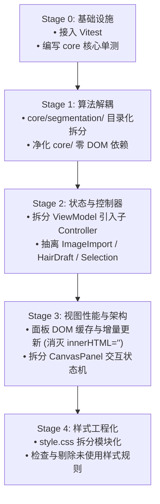

# 64px Portrait Studio 深度重构方案 (V3)

> **实施状态**：🎉 **全部阶段已顺利实施完毕并完成全量单测与构建验证** (28/28 测试通过，`tsc --noEmit` 0 错误，打包耗时 < 1s)。
> **文档定位**：在经历了 V1（死代码清理与模块初拆）和 V2（引入 ImGui 架构模式分层）之后，针对当前代码库中暴露出的 **「God Object 臃肿」、「DOM 频繁全量重建导致卡顿」、「Core 层 DOM 污染」、「算法单文件过大」** 等核心痛点制定的深度重构指南与实施计划。
> **基线状态**：`src/` 模块解耦与单元测试体系完备；`style.css` 模块化为 10 个领域文件；`npm test` 与生产构建 100% 通过。

---

## 0. 现状审查与前序重构回顾

项目在 2026-09 先后完成了两轮重大重构（详见 [docs/REFACTOR_FINDINGS.md](docs/REFACTOR_FINDINGS.md) 与 [docs/ARCHITECTURE_PROPOSAL.md](docs/ARCHITECTURE_PROPOSAL.md)）：

```
【当前架构分层】
Panels (panels/) ──调用──▶ ViewModel ──命令──▶ CommandHandler ──修改──▶ PortraitDocument
     ▲                         │                                        EditorSession
     └──── markDirty ◀─ fan-out ◀──────────── StudioEvents ◀────────────┘
```

### 已取得的成果
1. **分层清晰**：明确划分了纯算法层 (`core/`)、数据层 (`model/`)、命令撤销层 (`command/`)、应用协调层 (`app/`) 和视图层 (`panels/`)。
2. **命令模式落地**：文档修改均走 `SnapshotCommand`，历史记录撤销/重做（上限 40 步）稳定可靠。
3. **响应式刷新机制**：面板通过 `StudioEvents` 捕获事件，利用 `markDirty() + requestAnimationFrame` 合并帧渲染。

### 遗留与新滋生的核心痛点

| 序号 | 严重级别 | 痛点现象 | 典型文件 / 位置 | 影响分析 |
|:---|:---:|:---|:---|:---|
| **1** | **P0** | **`core/` 层边界被 DOM 污染** | `core/pixelRender.ts`<br>`core/zipExporter.ts`<br>`core/storage.ts` | 违反「core 零 DOM 依赖」原则，无法在 Web Worker、Node.js 或 Headless 自动化测试中独立运行。 |
| **2** | **P0** | **`ViewModel` 蜕变为超大 God Object** | `app/viewModel.ts`<br>(1,087 行) | 承担了事件扇出、图片解码流水线、发色草稿缓存、选区剪贴板、弹窗编排、导出流水线等 10 余种不相干职责。 |
| **3** | **P1** | **面板 `render()` 频繁全量重建 DOM (DOM Thrashing)** | `PalettePanel.ts:401`<br>`MaskPanel.ts:222`<br>`MaskToolsPanel.ts:331, 401`<br>`CanvasPanel.ts:781` | 每一帧/每次改动都执行 `innerHTML = ''` 并用 `createElement` 重新实例化数十个节点；光标移动即触发全量 innerHTML 重绘。导致大量 GC 停顿与布局抖动。 |
| **4** | **P1** | **`core/segmentation.ts` 单文件过大** | `core/segmentation.ts`<br>(1,240 行) | 仅 export 一个函数，内部混杂统计学、贝塞尔曲线、人脸/眼睛/嘴部几何识别等 10 个子领域，维护成本极高。 |
| **5** | **P1** | **`CanvasPanel` 交互状态机与悬浮 UI 混合** | `panels/canvas/CanvasPanel.ts`<br>(919 行) | 选区平移/复制、智能框选模式、Bresenham 画线、悬停信息格式化与光标管理全塞在一个类中。 |
| **6** | **P2** | **单体式 CSS 文件难以维护** | `src/style.css`<br>(3,403 行) | 全项目样式集中于单文件，命名空间易污染，死样式难以识别。 |
| **7** | **P2** | **缺乏自动化单元测试保障** | `package.json` | 核心算法（`editOps`、`pixelGrid`、`colorUtils`、`recolorEngine`、`minimalPng`）没有单测，重构与优化全靠人工冒烟。 |

---

## 1. 重构方案与模块化设计

### 1.1 [P0] 净化 `core/`：实现真正的 Headless 纯净算法层

#### 存在问题
- `core/pixelRender.ts` 中的 `createScaledCanvas()` 依赖 `document.createElement('canvas')`。
- `core/zipExporter.ts` 中的 `downloadBlob()` 依赖 `document.body.appendChild(a)`；色卡渲染依赖 DOM Canvas。
- `core/storage.ts` 直接耦合全局 `localStorage`。

#### 重构设计
1. **抽离 DOM 下载与 Canvas 辅助至应用层**：
   - 将 `downloadBlob` 移至 `app/utils/download.ts`。
   - `core/pixelRender.ts` 改造为只操作 `ImageData` / `Uint8ClampedArray`，或接收抽象画布接口；DOM 相关的 Canvas 生成统一收归至 `panels/canvas/` 或 `app/export/`。
2. **存储依赖倒置 (Storage Adapter)**：
   - 定义 `interface StorageAdapter { getItem(key: string): string | null; setItem(key: string, val: string): void; removeItem(key: string): void; }`。
   - `core/storage.ts` 接收适配器，默认使用浏览器 `localStorage`，测试或 headless 时可传入内存 Map。

```typescript
// 纯净的 core/storage.ts
export interface KeyValueStore {
  getItem(key: string): string | null;
  setItem(key: string, val: string): void;
  removeItem(key: string): void;
}

export class ProjectStorage {
  constructor(private readonly store: KeyValueStore = window.localStorage) {}
  // ...业务方法...
}
```

---

### 1.2 [P0] 拆解 `ViewModel`：引入子控制器 (Domain Controllers)

`ViewModel` 当前行数达 1,087 行。需要按领域职责拆分为独立的 Service / Controller，`ViewModel` 自身降维为**轻量门面 (Facade)**。

```
                  ┌─────────────────────────────────────┐
                  │              ViewModel              │ (Facade 统一入口，~300 行)
                  └──────────────────┬──────────────────┘
         ┌──────────────┬────────────┼─────────────┬──────────────┐
         ▼              ▼            ▼             ▼              ▼
┌────────────────┐┌───────────┐┌───────────┐┌─────────────┐┌─────────────┐
│  ImageImport   ││ HairDraft  ││ Selection ││   Export    ││   Session   │
│   Pipeline     ││ Controller ││  Service  ││   Service   ││ StateManager│
└────────────────┘└───────────┘└───────────┘└─────────────┘└─────────────┘
```

#### 拆分清单与职责：
1. **`app/controllers/ImageImportPipeline.ts` (~120 行)**：
   - 职责：处理 `DecodedImage`，执行 `quantizeToPalette`、OKLab 色彩映射、`computeSemanticMask`、构建初始 `PortraitDocument`。
   - 解耦：从 ViewModel 剥离图像导入与语义识别启动的复杂流程。
2. **`app/controllers/HairDraftController.ts` (~150 行)**：
   - 职责：管理 `hairDraftPreset`，派生与缓存 `hairPreview` 像素，计算当前发色系色阶索引，处理发色固化/放弃业务。
   - 解耦：发色预览缓存由该控制器自闭环管理，文档变化时自动作废缓存。
3. **`app/controllers/SelectionService.ts` (~120 行)**：
   - 职责：选区变更、全选、取消选区、剪贴板管理（`copy`、`cut`、`paste`、`delete`）、选区移动与图层变换（`flip`、`rotate`、`clearRect`）。
4. **`app/controllers/ExportService.ts` (~100 行)**：
   - 职责：`exportPng`、`exportZip` 流程编排；与 `StudioPrompts` 协调「导出前是否有未固化发色」的弹窗阻断逻辑。

---

### 1.3 [P1] 消除 DOM Thrashing：从「全量重建」转向「DOM 节点缓存与精准补丁」

#### 存在问题对比分析
当前面板中的典型坏味道：
```typescript
// ❌ 现状：每次 render() 都执行清空重建
render(): void {
  const familiesContainer = this.container.querySelector('#palette-families-container');
  familiesContainer.innerHTML = ''; // 强行触发整棵子树的重排重绘
  PALETTE_FAMILIES.forEach(family => {
    // 重新创建 36 个 DOM 节点并逐一设置 innerHTML/属性
  });
}
```

#### 改造范式：初始化构建 + 增量状态补丁 (Cache & Patch)

以 `PalettePanel` 为例：
1. **`build()` 阶段**：只执行一次，生成全部 36 个色块节点，并按 `index` 存入 `Map<number, HTMLElement>`。
2. **`render()` 阶段**：
   - 不修改 DOM 树结构；
   - 遍历缓存的色块元素，仅更新需要变化的属性：
     - `classList.toggle('active', index === fgIdx)`
     - `classList.toggle('is-bg', index === bgIdx)`
     - `classList.toggle('is-probed', isProbed)`
     - `style.backgroundColor = currentHex`（仅当色板被用户微调时）

同样适用于：
- **`MaskPanel`**：5 个分区卡片在 `build()` 中静态生成，`render()` 只更新勾选状态 (`checkbox.checked`)、锁定样式和各分区的像素计数字符串 (`countEl.textContent = ...`)。
- **`MaskToolsPanel`**：
  - 智能框选匹配色块：动态列表较小（一般 3~8 个），使用轻量级 keyed diff 或比对索引更新；
  - `renderColorList`（画面颜色一键转遮罩）：画面只有 36 种可能颜色，缓存 36 个 card 容器，根据统计结果显示/隐藏并设置占比条宽度 (`width: ${pct}%`)，**坚决杜绝每帧遍历 4,096 像素后拼接大段 HTML 字符串**。
- **`CanvasPanel.updateHoverInfo`**：
  - 提取 `#hover-info` 的子节点引用 (`coordEl`, `chipEl`, `textEl`, `zoneEl`)；
  - 鼠标移动时直接修改子节点的 `textContent` 与 `style.backgroundColor`，禁止使用 `innerHTML = \`...\``。

---

### 1.4 [P1] 拆分 `core/segmentation.ts` (1,240 行) 算法管道

将巨大的 `segmentation.ts` 拆为内聚良好的 `core/segmentation/` 包：

```
src/core/segmentation/
├── index.ts              # 唯一对外公开入口：computeSemanticMask(pixels: Rgb[]): Uint8Array
├── types.ts              # 内部边界框 (Bbox)、点 (Point)、面部特征结构体
├── stats.ts              # 百分位数、中位数、均值、连通域几何属性工具函数
├── background.ts         # 阶段 1：边界直方图聚类、背景色估算与初始前景掩码
├── contour.ts            # 阶段 2：贴背景的高频边缘提取、外轮廓线追踪
├── faceModel.ts          # 阶段 3a：肤色连通域、蛋形脸模型 (三次贝塞尔轮廓 + 扫描线填充)
├── eyeDetector.ts        # 阶段 3b：眼白、瞳色、高光几何识别
├── hairDetector.ts       # 阶段 3c：发色字典生成、种子区域生长、头发掩码提取
├── mouthDetector.ts      # 阶段 4：嘴部与表情 ROI 局部检测
└── resolver.ts           # 阶段 5：轮廓/头发/皮肤/眼睛/衣服 互斥认领水瀑流逻辑
```

> **重构约束**：保留全套数学逻辑与常数阈值，使用相同测试图像比对输出的 `Uint8Array(4096)`，确保重构前后 **逐像素完全一致**。

---

### 1.5 [P1] 拆解 `CanvasPanel`：分离状态机与悬浮组件

`CanvasPanel.ts` (919 行) 目前包含过多不同层次的职责。

#### 拆解建议：
1. **抽离 `canvas/SelectionInteraction.ts` (~200 行)**：
   - 专门管理「矩形选区平移、复制、智能框选拖拽」的手势状态机。
   - 封装 `startBoxSelect`、`updateDrag`、`commitDrag`、`cancel`，并暴露纯数据状态给渲染器。
2. **抽离 `canvas/HoverInfoBar.ts` (~120 行)**：
   - 专门负责画布下方坐标、颜色、分区、选区提示信息的 DOM 容器与状态更新。
   - 实现精确的 DOM 复用，替代原始的 `innerHTML` 拼装。
3. **保留 `CanvasPanel.ts` 作为粘合层 (~300 行)**：
   - 仅负责视口尺寸监听、原生鼠标/触控事件捕获、空格键按键路由，并将事件分发给绘图笔刷或 `SelectionInteraction`。

---

### 1.6 [P2] 模块化 CSS 拆分

当前 `src/style.css` 达 3,403 行。利用 Vite 的原生 CSS 导入机制进行拆解：

```
src/styles/
├── main.css              # 根入口：引入各分块样式
├── variables.css         # 色彩变量、间距、阴影、层级 z-index
├── layout.css            # 3 列响应式布局、拖拽 Splitter、全局滚动条
├── header.css            # 顶栏 Header 样式、自动保存指示器
├── panels/
│   ├── palette.css       # 左栏 36 色色板、微调弹窗、发色卡
│   ├── maskTools.css     # 遮罩工具箱、匹配色组、颜色转遮罩列表
│   └── mask.css          # 右栏 5 分区卡片、9 大发色预设网格
├── canvas/
│   ├── canvas.css        # 主画布视口、棋盘格底纹、空状态
│   ├── contextBar.css    # 悬浮上下文工具栏
│   └── selectionStats.css# 选区颜色统计浮动卡片
├── modals/
│   ├── confirmModal.css  # 通用确认弹窗
│   └── replaceColor.css  # 颜色替换弹窗
├── preview.css           # 画中画 (PiP) 实时预览浮窗
└── toaster.css           # 右下角通知吐司
```

---

### 1.7 [P2] 引入轻量级测试框架 (Vitest) 建立质量安全网

之前重构未引入测试框架，仅依赖人工和临时脚本。对于纯算法密集型的像素应用，引入 **Vitest** 成本极低（零额外配置，与 Vite 原生集成），但收益巨大。

#### 首期单测覆盖范围：
1. **`core/editOps.ts`**：
   - `stampPatch` / `extractPatch`：选区提取与贴回；
   - `flipRect` / `rotateRectCW`：水平翻转、垂直翻转、顺时针旋转 90 度；
   - `clearRect`：矩形擦除（验证锁定图层不被修改）；
   - `floodFillPixels` / `floodFillMask`：4 邻域与 8 邻域连通填充边界。
2. **`core/colorUtils.ts`**：
   - `rgbToOklab` 与 `oklabDistance` 数值精度；
   - `quantizeToPalette` 36 色感知色差映射稳定性。
3. **`core/minimalPng.ts` & `core/projectData.ts`**：
   - 8-bit PNG 编码有效性校验；
   - Base64 编解码一致性与 ProjectData Schema 校验。
4. **`command/commandHandler.ts`**：
   - 撤销/重做栈深度（40 步限制）；
   - `mergeWith`（连续颜色调整合并为一步）；
   - 空操作不入栈保护。

---

## 2. 重构执行路线图 (Roadmap)

按风险从低到高、从底层到表层的顺序分阶段实施，**每阶段均保证 `npm run build` 0 错误并验证回归**：



### 阶段详细任务与交付物

#### 阶段 0：测试与基线准备 (1~2 人日)
- 安装 `vitest`；
- 为 `editOps`、`colorUtils`、`pixelGrid`、`commandHandler` 建立第一批单元测试；
- 运行测试作为后续重构的「安全气囊」。

#### 阶段 1：Core 层净化与算法拆分 (2~3 人日)
- `core/segmentation.ts` 拆解为 `core/segmentation/` 多模块，确认输出像素哈希 100% 保持不变；
- 改造 `core/pixelRender.ts`、`core/zipExporter.ts`、`core/storage.ts`，移出浏览器 DOM 绑定；
- 验证：在 Node.js 环境可直接导入并运行 `core/` 模块。

#### 阶段 2：ViewModel 降维与领域服务解耦 (2~3 人日)
- 创建 `app/controllers/ImageImportPipeline.ts`；
- 创建 `app/controllers/HairDraftController.ts`；
- 创建 `app/controllers/SelectionService.ts`；
- 创建 `app/controllers/ExportService.ts`；
- `ViewModel` 瘦身为纯 Facade 协调器（代码行数由 1,087 降至 300 左右）。

#### 阶段 3：面板性能优化与 CanvasPanel 拆解 (3~4 人日)
- 改造 `PalettePanel`、`MaskPanel`、`MaskToolsPanel`：由 `innerHTML = ''` 改为 `build()` 一次性创建 + `render()` 高效补丁；
- 拆分 `CanvasPanel` 中的 `SelectionInteraction` 与 `HoverInfoBar`；
- 验证：使用 Chrome DevTools Performance 面板记录操作，确认 DOM 节点创建与垃圾回收（Minor GC）显著减少，画笔绘制无帧率骤降。

#### 阶段 4：样式模块化与清理 (1~2 人日)
- 按组件拆分 `style.css` 为 `src/styles/*.css`；
- 清理无用类名与内联 style。

---

## 3. 收益预期对比

| 指标 | 当前现状 (V2) | 重构后目标 (V3) | 改善收益 |
|:---|:---:|:---:|:---|
| **最大单文件行数** | 3,403 行 (`style.css`)<br>1,240 行 (`segmentation.ts`)<br>1,087 行 (`viewModel.ts`) | 全部 TS 文件 < 350 行<br>每个 CSS 模块 < 300 行 | 彻底消除超大文件，阅读心智负担大幅降低 |
| **`core/` 对 DOM 依赖** | 存在 3 处 Canvas/DOM 耦合 | **0 DOM 依赖** | 核心算法纯净度 100%，具备 Web Worker / 服务端复用能力 |
| **每次渲染 DOM 操作** | 每帧销毁重建 50~100 个 DOM 节点 | **0 节点销毁**，仅修改属性/样式 | 消除 DOM 内存颠簸，彻底避免长操作后的掉帧卡顿 |
| **测试覆盖** | 0 单元测试 | `core/` 关键逻辑测试覆盖率 > 80% | 变更时无需手动全流程回归，防退化能力极强 |
| **扩展性** | 增加新工具/分区需修改多个千行大文件 | 增改独立 Controller / Panel 模块即可 | 领域边界清晰，符合单一职责原则 (SRP) |

---

## 4. 总结与建议行动项

本项目在经过前两轮重构后，**设计方向（分层架构、命令模式、事件驱动）是非常健康且正确的**。当前的主要问题在于**具体实现层面**：
1. 模块聚合度不够高，导致几个关键节点（`ViewModel`、`CanvasPanel`、`segmentation.ts`）成为了聚集代码的「引力中心」；
2. Web 端原生渲染的特点未被充分发挥，ImGui 的立即模式思维在 DOM 环境下被简单直译成了 `innerHTML = ''` 的暴力重建，制约了运行性能。

**建议立即启动重构的第一步**：先接入轻量单测工具保障 `core/`，随后自底向上逐层推进解耦与性能升级。
