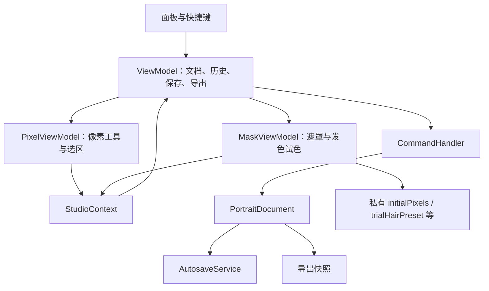
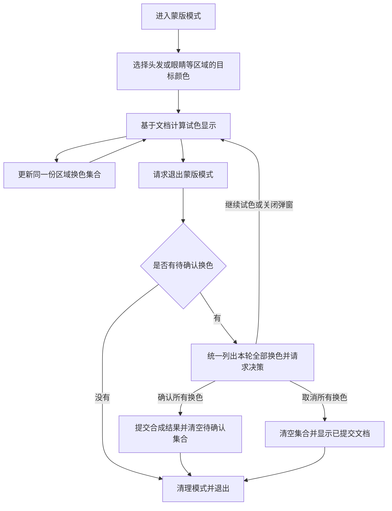

# 64px Portrait Studio：第二轮重构报告

报告日期：2026-10-08（America/Los_Angeles）

源码基线：`0b6a655`，审查开始时工作区干净。

性质：源码审查、行为复现与重构建议。本轮只新增报告，不修改产品实现、测试或配置。

## 1. 需求前提与主要结论

用户在本轮明确了产品要求：

> 发色试色状态是我要的，退出蒙版模式要用户确认 / 取消所有换色行为（以后眼睛等也会有）。

因此，**保留试色，并在退出蒙版模式时统一处理所有区域的待确认换色**，是本报告的前提。头发与未来的眼睛换色应属于同一轮蒙版编辑中的换色集合；不能把删除试色、恢复直接应用作为本轮重构目标。

最新提交拆出了 `PixelViewModel`、`MaskViewModel` 与 `SubViewModel`，职责分组更清楚，适合继续保留。主要缺口在于：试色通过普通命令立即写进文档、保存和历史，但确认/取消的状态留在子 ViewModel 的私有字段中，两套状态没有统一生命周期。

已通过临时脚本复现六项问题，其中两项会覆盖已有像素数据。建议先修复状态边界，再把头发专用试色提升为蒙版模式的统一换色流程，随后接入眼睛等区域。

本报告以 **P1** 标记可覆盖数据的问题，**P2** 标记交互和状态一致性问题。结构建议单独列出，不等同于已经发生的故障。

## 2. 当前结构与上一轮进展



上一轮内核建议中的多项已落实：网格规格统一、迁移直接依赖 Base64 工具、工程校验采用判别联合、遮罩算法收拢至 `editOps`、命令输入校验补强、分区固定样本扩充。本轮不重复提议这些已完成项。

当前值得保留的机制：

- 普通命令使用快照撤销，笔划按整笔提交；固定 64×64 的规模适合现有实现。
- `StudioContext.execute()` 回到父 ViewModel，能在命令执行前结束笔划。
- 导出先结束笔划、flush，再复制独立文档快照，输出数组不与编辑数组共享。
- 模式切换确认回调经过 `confirmWithGeneration()`，可防止旧弹窗操作新文档。
- 主画布和实时预览均使用 `displayPixels()`，可作为统一试色显示的接入点。

需要区分：旧弹窗回调已有代次保护，但 `MaskViewModel` 中保存的旧像素基准没有随文档替换清除。

## 3. 已确认问题

### F1 · P1：旧文档的试色基准可覆盖新文档

**位置：**[maskViewModel.ts](../src/app/maskViewModel.ts)，第 43–59、126–132、173–196、392–415 行；[viewModel.ts](../src/app/viewModel.ts)，第 257–281 行。

`replaceDocument()` 调用两个子模块的 `cleanup()`，但 `MaskViewModel.cleanup()` 只结束笔划、隐藏覆盖层，没有清除 `initialPixels`、`initialHairPreset`、`trialHairPreset`、`hasHairTrial`。新文档载入后，旧子模块实例继续存在。

复现顺序：

1. 工程 A 中试银白发色，保存 A 的整张像素基准。
2. 载入工程 B，B 的非头发像素 `pixelIndices[1] = 12`。
3. 通过分区入口 `setActiveZone(Hair)` 进入蒙版模式，再试银白。
4. 放弃换色。

**实际结果：**B 的 `pixelIndices[1]` 变为 A 的值 `5`。`hasHairTrial` 没有重置，所以新试色没有重新捕获 B 的基准。

通过 `setMode('mask')` 进入时，`enter()` 会重置基准，可避开此复现；分区入口没有调用 `enter()`。两个缺口共同导致污染，不能仅靠修复某一个界面入口掩盖旧状态残留。

**建议：**为文档替换提供明确的试色作废操作，载入、恢复、新建、清空、销毁均调用它。作废只释放旧状态，不能向新文档执行旧像素回滚。该操作与普通退出模式的“等待用户确认/取消”分开。

**验收：**A 试色 → B 载入 → 任一蒙版入口 → B 试色 → 取消，B 的像素、遮罩、预设和历史均不得引用 A 的数据。

### F2 · P1：取消换色会撤回整张图，破坏期间的几何变换

**位置：**[maskViewModel.ts](../src/app/maskViewModel.ts)，第 50–59、405–415 行；[app.ts](../src/app/app.ts)，第 300–315 行；[paletteCommands.ts](../src/command/paletteCommands.ts)，`CommitHairRecolorCommand.apply()`。

试色基准保存的是整张 `pixelIndices`。取消时，把这张旧数组作为新的普通命令写回；遮罩没有恢复对应基准。应用中的 Shift+H、Shift+V、Shift+T 在蒙版模式也能直接执行几何变换。

复现顺序：

1. `(1, 0)` 放一个 Skin 像素，色板索引为 `5`。
2. 试银白发色。
3. 水平翻转，Skin 像素移动到 `(62, 0)`。
4. 取消换色。

**实际结果：**`pixelIndices[62]` 从 `5` 变为 `255`，旧位置 `[1]` 又出现索引 `5`，但遮罩 `[1]` 为 None。用户取消发色，实际却撤回了整张像素图的翻转；像素与语义位置也失去对应。

这里只是透明归一化仍满足，不能用“文档值域合法”证明业务结果正确。

**建议：**让待确认换色与已提交文档分离，取消只移除本轮换色。若先采用最小修复，则几何变换和其他会改写像素坐标的入口必须先处理待确认换色，不能继续使用过期整图快照回滚。只保存头发区域也不足以解决坐标已经变换的问题。

**验收：**试色期间的翻转、旋转、粘贴、像素删除分别有明确规则；取消所有换色不得顺带取消其他编辑，像素与遮罩位置始终一致。

### F3 · P2：导出与自动保存已经包含尚未确认的试色

**位置：**[maskViewModel.ts](../src/app/maskViewModel.ts)，第 392–415 行；[viewModel.ts](../src/app/viewModel.ts)，`documentChanged()` 与第 733–756 行。

点击试色卡即执行 `CommitHairRecolorCommand`，因此像素事件会安排自动保存。`runExport()` 不检查 pending，直接 flush 并导出当前文档。

复现：有银白试色 pending 时调用 `exportPng()`，确认端口被调用 **0 次**，导出预设为 `06_silver_银白`，存储同样包含银白，但 `hasHairDraft()` 仍为 true。

**影响：**尚待确认的颜色已进入持久化和文件输出；刷新恢复后只有改色文档，没有对应的试色基准，用户无法再取消这一轮换色。

退出模式的确认要求已明确。导出如何处理 pending 属于需要保持一致的产品规则；历史审计 [engineer_refactor_findings.md](./engineer_refactor_findings.md) 第 5 节曾要求导出前检查 pending。

**建议：**保留既有“无 pending 直接保存导出；有 pending 先决策，再保存导出”的规则，并将判定扩展到所有待确认区域。采用独立试色显示后，自动保存保存已提交文档；若要恢复未确认试色，必须显式保存足以取消的试色信息，不能仅存已经改色的像素。

**验收：**PNG/ZIP、Ctrl+S、自动保存、页面隐藏、刷新恢复都区分已提交文档与待确认换色；取消导出不隐式确认试色。

### F4 · P2：pending 判断与历史脱节，提示可能描述错误颜色

**位置：**[maskViewModel.ts](../src/app/maskViewModel.ts)，第 30–40、392–415 行；[viewModel.ts](../src/app/viewModel.ts)，第 700–721 行。

`hasPendingHairTrial` 仅比较 `doc.currentHairPreset !== initialHairPreset`。撤销/重做恢复文档，不恢复私有的 `trialHairPreset` 等字段。

两个独立复现：

| 场景 | 实际结果 |
| --- | --- |
| 文档标记为黑色，但 Hair 中包含源色阶外的索引 `0`；再次选择黑色 | 像素从 `0` 改为 `2`，预设未变，pending 为 false；退出不确认这次实际换色 |
| 试银白 → 试棕色 → undo | 文档已恢复银白，`hairDraftName()` 仍返回“棕色”；退出弹窗描述与画面不符 |

**建议：**pending 从统一试色集合及其实际效果判断，不依赖发色标记是否变动。预设名称从当前活动试色状态读取。试色阶段的撤销与正式文档历史要建立明确边界，不能继续只恢复文档而保留另一套过期状态。

**验收：**相同预设但像素变化、A→B→undo、undo→redo、全部取消后的 undo/redo，以及未来仅有眼睛换色时，都得到一致的 pending 和提示。

### F5 · P2：分区与工具入口绕过模式生命周期

**位置：**[maskViewModel.ts](../src/app/maskViewModel.ts)，第 173–196、245–252 行；[viewModel.ts](../src/app/viewModel.ts)，第 392–412 行。

`setActiveZone()` 与 `setActiveMaskTool()` 直接 patch `activeMode = 'mask'`。因此，只有一部分入口执行 `canExit → cleanup → enter`。

复现中给 `pixel.cleanup()` 与 `mask.enter()` 加计数，像素模式调用 `setActiveZone(Skin)` 后，模式变成 mask，但两个计数均为 **0**。

这会跳过匹配色组初始化、覆盖层恢复和试色基准初始化，也是 F1 的实际触发路径。数字分区快捷键和面板分区卡都使用该入口，属于正常操作。

**建议：**所有会改变模式的业务入口通过父 ViewModel 的 `setMode()`，在允许进入后才应用目标分区或工具参数。`patchSession()` 保持底层状态更新作用，内部调用方不要再自行承担模式转换。

**验收：**顶栏切换、工具选择、分区数字键、分区卡片、色板选择分别验证同一生命周期。进入初始化不得覆盖调用方刚选择的分区或可见区域。

### F6 · P2：退出被取消后，可见区域已提前改变

**位置：**[maskViewModel.ts](../src/app/maskViewModel.ts)，第 200–227 行。

隐藏最后一个分区或隐藏全部时，先改 `visibleMaskZones`/`showMaskOverlay`，再调用 `setMode('pixel')` 请求用户决策。

复现：试银白 → 隐藏全部 → “继续试色”。模式仍为 mask，pending 仍存在，但可见分区为 `[]`，覆盖层关闭。请求退出前的界面状态没有恢复；同样状态还可能隐藏发色卡入口。

**建议：**以“请求退出 → 用户决策 → 同时完成模式和可见区域更新”的顺序处理。用户留在当前模式时，保留退出前的界面状态。若产品有意允许留在蒙版模式且隐藏全部，则把这个操作与“退出模式”分开，避免一个按钮同时承担两种含义。

**验收：**隐藏全部/最后一个分区之后，分别验证确认、取消全部换色、继续试色、关闭弹窗；不得提前改变被否决操作关联的会话状态。

## 4. 推荐重构：蒙版模式统一管理所有待确认换色

### 4.1 职责与状态归属

| 内容 | 推荐归属 | 理由 |
| --- | --- | --- |
| 已提交像素、遮罩与算法所需标记 | PortraitDocument | 统一参与工程保存与正式撤销 |
| 待确认的头发、眼睛等换色选择 | MaskViewModel 的一份换色集合 | 退出蒙版模式一次确认或一次取消全部 |
| 分区换色计算与合成 | core 中的纯计算函数 | 预览与提交复用同一结果 |
| 模式切换及文档替换 | 父 ViewModel | 统一生命周期和文档身份 |
| 确认窗口的展示与点击 | 现有 Prompt 端口 | 保留 UI 与业务分离 |
| 正式提交后的 undo/redo | 现有 CommandHandler | 继续复用快照机制 |

可先用简单的区域换色条目表达状态，不必新增 controller、服务层或通用插件框架。实现头发时保留明确的扩展位置；眼睛算法和其预设类型尚未实现，不在本轮凭空定义。

试色集合至少区分“没有待确认操作”与“有待确认操作”；区域条目的内容表达所选目标。不要用单一 `currentHairPreset` 来代替整个蒙版换色集合的状态。

### 4.2 一轮换色的完整流程



用户已明确“退出时确认/取消所有换色”。“继续试色”是当前已有的保留模式分支；是否继续展示该按钮，不是本轮源码重构必须修改的产品决策。

建议的实现行为：

1. **试色：**选择目标更新集合并计算显示结果，不把每次预设点击立即写入正式文档。基于同一已提交输入重新计算，避免自定义颜色在连续试色中反复近似映射。
2. **显示：**主画布与实时预览通过统一的 `displayPixels()` 获取合成结果；增加明确的预览变化通知。当前预览重绘主要监听文档事件，不能只改返回值而忘记通知。
3. **确认所有换色：**提交同一份合成结果，按需要同步正式区域标记，清空集合。建议整轮确认对应一条正式撤销记录；这是撤销粒度建议，尚不是已确认的产品要求。
4. **取消所有换色：**清空全部区域的待确认集合，不执行旧整图回写。建议保留期间独立完成的遮罩编辑；“取消换色”不自动等同于“取消所有蒙版编辑”。
5. **文档替换：**无条件作废旧集合与计算缓存，不向新文档应用旧数据。
6. **其他编辑：**几何变换、正式 undo/redo 等操作前明确处理 pending，或在新文档状态上重新计算预览。建议先采用简单、明确的结算规则，避免引入复杂的差量回滚与坐标重映射。

如果先保留立即写文档的实现，也必须把像素、遮罩、标记、历史和试色元数据作为一致的编辑过程处理。仅增加几个布尔值，或将 `initialPixels` 改成完整文档快照，仍会让“取消换色”误取消其他编辑，不足以满足需求。

### 4.3 currentHairPreset 的角色仍需整理

像素面板的发色卡系列选择调用 `setHairPreset()`，只改正式文档标记；蒙版试色又把它当作 pending 判断依据。这个混用是上一轮已指出的遗留项，本轮更直接影响确认行为。

建议把“当前浏览/选中的系列”留在面板或会话，把正式文档标记明确为换色算法所需的源参考。新增眼睛换色时，区域目标选择与正式源参考同样分开。保存格式是否增加区域标记，待眼睛算法实际需要时再做版本设计。

## 5. 结构与文档清理建议

### C1：保留子 ViewModel，控制父门面的重复接口

父 ViewModel 仍有大量逐个转发的工具、色板、选区与遮罩方法，且 `pixel`/`mask` 本身已经公开。拆分改善了实现归属，但 UI 的依赖面尚未明显缩小。

建议模式专属面板逐步依赖所需子模块接口；跨模式画布、全局快捷键及生命周期仍使用父 ViewModel。统一模式协调规则后再迁移调用，避免为了减少转发而绕过协调器。现有调用方多，不必一次性全部迁移。

### C2：清理名义上的兼容入口

`confirmHairDraft()` 仍无条件调用 `onApplied`，但当前确有 pending；这是名义与实际行为不符的接口。`openHairRecolorPrompt()` 与 `canExit()` 还重复组织头发专用决策。`stepHistory()` 仅转发并保留未使用消息参数。

统一为区域换色决策后，让需要的入口复用同一规则，删除仓库中无调用且不承担外部兼容契约的旧入口。不要为了保留旧名字而留下绕过确认的成功回调。

### C3：同步指南的行为描述

[CODE_REVIEW_GUIDE.md](./CODE_REVIEW_GUIDE.md) 第 11 行宣称完整状态隔离和严格生命周期，但 F1/F5 表明仍有例外。第 188 行仍写 `hasHairDraft()` 恒为 false，与最新实现直接冲突。

指南应写明：已有试色和退出决策；哪些入口已统一；试色何时进入文档、存储及撤销；所有区域如何整体确认/取消。旧 [CORE_REFACTOR_REPORT.md](./CORE_REFACTOR_REPORT.md) 带明确历史基线，可保留作为上一轮记录，不应把历史结论当作当前实现说明。

## 6. 建议实施顺序与验收矩阵

| 阶段 | 工作 | 完成标准 |
| --- | --- | --- |
| 1：先隔离数据 | 文档替换作废试色；统一进入模式；限制过期整图回滚路径 | F1/F2 的数据覆盖复现转为正确结果 |
| 2：统一换色过程 | 一份区域换色集合、统一显示、确认提交与取消清除 | 发色继续支持试色；退出统一决策；F3/F4 修复 |
| 3：闭合交互边界 | 历史、导出、其他像素命令、显隐退出和弹窗 dismiss | F5/F6 修复；拒绝操作不提前改变状态 |
| 4：收拢接口与文档 | 面板依赖、兼容入口与指南同步 | 职责清楚，文档只描述实际实现 |

建议补充真正区分正确与错误行为的组合测试：

| 场景 | 核心断言 |
| --- | --- |
| A 试色 → B 载入 → B 试色 → 取消 | B 不出现 A 的像素、标记或历史 |
| 发色试色 → 几何变换 → 取消换色 | 非换色编辑按既定规则保留，像素/遮罩对应 |
| 原预设相同但像素发生变化 | pending 不漏报 |
| 连续试两种颜色 → undo/redo | 画面、名称、pending 与待确认集合一致 |
| 头发与眼睛均 pending → 退出 | 一次确认提交全部；一次取消清除全部；无需两个区域分别弹窗 |
| 隐藏全部 → 留在当前模式 | 模式与界面恢复请求退出前状态 |
| 通过所有 UI 入口进入蒙版 | 每次真实切换统一运行 cleanup/enter |
| pending → PNG/ZIP/保存/恢复 | 输出和恢复行为符合明确的试色决策规则 |

多区域测试待眼睛换色能力接入时落地。本轮不声称已验证尚不存在的眼睛算法。

## 7. 本轮验证与证据范围

| 检查 | 结果 |
| --- | --- |
| `npm run typecheck` | 通过 |
| `npm run typecheck:tests` | 通过 |
| `npm test` | 26 个测试文件，214 项测试通过 |
| `npm run build` | 通过 |
| `npm run test:e2e` | 系统 Chrome，11 项测试通过 |
| 临时 TypeScript 行为探针 | 六项问题均复现；F4 包含两个独立场景，共七组观测 |
| `git diff --check` | 通过 |

探针使用仓库的 `createTestViewModel()`、内存存储和合法工程编解码，并通过 `vite-node` 执行。每组使用独立实例，结束后 dispose；临时脚本已删除，没有添加永久失败测试。

关键观测值：

```text
F1：B 的非头发像素应为 12，取消后实际为 5。
F2：翻转后 Skin 像素在位置 62；取消后该位置为 255，位置 1 重现旧像素。
F3：导出确认次数 0；导出/存储均为银白；pending 仍为 true。
F4：相同黑色预设使像素 0 -> 2，但 pending 为 false；undo 后画面银白、提示棕色。
F5：分区入口进入 mask，但 pixel.cleanup 与 mask.enter 调用次数均为 0。
F6：继续试色后 mode=mask、visibleMaskZones=[]、showMaskOverlay=false。
```

现有测试通过证明当前覆盖的流程可运行，不代表上述组合场景正确。行为探针验证应用层状态和数组结果；未另行录制这些故障的浏览器操作。报告提出的统一区域换色架构尚未实现。
