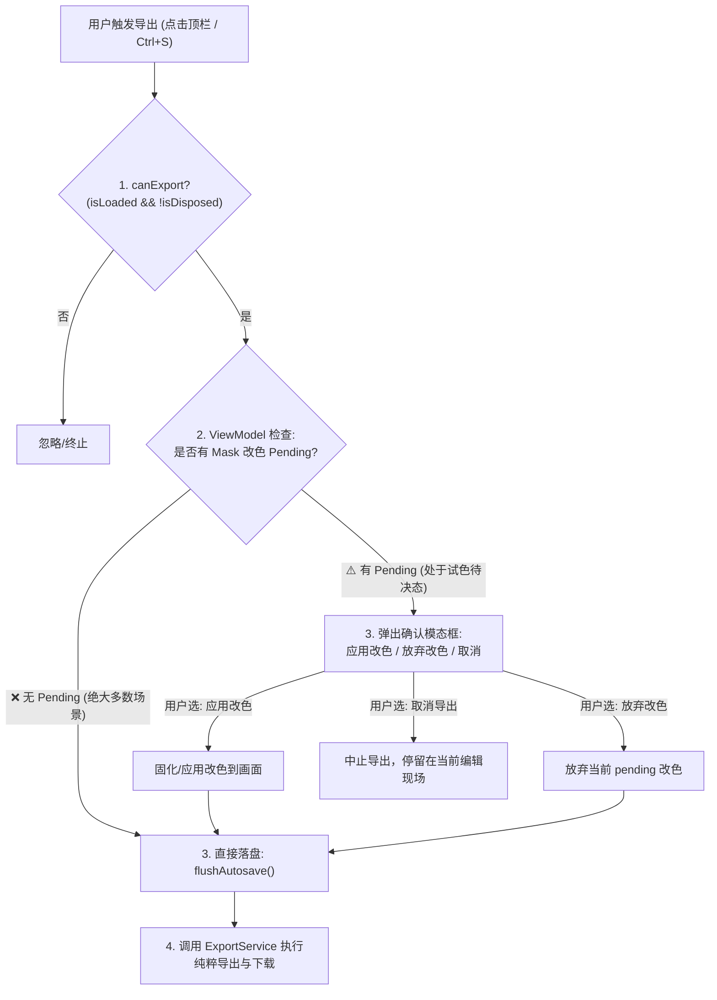
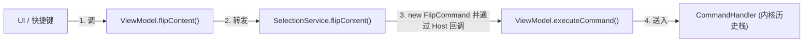

# 64px Portrait Studio 导出机制、遮罩改色与架构发现全景审计报告
# (Export, Mask Recolor & Architecture Discoveries Audit)

本文档系统归纳用户在工程审查期间提出的**全部核心发现与架构洞察**，针对导出调用链、持久化保存时序、遮罩改色内核设计，以及“导出时基于 Mask 改色 Pending 的弹窗决策”进行深度剖析与规范化建模。

---

## 1. 发现全景概览（Executive Summary of Discoveries）

用户在审查 [`ExportService.ts`](file:///d:/godot_exe/64px-portrait-studio/src/app/controllers/ExportService.ts) 与 [`HairDraftController.ts`](file:///d:/godot_exe/64px-portrait-studio/src/app/controllers/HairDraftController.ts) 时，连续提出了 4 项触及系统设计底层的核心发现：

| 发现编号 | 用户核心洞察 | 现存代码缺陷与瓶颈 | 终态架构目标 |
| :---: | :--- | :--- | :--- |
| **发现 1** | **Export 进入了 ViewModel，但检查却在 ExportService** | `ViewModel` 仅做单薄透传；`ExportService` 反向管理发色与弹窗，导致 `ExportPorts` 接口严重污染 | 检查逻辑完全收敛至 `ViewModel`；`ExportService` 退回为纯粹的文件生成与下载器 |
| **发现 2** | **ViewModel 确认能导出后，必须先执行保存操作** | LocalStorage 的 300ms 防抖导致刚画完立刻导出时本地缓存未落盘，若导出后关闭标签页有丢数据风险 | 在执行物理导出前，由 `ViewModel` 主动调用 `flushAutosave()` 强制刷盘，确保本地存储与导出文件 100% 同步 |
| **发现 3** | **改色草稿箱是典型的过度设计，内核本应直接完成合成** | 引入了悬空的 `hairDraftPreset` 草稿态与 186 行的 `HairDraftController`，在切模式、撤销、导出处处弹窗打断用户 | 回归内核合成模型：原图像素 + Mask 区域改色 = 最终显示/导出画面，消除不必要的临时态 |
| **发现 4** | **导出时的弹窗决策规则：检查有无 Mask 改色 Pending** | 之前由 `ExportService` 强行无脑弹窗，打乱了保存时序 | **由 ViewModel 检查当前有无 mask 改色 pending**：无 pending 则零弹窗直接保存后导出；有 pending 则提示用户决策后再保存导出 |
| **发现 5** | **彻底消灭多余 Controller，所有导入导出统一收拢到 `projectArchive.ts`** | `ImportCoordinator` 搞了没必要的请求序号防竞态和取消计数器，`ExportService` 也只是薄薄一层封装 | 奉行“用户点啥就干啥，别 over engineering”：由 `projectArchive.ts` 全权负责所有导入（ZIP/图片分流）与导出（PNG/ZIP），直接删掉这两个多余的 Controller 类 |
| **发现 6** | **`SelectionService` 是典型的中间人坏味道，其操作实质本就是内核命令** | 只是持有单个 `clipboard` 变量的空壳转话筒，把翻转、旋转、扣白底、换颜色等内核命令套了一层，导致 ViewModel 出现 13 个无脑透传方法 | 彻底删掉 `SelectionService`，内核命令由 ViewModel 直接调用 `execute()`，算法沉淀至 `core`，剪贴板变量直接内聚在 ViewModel |

---

## 2. 发现一：Export 链路的架构归属与职责倒置

### 2.1 现状调用链路
在当前代码中，外部 UI 与快捷键均调用 `ViewModel`：
- 顶栏“快速保存”按钮：[`Header.ts:121`](file:///d:/godot_exe/64px-portrait-studio/src/panels/Header.ts#L121) $\to$ `this.vm.exportPng()`
- 顶栏“导出 ZIP”按钮：[`Header.ts:122`](file:///d:/godot_exe/64px-portrait-studio/src/panels/Header.ts#L122) $\to$ `this.vm.exportZip()`
- 全局快捷键 `Ctrl + S`：[`app.ts:303`](file:///d:/godot_exe/64px-portrait-studio/src/app/app.ts#L303) $\to$ `vm.exportZip()`

### 2.2 缺陷剖析：单薄透传与接口污染
在 [`ViewModel.ts:973-983`](file:///d:/godot_exe/64px-portrait-studio/src/app/viewModel.ts#L973-L983) 中：
```ts
exportPng(): Promise<void> {
  if (this._isDisposed) return Promise.resolve();
  this.endStroke();
  return this.exportService.exportPng();
}
```
`ViewModel` 仅仅结算了笔刷，就将全部控制权交给底层 `ExportService`。
为了让 `ExportService` 能够弹窗阻断，[`ExportPorts`](file:///d:/godot_exe/64px-portrait-studio/src/app/controllers/ExportService.ts#L5-L20) 被迫混入了原本属于业务层的发色方法：
```ts
export interface ExportPorts extends ExportBackend {
  isLoaded(): boolean;
  hasHairDraft(): boolean;        // ❌ 接口污染：通用导出服务被强塞了发色概念
  hairDraftName(): string;        // ❌ 接口污染
  confirmHairDraft(...): void;    // ❌ 接口污染
  captureDocument(): PortraitDocument;
  notify(...): void;
}
```

### 2.3 归位方案
- 所有的状态校验、前置弹窗拦截全权收归 `ViewModel`；
- `ExportPorts` 剔除 `hasHairDraft`、`hairDraftName`、`confirmHairDraft`，回归干净单一职责：
  ```ts
  export interface ExportPorts extends ExportBackend {
    notify(message: string, level?: ToastLevel): void;
  }
  ```

---

## 3. 发现二：导出时的持久化保存时序（“先存盘、后导出”）

### 3.1 现存时序问题（Persistence Sync Gap）
1. 用户在画布上涂画后，`ViewModel` 通过 300ms 防抖计时器异步暂存（`saveDebounced`）。
2. 用户在 300ms 窗口期内立即点击“快速保存”或按 `Ctrl+S`。
3. `ViewModel` 执行 `this.endStroke()` 结算当前笔刷进内存 `doc`，因此导出的文件是最新的。
4. **但是 `localStorage` 此时依然处于未落盘的挂起状态**！
5. 若用户认为“既然已经导出成功，可以关闭浏览器了”，一旦直接关闭页面，浏览器本地缓存有丢失最新笔画的风险。

### 3.2 解决方案
`ViewModel` 已经内置了同步强制刷盘方法 [`flushAutosave()`](file:///d:/godot_exe/64px-portrait-studio/src/app/viewModel.ts#L176)：
```ts
flushAutosave(): StorageSaveResult | null {
  if (this._isDisposed) return null;
  this.endStroke();
  return this.autosave.flush(); // 取消防抖计时器，立刻写入 store，触发 onSaveStatus('saved')
}
```
因此，在任何导出动作真正触发物理下载之前，**必须先执行 `this.flushAutosave()`**，确保本地存储状态与导出的文件 100% 强一致。

---

## 4. 发现三：内核改色合成模型 vs 现存草稿过度设计剖析

### 4.1 用户原本的设计：清爽的“内核状态合成（Derived State）”
用户构思的核心心智模型：
$$\text{用户看到的画面 (Display Image)} = \text{原图像素 (Base)} + \text{Mask 遮罩} + \text{发色配置 (Hair Preset)}$$
- **这一切在内核（Core / Document）完成**：
  - 非头发区域保持原色；
  - 头发区域根据当前发色预设实时计算换色映射；
  - 画布渲染与文件导出直接读取内核合成后的完整画面。
- **操作自然流畅，完全不需要草稿态**：
  - 用户点选“金发”，当前发色状态即为金发，画面所见即所得；
  - 导出直接就是金发；
  - 想撤回？直接 `Ctrl+Z` 撤销到上一发色状态；
  - **根本不需要到处弹窗询问“是否固化”、“是否放弃”！**

### 4.2 现有实现的“过度设计”滚雪球过程
现存代码把换发色实现为了**“拟物化临时草稿箱（Staging Area）”**：
1. 在会话中维护了悬空的 `session.hairDraftPreset`；
2. 担心草稿在用户离开蒙版模式时丢失，所以在 [`ViewModel.setMode('pixel')`](file:///d:/godot_exe/64px-portrait-studio/src/app/viewModel.ts#L408) 加了三选一弹窗；
3. 担心草稿在撤销/重做时丢失，所以在 [`ViewModel.stepHistory()`](file:///d:/godot_exe/64px-portrait-studio/src/app/viewModel.ts#L949) 加了三选一弹窗；
4. 担心草稿在导出时丢失，所以在 [`ExportService.ts`](file:///d:/godot_exe/64px-portrait-studio/src/app/controllers/ExportService.ts#L93) 又加了三选一弹窗；
5. 为了支撑这套弹窗，硬写了 186 行的 [`HairDraftController.ts`](file:///d:/godot_exe/64px-portrait-studio/src/app/controllers/HairDraftController.ts) 和专用提交命令 `CommitHairRecolorCommand`；
6. 导致原本极简的功能变得极其繁琐，严重打断用户的绘图创作心流。

---

## 5. 发现四：导出时的弹窗决策规则（ViewModel 检查 Mask 改色 Pending）

结合用户对导出交互的精准定义：
> **“导出时，ViewModel 查看当前有没有 mask 的改色 pending，来决定要不要弹窗”**

### 5.1 决策规则形式化定义
在 `ViewModel` 发起导出时，严格遵循以下判断流：



### 5.2 状态判定实现细节
在 `ViewModel` 中提供专门的检查属性与守卫：
```ts
/** 是否处于可导出状态 */
get canExport(): boolean {
  return !this._isDisposed && this.session.isLoaded;
}

/** 当前是否存在 Mask 区域未决断的改色 Pending */
get hasPendingMaskRecolor(): boolean {
  return !this._isDisposed && this.session.hairDraftPreset !== null;
}
```

### 5.3 导出管道的标准化实现
```ts
async exportPng(): Promise<void> {
  if (!this.canExport) return;
  this.endStroke();

  // 若无改色 Pending，零弹窗，先落盘保存，立即导出
  if (!this.hasPendingMaskRecolor) {
    this.flushAutosave();
    await this.exportService.exportPng(this.doc);
    return;
  }

  // 若有改色 Pending，调起确认弹窗
  const draftName = this.hairDraft.hairDraftName();
  this.confirmHairDraft({
    icon: '📦',
    title: '导出前发色确认',
    message: `当前正在试色【${draftName}】，尚未固化。`,
    subMessage: '是否将此发色应用后再导出？',
    applyLabel: `✓ 应用【${draftName}】并导出`,
    onApplied: async () => {
      // 内部已自动 commit 发色
      this.flushAutosave(); // 先强制落盘保存
      await this.exportService.exportPng(this.doc);
    },
    otherLabel: '✕ 按原图导出',
    onOther: async () => {
      this.discardHairRecolor(); // 放弃试色
      this.flushAutosave();      // 落盘保存
      await this.exportService.exportPng(this.doc);
    },
    cancelLabel: '取消导出',
    onCancel: () => {},
  });
}
```

---

## 6. 发现五：导入导出全部收拢到 `projectArchive.ts`，消灭过度设计的中间协调器

### 6.1 用户核心批评：去除无谓的防御，所见即所得
在 [`ImportCoordinator.ts`](file:///d:/godot_exe/64px-portrait-studio/src/app/controllers/ImportCoordinator.ts) 中，之前设计了：
- `currentRequestId` 序号自增防竞态（担心用户极速连拖两张图导致后发先至）；
- `cancelPending()` 废弃旧请求（担心清空画布时后台异步任务还在跑）。

**用户的核心定性非常到位：**
> **“1、2 都没有必要，用户点啥就干啥，别 over engineering！”**
> **“能不能直接放到 `projectArchive.ts`，由它负责所有的导入导出？”**

对于一个运行在单机浏览器本地的像素头像工作台而言：
- 用户拖入文件就是为了立刻打开它；
- 搞一套多任务请求 ID 拦截机制，纯粹是用云端高并发分布式服务的思维来套单机应用，凭空增加了模块数量与调用链层级。

### 6.2 方案：让 `projectArchive.ts` 名副其实地统筹“导入与导出”
`projectArchive`（工程归档）从命名语义上就天然是对称的：
- **Archive（归档 / 导出）**：
  - `exportProjectPng(doc)`：导出 64×64 索引色纯净 PNG（已在此文件中）
  - `exportProjectZip(doc)`：打包导出完整工程 ZIP（已在此文件中）
- **Unarchive（解包 / 导入）**：
  - `importProjectZip(file)`：解包工程 ZIP 并恢复工程数据（已在此文件中）
  - **统一文件导入分流 `importAnyFile(file)`**（新增整合）：
    ```ts
    export type ImportFileResult =
      | { kind: 'project'; data: ProjectData }
      | { kind: 'image'; image: DecodedImage };

    export async function importAnyFile(file: File): Promise<ImportFileResult> {
      const lower = file.name.toLowerCase();
      const isZip = lower.endsWith('.zip') || file.type.includes('zip');
      if (isZip) {
        const data = await importProjectZip(file);
        return { kind: 'project', data };
      }
      const image = await decodeImageFile(file);
      if (!image) throw new Error('无法解析图片像素数据');
      return { kind: 'image', image };
    }
    ```

### 6.3 收益：直接消灭两个多余的 Controller 类
通过这一重构：
1. **完全删除 `src/app/controllers/ImportCoordinator.ts`**（文件拖拽/上传直接调用 `projectArchive.importAnyFile`）；
2. **完全删除 `src/app/controllers/ExportService.ts`**（导出直接由 `ViewModel` 检查 pending 并落盘后调 `projectArchive.exportProject*`）；
3. 导入导出的物理 I/O 与打包逻辑全部高内聚在 [`src/app/browser/projectArchive.ts`](file:///d:/godot_exe/64px-portrait-studio/src/app/browser/projectArchive.ts) 中，干净、直观、零多余间接层。

---

## 7. 发现六：`SelectionService` 纯属“中间人坏味道”，其操作实质本就是内核命令

### 7.1 现状：“转话筒”式的滑稽调用链
查看 [`SelectionService.ts`](file:///d:/godot_exe/64px-portrait-studio/src/app/controllers/SelectionService.ts) 的实现，可以发现它调用的**全都是 `src/command/` 下的内核命令**：
- 翻转画布 $\to$ [`FlipCommand`](file:///d:/godot_exe/64px-portrait-studio/src/command/transformCommands.ts)
- 旋转画布 $\to$ [`RotateCommand`](file:///d:/godot_exe/64px-portrait-studio/src/command/transformCommands.ts)
- 矩形清除 $\to$ [`ClearRectCommand`](file:///d:/godot_exe/64px-portrait-studio/src/command/pixelCommands.ts)
- 颜色替换 $\to$ [`ReplaceColorCommand`](file:///d:/godot_exe/64px-portrait-studio/src/command/pixelCommands.ts)
- 扣除外围白底 $\to$ [`ClearPixelsCommand`](file:///d:/godot_exe/64px-portrait-studio/src/command/pixelCommands.ts)

**但系统却建立了一条极其冗长的套娃链路：**

UI 调 ViewModel，ViewModel 调 SelectionService，SelectionService 实例化一个 Command，又通过 Host 接口回调回 ViewModel 的 execute……在内存里大费周章地绕了一圈，仅仅为了做一句 `new FlipCommand()`。

### 7.2 职责大杂烩与空壳状态
1. **名不副实**：
   - 名字叫 `SelectionService`（选区服务）；
   - 里面却塞了**画布翻转/旋转**（Transform 变换）、**扣除外围白底**（基于泛洪连通图算法的抠图工具，与选区无关）、**颜色替换**（调色板工具）；
   - 真正与选区（Selection）相关的，仅仅是复制/剪切/粘贴几个操作。
2. **空壳状态**：
   - 全类 153 行，自己持有的状态**仅有唯一的一个变量**：
     ```ts
     private clipboard: Patch | null = null;
     ```
   - 选区本身在 `session.selection`，文档在 `doc`，执行能力在 `CommandHandler`。
3. **副作用：ViewModel 产生 13 个无脑透传方法**：
   在 [`ViewModel.ts:871-921`](file:///d:/godot_exe/64px-portrait-studio/src/app/viewModel.ts#L871-L921) 中，整整 13 个方法仅仅是将参数直接透传给 `this.selectionService`。

### 7.3 归位方案：消灭 `SelectionService`
1. **内核命令直接由 ViewModel 执行**：
   - 翻转与旋转：直接在 ViewModel 中执行 `this.execute(new FlipCommand(...))`；
   - 颜色替换：直接在 ViewModel 中执行 `this.execute(new ReplaceColorCommand(...))`；
   - 扣除外围白底：将泛洪计算提炼为纯函数 `findOuterWhiteOffsets(doc, locked)`，ViewModel 执行 `ClearPixelsCommand`。
2. **剪贴板状态内聚**：
   - `clipboard: Patch | null` 直接放在 ViewModel 内部，几行代码即可完成 copy / cut / paste。
3. **收益**：
   - 彻底删除 [`SelectionService.ts`](file:///d:/godot_exe/64px-portrait-studio/src/app/controllers/SelectionService.ts)（153 行）；
   - 彻底删除 `SelectionHost` 接口；
   - 彻底删除 ViewModel 中 13 个无意义的转发方法；
   - 调用链路直接扁平化为：`UI` $\to$ `ViewModel.execute(Command)` $\to$ `内核`。

---

## 8. 架构全景反思：`src/app/controllers/` 目录的本质诊断

通过对用户所有发现的系统化梳理，我们可以清晰地看到：
**整个 `src/app/controllers/` 目录，本质上几乎全都是过度设计（Over-engineering）出来的多余间接层！**

| 控制器文件 | 代码行数 | 真实职责与坏味道诊断 | 终极重构处置方案 |
| :--- | :---: | :--- | :--- |
| **`ExportService.ts`** | 114 行 | 只是在调用 `projectArchive` 前强行塞入了发色草稿检查与弹窗，导致接口污染与时序死结 | 🗑️ **彻底删除**：ViewModel 直接判断 pending 并强制存盘后，调 `projectArchive` 导出 |
| **`ImportCoordinator.ts`** | 72 行 | 搞了单机本地应用根本不需要的请求序号防竞态和取消计数器，过度设计 | 🗑️ **彻底删除**：文件读取分流直接合并入 `projectArchive.importAnyFile` |
| **`SelectionService.ts`** | 153 行 | 典型的“中间人（Middleman）”，持有一个 clipboard 变量到处做命令转话筒，职责大杂烩 | 🗑️ **彻底删除**：内核命令由 ViewModel 直接调用，剪贴板内聚，抠图算法进 `core` |
| **`HairDraftController.ts`** | 186 行 | 搞了复杂的拟物化“草稿箱模式”，导致全工程处处三选一弹窗拦截，打断创作心流 | ✂️ **大幅精简**：回归用户最初设想的“内核原图 + 遮罩直接合成”架构，消除多余弹窗与临时态 |

> **架构结论**：重构完成后，4 个控制器中有 3 个将被彻底删除（预计删除 340+ 行冗余代码），系统将从原本网状纠缠的“双重代理”模型，蜕变为干净、透亮、扁平的**“视图模型 $\to$ 内核命令 / 归档 I/O”**经典极简架构。

---

## 9. 全工程前置检查（Guards）隐患清单

除了导出与发色外，全工程其他操作的前置检查也需要同步梳理，避免“某些地方过度检查，某些破坏性操作却零检查”的失衡现象：

| 业务操作 | 当前检查状态 | 潜在风险 | 建议整改措施 |
| :--- | :--- | :--- | :--- |
| **清空画布 (`requestReset`)** | 🟢 包含 `confirmWithGeneration` 弹窗确认 | 规范安全 | 保持现状 |
| **新建空白项目 (`newBlankProject`)** | 🔴 **零检查**：直接执行 `replaceDocument` | 若用户在旧图上绘制后误触新建，未导出的成果直接丢失 | 增加未保存修改确认弹窗（若有未保存工作则先提示） |
| **导入外部图片 (`importImage`)** | 🔴 **零检查**：直接解析并覆盖当前文档 | 误选文件或误触导入直接刷掉当前画布 | 增加覆盖确认保护 |
| **模式切换 (`setMode`)** | 🟡 仅检查发色草稿，过度弹窗 | 频繁打断心流 | 后续可随内核改色重构逐步弱化弹窗 |
| **历史撤销 (`undo / redo`)** | 🟡 拦截发色草稿弹窗 | 破坏了常规软件中按 `Ctrl+Z` 预期自然回退的心智 | 发色状态纳入普通命令栈后，直接撤销无需弹窗 |

---

## 10. 实施路线图（Implementation Roadmap）

建议分两阶段推进工程整洁化：

### 阶段一：规范导出时序与消灭过度封装的 Controllers（立即推进）
1. **统一收拢所有导入导出至 `projectArchive.ts`**：
   - 补齐 `importAnyFile(file)`，接管 ZIP 解包与普通图片解码；
   - 彻底删除 `ImportCoordinator.ts` 与 `ExportService.ts`。
2. **导出检查与落盘时序归位**：
   - 在 `ViewModel` 中根据 `hasPendingMaskRecolor` 决定是否弹窗；
   - 导出前统一先执行 `flushAutosave()` 强制存盘，再调用 `projectArchive` 物理导出。
3. **消灭 `SelectionService.ts`**：
   - 内核命令直接由 ViewModel 触发 `this.execute()`；
   - 消除 ViewModel 内部 13 个无意义的透传转发方法。
4. **单测更新与全量验证**：
   - 确保 `npm run typecheck` 0 错误，全部单测 100% 通过。

### 阶段二：回归内核改色合成架构（后续解耦）
1. 将头发改色从“草稿箱模式”重构为“内核动态合成（Composite Layer / Derived State）”；
2. 彻底移除 `HairDraftController` 中的冗余弹窗逻辑，让 `setMode` 和 `undo/redo` 恢复无弹窗顺畅体验。


